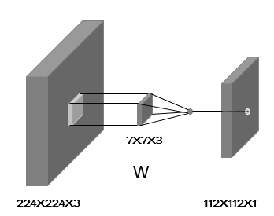
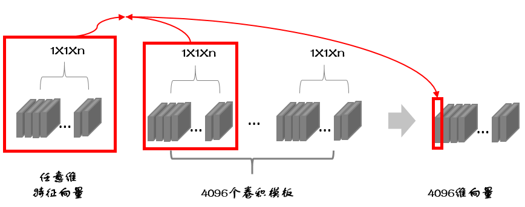

# CNN 核心概念：全连接、卷积、激活与全卷积网络

## TL;DR

- 全连接层（`Linear`）是“每个输出单元连接全部输入单元”的线性映射。
- 卷积层是“局部连接 + 权重共享”的线性映射，本质也是线性算子。
- 激活函数提供非线性；没有非线性，多层线性层可折叠为一层。
- `H x W` 卷积核在 `H x W x C_in` 特征图上做 `valid` 卷积，输出 `1 x 1 x C_out`，与全连接在该输入尺寸下等价。
- `1x1` 卷积主要做通道混合，不会跨空间位置聚合；要得到固定长度表示，常配合全局池化。

---

## 1. 全连接层（Fully Connected / Linear）

设输入向量维度为 `D_in`，输出维度为 `D_out`：

$$
y = Wx + b,
$$

其中 `W` 形状为 `D_out x D_in`，`b` 形状为 `D_out`。

- 参数量：`D_in * D_out + D_out`（含偏置）。
- 例：`4096 -> 10`，参数量是 `4096*10 + 10 = 40970`。

直观上，每个输出单元都“看到”全部输入，因此称“全连接”。

---

## 2. 卷积层（Convolution）

输入特征图采用 `N x H x W x C_in`（NHWC）记法。二维卷积核大小 `K_h x K_w`，卷积核个数为 `C_out`：

- 单个卷积核参数量：`K_h * K_w * C_in`（若含偏置再 `+1`）。
- 整层参数量：`K_h * K_w * C_in * C_out (+ C_out)`。

*图：卷积核深度与输入通道数一致，滑动后生成输出特征图。*

### 输出尺寸公式

设步幅为 `S`，每侧填充为 `P`，则

$$
H_{out}=\left\lfloor \frac{H+2P-K_h}{S} \right\rfloor + 1,
\quad
W_{out}=\left\lfloor \frac{W+2P-K_w}{S} \right\rfloor + 1.
$$

### `same` 填充的常用结论

- 当框架声明 `padding=same` 时，常见实现满足：

$$
H_{out}=\left\lceil \frac{H}{S} \right\rceil,
\quad
W_{out}=\left\lceil \frac{W}{S} \right\rceil.
$$

- 例：`224x224` 输入，`7x7` 卷积，`stride=2, padding=same`，输出空间尺寸应为 `112x112`，不是 `114x114`。

---

## 3. 卷积与全连接的关系（等价与不等价）

### 等价情形

若输入是 `H x W x C_in`，使用 `K_h=H, K_w=W` 的 `valid` 卷积，输出 `1 x 1 x C_out`。

- 每个输出通道都依赖全部输入元素。
- 这在该输入尺寸下与一个 `Linear(H*W*C_in -> C_out)` 等价。

### 常见误区

- `1x1` 卷积不是“全连接替代品”的普适答案。
- `1x1` 只在每个空间位置做通道线性组合，不聚合不同空间位置。
- 若目标是把任意分辨率输入映射到固定长度向量，典型做法是：
  - 若干卷积层提特征；
  - `Global Average Pooling`（或 `Global Max Pooling`）做空间聚合；
  - 必要时再接 `Linear`。

---

## 4. 线性层与非线性层

- 卷积层、全连接层本质都是线性变换（忽略激活与归一化）。
- 若网络中全是线性层，则整体仍是线性映射，表达能力受限。
- 通过 `ReLU / GELU / SiLU` 等激活引入非线性，模型才具备复杂函数拟合能力。

工程上，常见最小单元是：

`Conv/Linear -> Norm(可选) -> Activation`

*图：用卷积结构替代固定维度全连接头，有利于处理不同分辨率输入。*

---

## 5. 参数量对比直觉

以输入 `224x224x3`、输出通道 `64` 为例：

- 若强行全连接到 `64` 维：参数量约 `224*224*3*64 ≈ 9.63M`（不含偏置）。
- 用 `7x7` 卷积得到 `64` 个通道：参数量 `7*7*3*64 = 9408`（不含偏置）。

差异来自两点：

- 局部连接（每次只看局部感受野）；
- 权重共享（同一卷积核在不同空间位置复用）。

---

## 6. 实战速查

- 想算卷积输出尺寸：先统一记法（`NCHW` 或 `NHWC`），再套同一公式。
- 想替代末端全连接：优先考虑 `GAP + 1x1 Conv/Linear`。
- 想减少参数：先减 `C_out`、再减核大小、最后再调深度。
- 想避免维度错误：把每层的 `(H,W,C)` 写成表格逐层推。

这套框架足以覆盖大部分 CNN 入门和工程实现中的维度、参数量与结构设计问题。
