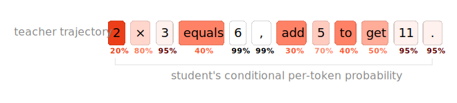
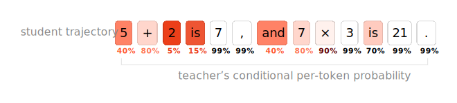
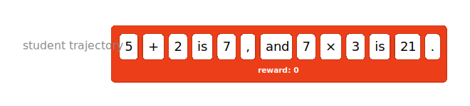
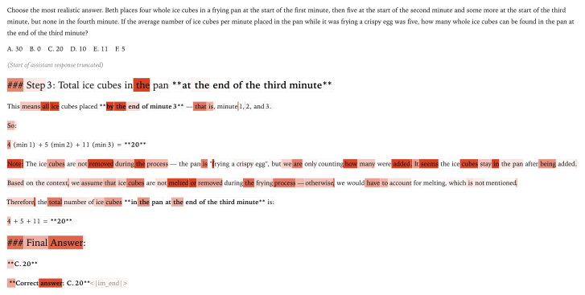
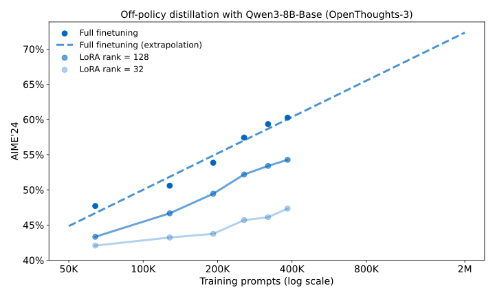
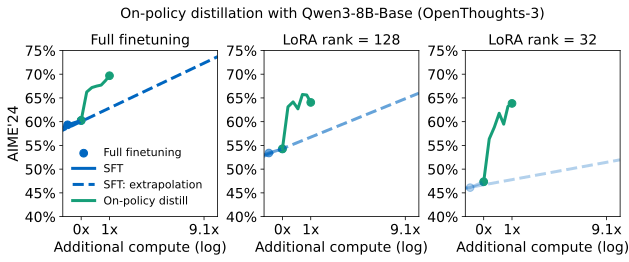
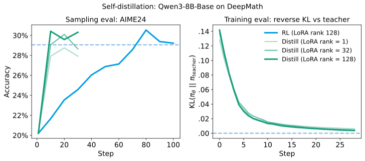
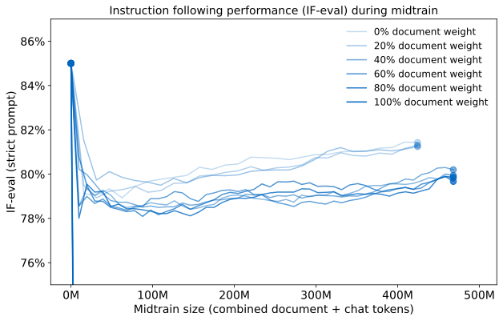
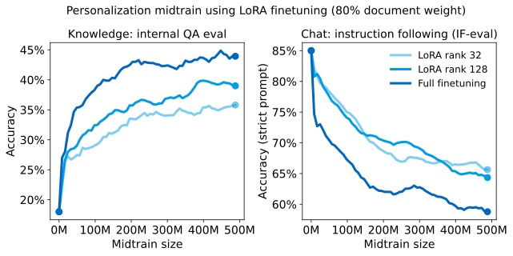

# OPD（On-Policy Distillation）

## TL;DR

`OPD` 的核心不是“更便宜的单步训练”，而是“更高密度、对准学生真实状态分布的监督”，因此在一些设定下能用更少训练步数达到目标策略。

- 训练视角：先让学生按当前能力生成轨迹，再让教师在同轨迹上给 token 级反馈，监督密度高于常见稀疏奖励。
- 成本视角：单步前向虽更贵，但若能显著减少达到目标质量所需步数，总成本仍可能低于离线蒸馏或部分 RL 路线。
- 工程视角：在持续学习里可把旧模型作为教师，用于新知识注入后的行为回填，减少能力回退。

## 1. SFT vs OPD

- `SFT`/传统蒸馏通常是 `off-policy`：学生学老师预先生成的数据，容易在学生真实错误路径上失稳（复合错误）。
- `OPD` 是 `on-policy`：先让学生生成轨迹，再让教师在同一轨迹上给 token 级信号，直接学习“自己会走到的状态”。

## 2. RL vs OPD

- 共同点：都可缓解纯 `SFT` 的分布外错误累积。
- 差异点：标准 `RL` 常是稀疏或低密度奖励，credit assignment 难；`OPD` 通过教师分布提供更密集学习信号。
- 可理解为：`RL` 更像“靠回报探索”，`OPD` 更像“在学生轨迹上做精细示教”。

## 3. 成本与效率（需要口径意识）

- 常见直觉：`OPD` 每步都要调用教师，单步成本高。
- 来源主张：总体效率可能优于 `SFT`/`RL`，因为达到同等策略所需步数更少。
- 使用建议：看“达到目标质量的总训练成本”，不要只看“单步前向成本”。

## 4. 持续学习价值

- 场景：引入新知识后，旧行为（如 instruction-following）可能退化。
- 做法：用旧版本模型作教师，通过 `OPD` 做“行为回填”。
- 启发：可交替进行“新知识训练”和“行为恢复蒸馏”。

## 5. 最优雅的，在于想象力的一跃

- `SFT`/蒸馏阵营常见误区是“成本洁癖”：把离线便宜当成唯一锚点，天然排斥在线教师参与训练，默认 `OPD` 不可能比 `SFT` 便宜。
- `RL` 阵营常见误区是“奖励模型崇拜”：把标量奖励和探索当作唯一正统，低估了直接模仿教师分布这条更短学习路径。
- 关键判断是：`OPD` 用同一组实验同时挑战了这两种直觉。
  - 看似昂贵的在线蒸馏，因为样本效率提升，可能在总成本上优于离线 `SFT`。
  - 看似“只是模仿”的方法，在后训练中可能比“先学奖励再学策略”更稳、更快、更可控。
- 从工程角度，这一跃迁的价值在于目标函数的简化：
  - `PRM/RM` 路线常给标量反馈，学生仍要自行探索改进方向。
  - `OPD` 路线直接在 token 分布层对齐教师，优化方向更直接。
- 在持续学习中，这种思路还有一个额外收益：新知识训练后出现行为退化时，可以用“旧模型教师”进行能力回填，而不是只靠重新混合旧数据重训。

## 6. 讨论

### 6.1 Dense supervision greatly improves compute efficiency

- `RL` 与 `OPD` 都可看作在 `reverse KL` 意义上更新策略，但两者监督密度不同。
- 这里沿用 `LoRA Without Regret` 的信息论直觉：`RL` 每个 episode 常只有低密度反馈，而蒸馏可在整条 token 序列上传递监督。
- 这解释了为什么“单步更贵”的 `OPD` 可能在“达到同目标策略”时更省总算力：每一步都更少浪费。

### 6.2 Distillation can effectively reuse training data for data efficiency

- 实务里，高质量提示数据贵且难收集，往往希望重复利用同一批提示。
- 一个关键对比是：
  - 在某些 `RL` 设定中，同一提示反复训练可能走向答案记忆。
  - 在 `OPD` 中，目标是逼近教师分布而非单答案记忆，因此同一提示可采多条轨迹做训练，数据利用率更高。

### 6.3 RL searches in the space of semantic strategies

- 一个可操作的解释框架是：把 `RL` 主要看成“策略搜索成本”，而不是“梯度更新成本”。
- 一旦 `RL` 找到有效策略，`OPD` 可作为“学习最终策略”的捷径，不必显式复现整个中间策略演化过程。
- 这也对应“搜索与学习可扩展性”观点：生产场景通常只关心最终策略质量，未必要为全部中间策略付费建模。

### 6.4 On-policy learning as a tool for continual learning

- 关键点是：`on-policy` 蒸馏可用于持续学习中的行为保持。
- 具体可执行流程：
  - 先用新数据微调模型获取新知识。
  - 再以旧版本模型为教师做 `OPD`，恢复被削弱的既有行为。
  - 交替迭代，形成“知识更新 + 行为保持”的双目标训练循环。
- 这比“仅靠一次性混合数据再训练”更接近可控工程流程，因为恢复目标更明确，验证指标也可拆分。

## 7. 风险与边界

- 当前很多强结论来自单组织实验栈，迁移到其他任务前要做本地复现。
- 成本优势高度依赖教师规模、采样配置、上下文长度、批次结构。
- 对代码 Agent、多工具调用等任务，仍需单独验证收益曲线。

## 8. 参考

- Thinking Machines: <https://thinkingmachines.ai/blog/on-policy-distillation/>（2025-10-27）
- Thinking Machines: <https://thinkingmachines.ai/blog/lora/>（2025-09-29）
