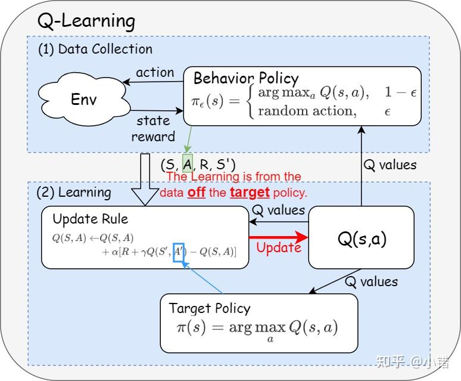
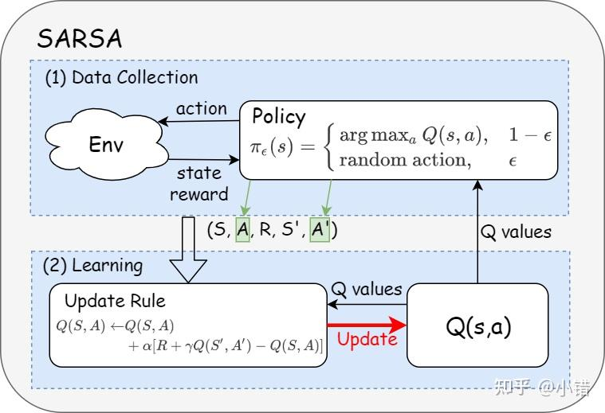

# 强化学习基础：Off-Policy、重要性采样、PPO 与 ERC

## TL;DR

强化学习可以拆成两件事：`采样` 与 `学习`。`off-policy` 通过行为策略与目标策略解耦提高数据利用率；重要性采样用于分布校正，但会带来高方差；`PPO-Clip` 通过概率比率裁剪约束已采样动作的更新幅度；`ERC`（Entropy Ratio Clipping，熵比裁剪）进一步约束整分布熵漂移，补上 `PPO-Clip` 对未采样动作约束不足的问题。

---

## 1. 图示主线还原

图示可压缩为一条主线：

1. 先用行为策略与环境交互拿到轨迹。
2. 再用目标策略定义学习目标。
3. 若两者不一致，需要分布校正（重要性采样）。
4. 策略梯度类方法继续需要“稳定更新”机制（PPO / ERC）。

---

## 2. Off-Policy 与 On-Policy（结合图示）

### 2.1 Off-Policy：Q-Learning 图示含义

- 行为策略常是 $\epsilon$-greedy：

$$
\pi_\epsilon(s)=
\begin{cases}
\arg\max_a Q(s,a), & 1-\epsilon\\
\text{random action}, & \epsilon
\end{cases}
$$

- 目标策略是贪心策略：$\pi(s)=\arg\max_a Q(s,a)$。
- 核心更新：

$$
Q(S,A) \leftarrow Q(S,A)+\alpha\big[R+\gamma\max_{a'}Q(S',a')-Q(S,A)\big]
$$

这说明“采样策略”和“学习目标策略”可以不同，属于典型 `off-policy`。

### 2.2 On-Policy：SARSA 图示含义

SARSA 使用与采样一致的下一步动作 $A'$ 做 bootstrap：

$$
Q(S,A) \leftarrow Q(S,A)+\alpha\big[R+\gamma Q(S',A')-Q(S,A)\big]
$$

因为更新目标直接依赖当前执行策略，属于 `on-policy`。

---

## 3. 重要性采样（公式补全）

### 3.1 从期望重写得到权重

若目标分布为 $p(x)$，采样分布为 $q(x)$：

$$
\mathbb{E}_{x\sim p}[f(x)] = \int p(x)f(x)dx = \int q(x)\frac{p(x)}{q(x)}f(x)dx = \mathbb{E}_{x\sim q}\left[f(x)\frac{p(x)}{q(x)}\right]
$$

对应 Monte Carlo 估计：

$$
\mathbb{E}_{x\sim p}[f(x)] \approx \frac{1}{N}\sum_{i=1}^{N} f(x_i)\frac{p(x_i)}{q(x_i)},\quad x_i\sim q
$$

其中 $\frac{p(x_i)}{q(x_i)}$ 就是重要性权重。

### 3.2 为什么容易高方差

期望可被校正，但方差不守恒：

$$
\mathrm{Var}_{x\sim q}\left[f(x)\frac{p(x)}{q(x)}\right]
= \mathbb{E}_{x\sim p}\left[f(x)^2\frac{p(x)}{q(x)}\right]-\left(\mathbb{E}_{x\sim p}[f(x)]\right)^2
$$

当 $\frac{p}{q}$ 很大或长尾时，方差会显著放大。这是 `off-policy` 更新不稳定的核心来源之一。

### 3.3 Off-Policy Monte Carlo 形式

给定目标策略 $\pi$、行为策略 $\pi'$，在时刻 `t` 到终点 `T` 的轨迹权重：

$$
\rho_t^T=\prod_{k=t}^{T}\frac{\pi(a_k|s_k)}{\pi'(a_k|s_k)}
$$

回报：

$$
G_t=\sum_{k=t}^{T}\gamma^{k-t}r_k
$$

状态值估计可写作：

$$
V(s)=\frac{\sum_{t\in\mathcal{T}(s)}\rho_t^T G_t}{|\mathcal{T}(s)|}
$$

---

## 4. Q-Learning 为何通常不需要显式重要性采样

关键不是“没有分布偏移”，而是其学习目标是最优贝尔曼算子：

$$
Q^*(s,a)=\sum_{s',r}P(s',r|s,a)\left[r+\gamma\max_{a'}Q^*(s',a')\right]
$$

更新目标中的 $\max_{a'}Q(s',a')$ 不依赖行为策略的动作概率；只要状态-动作覆盖足够，迭代就朝 $Q^*$ 逼近。因此在表格型 Q-Learning 里通常不显式乘重要性权重（DQN 继承这一思想，但还需用目标网络、经验回放等稳态技巧）。

---

## 5. PPO 两种形式

### 5.1 PPO-Penalty

在目标中加入 KL 惩罚：

$$
L^{\text{pen}}(\theta)=\mathbb{E}_t\big[r_t(\theta)\hat A_t-\beta\,\mathrm{KL}(\pi_{\theta_{\text{old}}}(\cdot|s_t)\|\pi_\theta(\cdot|s_t))\big]
$$

优点是全局约束明确，缺点是 $\beta$ 较敏感。

### 5.2 PPO-Clip

$$
L^{\text{clip}}(\theta)=\mathbb{E}_t\left[\min\left(r_t(\theta)\hat A_t,\,\mathrm{clip}(r_t(\theta),1-\epsilon,1+\epsilon)\hat A_t\right)\right]
$$

$$
r_t(\theta)=\frac{\pi_\theta(a_t|s_t)}{\pi_{\theta_{\text{old}}}(a_t|s_t)}
$$

优点是鲁棒且易调参；局限是仅直接约束“采样到的动作”，对未采样动作分布漂移缺乏直接限制。

---

## 6. ERC（Entropy Ratio Clipping）补全

### 6.1 定义

`ERC` 定义新旧策略在同一 token 条件分布上的熵比：

$$
\rho_t = \frac{\mathcal{H}(\pi_\theta,t)}{\mathcal{H}(\pi_{\text{old}},t)}
$$

其中

$$
\mathcal{H}(\pi_\theta,t)=-\sum_{a\in\mathcal{V}}\pi_\theta(a|y_{<t},x)\log\pi_\theta(a|y_{<t},x)
$$

$$
\mathcal{H}(\pi_{\text{old}},t)=-\sum_{a\in\mathcal{V}}\pi_{\text{old}}(a|y_{<t},x)\log\pi_{\text{old}}(a|y_{<t},x)
$$

写成合式即：

$$
\rho_t=
\frac{-\sum_{a\in\mathcal{V}}\pi_\theta(a|y_{<t},x)\log\pi_\theta(a|y_{<t},x)}
{-\sum_{a\in\mathcal{V}}\pi_{\text{old}}(a|y_{<t},x)\log\pi_{\text{old}}(a|y_{<t},x)}
$$

### 6.2 作用机制

- `PPO-Clip`：约束单个样本动作的概率比。
- `ERC`：监控整个动作分布（含未采样动作）的熵变化。

当 $\rho_t$ 超出设定区间 $[\rho_{\min},\rho_{\max}]$ 时，`ERC` 对该样本梯度做截断/抑制，避免策略整体分布快速漂移。

一个直观类比：

- `PPO-Clip` 像“只盯住这次被点名回答的同学（采样动作）”，防止他分数波动太大。
- `ERC` 像“看全班分数分布是否突然从均衡变成两极化（整体熵变化）”。

两者一起用时，前者管“单点不过激”，后者管“整体不失衡”。

### 6.3 常见实现形态（工程写法）

实践里常见一种门控写法：

$$
g_t^{\text{erc}} = g_t \cdot \mathbf{1}\{\rho_{\min}\le \rho_t\le \rho_{\max}\}
$$

即熵比越界则不采用该样本梯度（或改为缩放而非硬截断）。这不是唯一实现，但符合“熵比裁剪”核心思想。

### 6.4 和常见约束的直观对比

| 方法 | 主要盯什么 | 直观优点 | 主要盲区 |
|---|---|---|---|
| `PPO-Clip` | 已采样动作的概率比 $r_t$ | 简单、鲁棒、训练稳定 | 未采样动作可能悄悄大幅变化 |
| `KL-Penalty` | 新旧策略全分布距离（KL） | 全局约束更直接 | 系数较敏感，调参不当会过强/过弱 |
| `ERC` | 新旧策略熵的相对变化 $\rho_t$ | 能快速发现“分布突然变尖/变平” | 只看“形状松紧”，不保证逐 token 概率都被约束 |

可把三者理解为三层保险：

1. `PPO-Clip`：防止“单步动作”跳太猛。
2. `KL-Penalty`：防止“整分布位置”偏太远。
3. `ERC`：防止“整分布形状”突然塌缩或过度发散。

---

## 7. PPO + ERC 训练时看什么

1. `approx_kl`：监控新旧策略偏离程度。
2. `clip_fraction`：判断 PPO-Clip 约束是否过频繁触发。
3. `entropy` 与 `entropy_ratio`：判断探索度与分布漂移。
4. `erc_trigger_rate`：ERC 触发比例过高常意味着更新太激进。
5. `value_loss` / `advantage` 方差：排查是否由估计噪声导致不稳。

---

## 8. 一句话总结

`off-policy` 提升数据利用率，重要性采样负责校正但引入方差；`PPO-Clip` 稳定局部更新，`ERC` 约束全局熵漂移。二者组合的目标是：在不牺牲学习速度的前提下，降低信任域偏离风险。

---

## 9. 逐图对照注释（简版）

### 图 1：Q-Learning 的 Off-Policy 结构

公式：

$$
Q(S,A) \leftarrow Q(S,A)+\alpha\big[R+\gamma\max_{a'}Q(S',a')-Q(S,A)\big]
$$

一句话解释：采样可来自带探索的行为策略，但学习目标由贪心目标策略定义。

### 图 2：SARSA 的 On-Policy 结构

公式：

$$
Q(S,A) \leftarrow Q(S,A)+\alpha\big[R+\gamma Q(S',A')-Q(S,A)\big]
$$

一句话解释：更新目标使用当前策略实际会执行的下一动作，因此采样与学习同策略。
