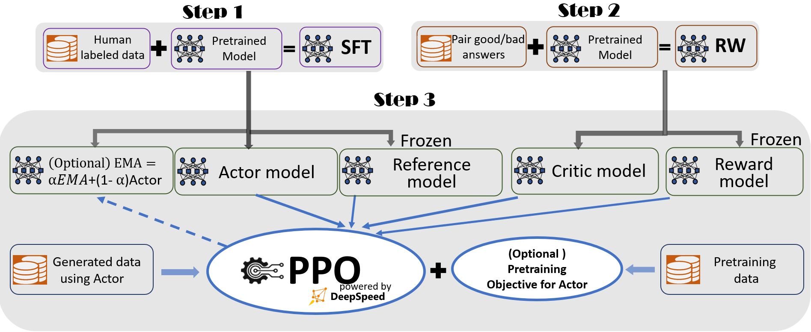
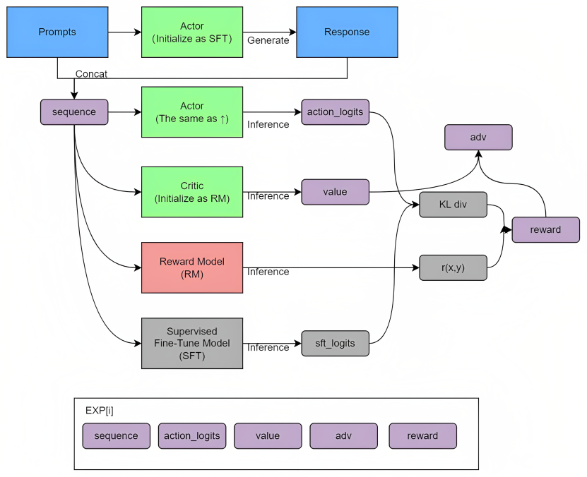
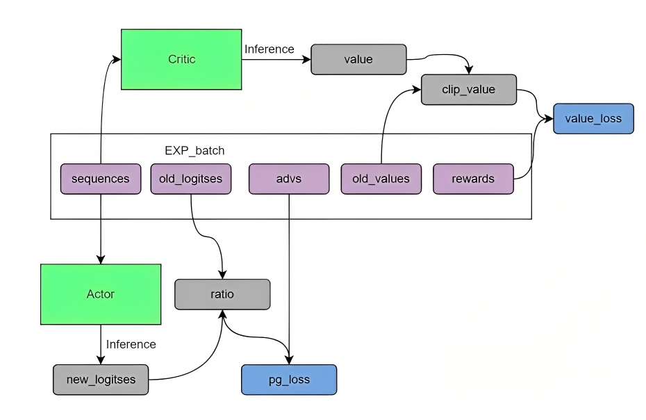

# LLM 后训练阶段是如何工作的（结合 DeepSpeed-Chat 代码）

## TL;DR

如果只关心 `LLM` 后训练（`SFT` 之后）到底在做什么，可以记一句话：

用 `actor` 生成回答，用 `reward model` 给整段回答打分，用 `critic` 估计每一步价值，再用 `PPO` 更新 `actor`，并用 `ref model` 的 `KL` 项限制策略漂移。

---


图：RLHF 三阶段总览。前两步分别得到 `SFT` 与 `RW(RM)`，第三步用 `actor/ref/critic/reward` 进入 `PPO` 训练。

---

## 1. 概念对应关系（先把名词对齐）

下面是 `RL` 抽象和 `DeepSpeed-Chat` 实现的一一对应：

| RL/LLM 概念 | 在代码里的实体 | 代码位置 |
|---|---|---|
| `state s_t`（当前状态） | `prompt + 已生成前缀 token` | `seq` 与 `attention_mask` 在 Step3 主循环中构造 |
| `action a_t`（当前动作） | 本步生成的下一个 token | `actor_model.module.generate(...)` |
| `policy πθ(a_t\|s_t)` | `actor` 输出的 token 概率分布 | `dschat/rlhf/ppo_trainer.py` |
| `reference policy πref(a_t\|s_t)` | 冻结的 `ref` 模型（通常由 SFT 初始化） | `dschat/rlhf/rlhf_engine.py` 的 `_init_ref` |
| 序列级偏好奖励 | `reward_model.forward_value(...)[chosen_end_scores]` | `dschat/rlhf/ppo_trainer.py` |
| 每步价值 `V(s_t)` | `critic_model.forward_value(..., return_value_only=True)` | `dschat/rlhf/ppo_trainer.py` |
| `KL penalty` | `-kl_ctl * (log_probs - ref_log_probs)` | `compute_rewards` |
| `advantage` / `return` | `get_advantages_and_returns`（`GAE` 形式） | `ppo_trainer.py` |
| 策略更新 | `actor_loss_fn`（`PPO-Clip`） | `ppo_trainer.py` |
| 价值更新 | `critic_loss_fn`（value clipping） | `ppo_trainer.py` |

关键点：这里不是直接训练一个“奖励最大化文本分类器”，而是训练一个“逐 token 决策策略”。

---

## 2. DeepSpeed-Chat 的 RLHF 流程（按执行顺序走一遍）

本节对应入口：`training/step3_rlhf_finetuning/main.py`。

### 2.1 初始化阶段：四个模型各司其职

`DeepSpeedRLHFEngine` 会初始化四个角色：

- `actor`：要被优化的生成模型（策略）。
- `ref`：冻结参考模型，用来算 KL 约束。
- `critic`：价值模型，估计每个位置的 value。
- `reward`：奖励模型，给整段回答输出末端分数。

代码入口在 `dschat/rlhf/rlhf_engine.py` 的 `__init__`，对应 `_init_actor/_init_ref/_init_critic/_init_reward`。

一个容易混淆点：`critic` 和 `reward` 都是 `RewardModel` 结构，但用途不同。

- `reward` 只用于给 rollout 打分，不参与 PPO 反传。
- `critic` 用同样的 value head 结构，但会被训练来逼近 return。

这就是为什么 Step3 需要两个“看起来很像”的模型实例。

### 2.2 经验采样：先生成，再打分

在主循环里，每个 batch 会调用：

```python
out = trainer.generate_experience(batch_prompt['prompt'],
                                  batch_prompt['prompt_att_mask'],
                                  step)
```

`generate_experience` 做了 5 件事：

1. `actor.generate` 生成完整序列 `seq = prompt + answer`。  
2. 用 `actor` 再前向一次，拿到已采样动作的 `logprobs`。  
3. 用 `ref` 前向，拿到 `ref_logprobs`（用于 KL 项）。  
4. 用 `reward_model.forward_value(..., prompt_length=...)` 拿序列奖励分（`chosen_end_scores`）。  
5. 用 `critic.forward_value(..., return_value_only=True)` 拿每个位置的 `values`。  

最后返回的就是 PPO 所需的一包 rollout 数据：
`{logprobs, ref_logprobs, rewards, value, input_ids, attention_mask, prompts}`。


图：Step3 经验采样与奖励构造（对应 `generate_experience`，强调 `actor/ref/reward/critic` 如何共同形成 `adv/reward`）。

### 2.3 奖励重构：把“末端奖励”变成“每步奖励”

真正用于 `advantage` 的不是原始 `reward_score`，而是重构后的 token 级奖励：

```python
kl_divergence_estimate = -self.kl_ctl * (log_probs - ref_log_probs)
rewards = kl_divergence_estimate
rewards[last_answer_token] += clipped_reward_score
```

对应函数：`compute_rewards`。

这段逻辑非常关键，表示目标函数近似为：

$$
r_t = -\beta \left(\log \pi_\theta(a_t|s_t)-\log \pi_{\text{ref}}(a_t|s_t)\right)
$$

并在最后一个回答 token 位置额外加上 `RM` 的序列奖励。  
直观上就是：

- 每一步都付出“偏离参考策略”的代价；
- 只有整段回答结束时拿到“答得好不好”的主奖励。

### 2.4 优势估计：从 rewards + values 得到训练信号

`get_advantages_and_returns` 使用的是 `GAE` 递推：

$$
\delta_t=r_t+\gamma V(s_{t+1})-V(s_t)
$$

$$
A_t=\delta_t+\gamma\lambda A_{t+1}
$$

代码里默认 `gamma=1.0, lam=0.95`。  
这里的 `gamma=1.0` 不是“理论必须”，而是这份实现的设定。

### 2.5 PPO 更新：Actor 与 Critic 各自优化

在 `train_rlhf` 里：

- `actor_loss_fn` 用 `PPO-Clip`：
  - 比值 `ratio = exp(logprobs - old_logprobs)`
  - 用 `clip(ratio, 1-eps, 1+eps)` 抑制更新过猛
- `critic_loss_fn` 用 value clipping，避免 value 网络震荡

这一步就是后训练阶段的核心“学习”动作。

### 2.6 主循环组织：生成批与训练批解耦

`MiniDataset` 的作用是把“生成批”切成多个“训练小批”，并可多轮 `ppo_epochs` 重放。  
这就是 PPO 的典型形态：先 rollout，再对同一批经验做若干次优化。

### 2.7 最直观循环骨架（对应 `step3_rlhf_finetuning/main.py`）

```python
for step, batch_prompt in prompt_dataloader:
    # A. 采样阶段：每个 prompt 先生成 1 条 answer（形成 1 条轨迹样本）
    out = trainer.generate_experience(
        batch_prompt["prompt"], batch_prompt["prompt_att_mask"], step
    )

    # B. 暂存经验：累计到 generation_batches 后再进入训练
    exp_dataset = exp_mini_dataset.add(out)
    if exp_dataset is None:
        continue

    # C. 训练阶段：同一批已采样样本会被重复训练 ppo_epochs 轮
    for ppo_ep in range(args.ppo_epochs):
        for exp_data in exp_dataset:   # exp_data 是切好的训练微批
            actor_loss, critic_loss = trainer.train_rlhf(exp_data)

    # D. 清空缓存，回到下一轮采样
```

用一句话描述就是：
`一次 prompt 先产出一次样本（rollout），然后该样本会在训练环节被复用多次（ppo_epochs × 若干微批）`。

---

## 3. 你最关心的后训练本质：到底学到了什么

把上面合起来，Step3 本质上在学三件事：

1. `actor` 学会在“高 RM 分 + 低 KL 代价”之间折中。  
2. `critic` 学会预测“当前前缀下，未来总回报大概是多少”。  
3. 整个系统通过 `PPO-Clip + value clip + KL` 保证更新稳定，不让策略瞬间漂移。  

所以你可以把 `RLHF` 理解成：

不是在教模型“正确答案是什么”（这更像 SFT），  
而是在教模型“在已有能力上，哪些生成轨迹更符合人类偏好且更可控”。

---

## 4. 单条样本时序图（文本版，含张量形状）

下面把一条样本（为便于看形状，仍用 batch 维表示）从 `prompt` 到一次参数更新串起来。

约定符号：

- `B_gen`：生成批大小（`per_device_generation_batch_size`）
- `B_train`：训练微批大小（`per_device_training_batch_size`）
- `P`：prompt 长度（经 collator 对齐后，通常是 `max_prompt_seq_len`）
- `A`：answer 最大长度（`max_answer_seq_len`）
- `T`：实际总长度（`prompt + answer`，且 `T <= P + A`）
- `V`：词表大小

时序：

1. 输入 prompt（来自 `DataCollatorRLHF`）  
   - `prompt`: `[B_gen, P]`  
   - `prompt_att_mask`: `[B_gen, P]`

2. `actor.generate` 生成回答（`generate_experience -> _generate_sequence`）  
   - `seq`（prompt+answer）: `[B_gen_valid, T]`  
   - 这里可能丢弃过短回答，所以 `B_gen_valid <= B_gen`

3. rollout 打包（`generate_experience`）  
   - `actor logits`: `[B_gen_valid, T, V]`  
   - `ref logits`: `[B_gen_valid, T, V]`  
   - `logprobs = gather(logits[:, :-1], seq[:, 1:])`: `[B_gen_valid, T-1]`  
   - `ref_logprobs`: `[B_gen_valid, T-1]`  
   - `reward_score = chosen_end_scores`: `[B_gen_valid]`  
   - `values = critic(..., return_value_only=True)[:, :-1]`: `[B_gen_valid, T-1]`  
   - `attention_mask = (seq != pad)`: `[B_gen_valid, T]`

4. 奖励重构（`compute_rewards`）  
   - `kl_term = -kl_ctl * (logprobs - ref_logprobs)`: `[B_gen_valid, T-1]`  
   - `rewards` 初始等于 `kl_term`  
   - 在每条样本最后一个 answer token 位置加上 `reward_score`（裁剪后）  
   - 最终 `rewards`: `[B_gen_valid, T-1]`

5. 优势与回报（`get_advantages_and_returns`）  
   - `start = P - 1`（从回答起点对应的动作位置开始）  
   - `advantages`: `[B_gen_valid, T-1-start]`  
   - `returns`: `[B_gen_valid, T-1-start]`

6. 从生成批切成训练微批（`MiniDataset`）  
   - 每个 `exp_data` 的 batch 维从 `B_gen_valid` 切成若干个 `B_train`

7. Actor 更新（`train_rlhf -> actor_loss_fn`）  
   - 新前向 `actor_log_prob`: `[B_train, T-1]`  
   - 取回答区间 `actor_log_prob[:, start:]`: `[B_train, T-1-start]`  
   - 与旧策略 `old_logprobs[:, start:]`、`advantages` 计算 `PPO-Clip` loss  
   - 反传并 `actor.step()`

8. Critic 更新（`train_rlhf -> critic_loss_fn`）  
   - 新 `value[:, :-1]`: `[B_train, T-1]`  
   - 取回答区间 `value[:, start:]`: `[B_train, T-1-start]`  
   - 对齐 `returns` 做 value clipping loss  
   - 反传并 `critic.step()`

一句话看完这一条链路：
`prompt -> actor rollout -> RM+KL 得到 token 级 reward -> GAE 得 advantage -> PPO 更新 actor + value 回归更新 critic`。

---


图：Step3 PPO 参数更新（对应 `train_rlhf`，左下是 `pg_loss`，右上是 `value_loss`）。

## 5. 最小伪代码（变量名对齐 `ppo_trainer.py`）

```python
# [1] generate_experience: 采样 + 打分 + 打包“旧策略信息”
seq = actor.generate(prompts, attention_mask=prompt_mask)  # rollout
attention_mask = (seq != pad_token_id).long()
with no_grad():
    logits = actor(seq, attention_mask=attention_mask).logits
    logits_ref = ref(seq, attention_mask=attention_mask).logits
    log_probs = gather_log_probs(logits[:, :-1, :], seq[:, 1:])          # old_logprobs
    ref_log_probs = gather_log_probs(logits_ref[:, :-1, :], seq[:, 1:])
    reward_score = reward.forward_value(
        seq, attention_mask, prompt_length=prompt_len
    )["chosen_end_scores"]                                                # 末端序列奖励
    old_values = critic.forward_value(
        seq, attention_mask, return_value_only=True
    )[:, :-1]

start = prompt_len - 1
action_mask = attention_mask[:, 1:]
old_rewards = -kl_ctl * (log_probs - ref_log_probs)                      # KL 项
old_rewards[last_answer_token] += clamp(reward_score, -clip_reward, clip_reward)
advantages, returns = get_advantages_and_returns(old_values, old_rewards, start)

# [2] train_rlhf: 用同一批样本做 PPO 更新（actor + critic）
new_logits = actor(seq, attention_mask=attention_mask, use_cache=False).logits
new_log_probs = gather_log_probs(new_logits[:, :-1, :], seq[:, 1:])
actor_loss = actor_loss_fn(
    new_log_probs[:, start:], log_probs[:, start:], advantages, action_mask[:, start:]
)
actor.backward(actor_loss)
actor.step()

new_values = critic.forward_value(
    seq, attention_mask=attention_mask, return_value_only=True, use_cache=False
)[:, :-1]
critic_loss = critic_loss_fn(
    new_values[:, start:], old_values[:, start:], returns, action_mask[:, start:]
)
critic.backward(critic_loss)
critic.step()

# [3] 外层主循环复用样本：同一批 rollout 会重复训练 ppo_epochs 轮
for ppo_ep in range(ppo_epochs):
    for exp_data in exp_dataset_minibatches:
        train_rlhf(exp_data)
```

上面代码里的 `[1]/[2]/[3]` 分别对应：

1. `generate_experience` 只负责“采样+打分+打包旧策略信息”。  
2. `train_rlhf` 负责“用同一批样本做 PPO 更新”。  
3. `ppo_epochs` 越大，单次 rollout 的样本复用次数越高。

---

## 代码导航（相对 `DeepSpeedExamples`）

- Step3 入口：`applications/DeepSpeed-Chat/training/step3_rlhf_finetuning/main.py`
- 四模型初始化：`applications/DeepSpeed-Chat/dschat/rlhf/rlhf_engine.py`
- PPO 与奖励重构：`applications/DeepSpeed-Chat/dschat/rlhf/ppo_trainer.py`
- 奖励模型结构：`applications/DeepSpeed-Chat/dschat/utils/model/reward_model.py`
- Step2 RM 训练入口：`applications/DeepSpeed-Chat/training/step2_reward_model_finetuning/main.py`

---

## 6. 后训练新技术补充：`PPO / DPO / GRPO / OPD`

下面按“先介绍，再对比”的顺序来补充。

### 6.1 `PPO`（简述，本文主线）

`PPO` 是当前文档已经详细展开的方法：  
先用当前策略在线采样（rollout），再用 `RM` 给序列奖励、用 `critic` 做 value 估计，最后用剪切目标更新策略。

你可以把它理解为“完整 RL 管线”：

- 有策略模型（`actor`）
- 有参考模型（`ref`，用于 KL 约束）
- 有价值模型（`critic`）
- 常配奖励模型（`reward model`）

优点是优化目标直接、可控性强；代价是工程链路长，训练成本高。

### 6.2 `DPO`（Direct Preference Optimization）

`DPO` 的核心思想是：  
直接用偏好对数据（`chosen` vs `rejected`）训练策略，不显式跑 PPO 这类在线 RL 回路。

直观理解：

- 给同一个 prompt 两个回答（好/坏）
- 让模型提高好回答相对坏回答的对数概率差
- 同时相对参考模型做约束（常见为隐式 KL 形式）

在工程上，`DPO` 常被看成“偏好学习的监督化改写”：

- 不需要单独训练 `critic`
- 通常也不需要在线 rollout
- 实现与调参难度明显低于 PPO

局限是它基本受制于离线偏好数据分布，在线探索能力较弱。

### 6.3 `GRPO`（Group Relative Policy Optimization）

`GRPO` 常见做法是：  
对同一 prompt 采样一组回答，在组内做相对比较，构造“相对优势”来更新策略。

它和 PPO 的关系是“仍在做策略优化，但信号构造方式更轻”：

- 强调组内相对奖励，而不是强依赖单独 value 网络
- 在一些实现里可弱化或移除 `critic`
- 仍然可以保留 KL/参考策略约束

优势是训练路径可能更简化，且能减轻 critic 偏差带来的问题；  
难点是对“组采样质量、组大小、奖励噪声”较敏感。

### 6.4 `OPD`（On-Policy Distillation）

`OPD` 可以理解成：  
先用 on-policy 方式产生当前策略分布上的样本，再把“改进策略”过程蒸馏到学生模型。

一个直观视角是把“RL 更新”转成“蒸馏更新”：

- 数据仍来自当前策略（on-policy）
- 但优化目标更接近蒸馏损失，而不一定是标准 PPO loss
- 可以更好复用蒸馏基础设施，训练往往更稳

它适合“已有较强 teacher 或蒸馏管线”的场景；  
上限会受 teacher 质量与采样分布覆盖影响。

### 6.5 对比与选型

| 方法 | 主要训练信号 | 是否在线采样 | 是否依赖 Critic | 工程复杂度 | 适用场景 |
|---|---|---|---|---|---|
| `PPO` | 奖励 + KL + GAE/value | 是 | 通常是 | 高 | 需要强可控、愿意承担复杂度 |
| `DPO` | 偏好对相对概率目标 | 否（多为离线） | 否 | 低 | 先快速做偏好对齐、资源有限 |
| `GRPO` | 组内相对优势/相对奖励 | 是 | 常可弱化 | 中 | 想保留在线优化但降低 critic 负担 |
| `OPD` | on-policy 数据上的蒸馏目标 | 是 | 不强依赖 | 中 | 已有蒸馏体系，优先稳定和吞吐 |

实用建议（从易到难）：

1. 先要“快速可用”：优先 `DPO`。  
2. 需要在线探索和更细致控制：考虑 `PPO` 或 `GRPO`。  
3. 已有 teacher/蒸馏基础设施，且追求稳定迭代：加入 `OPD`。  
