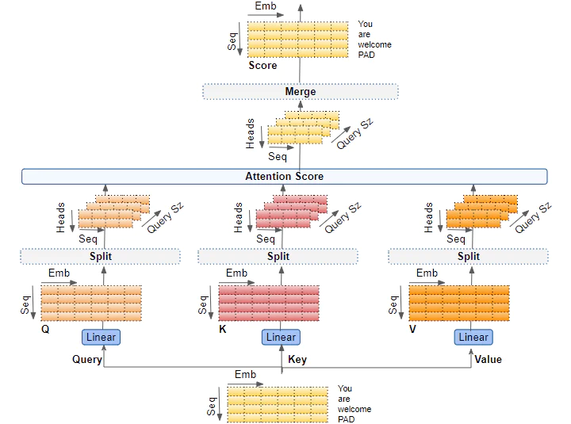
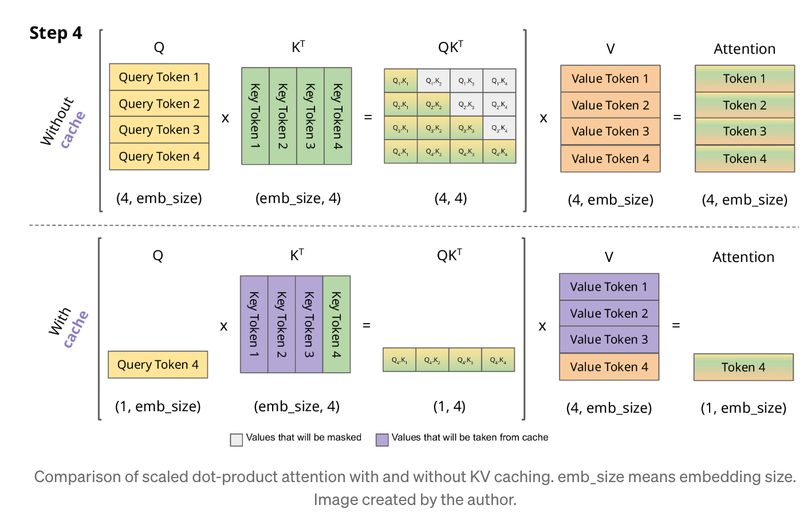
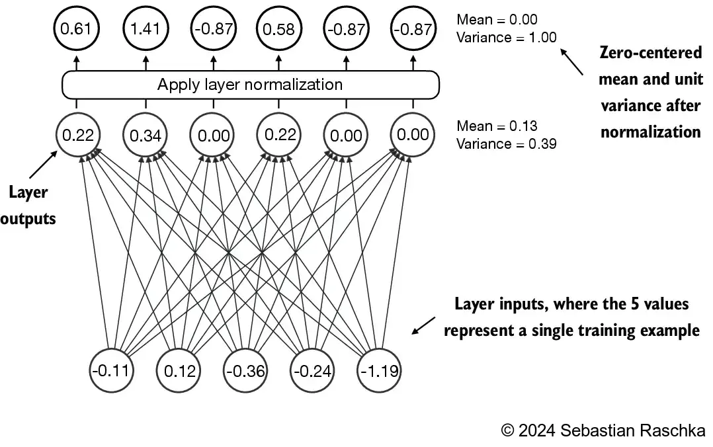
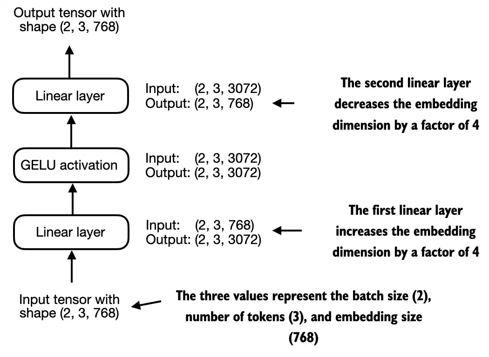
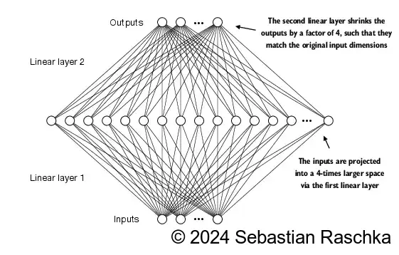
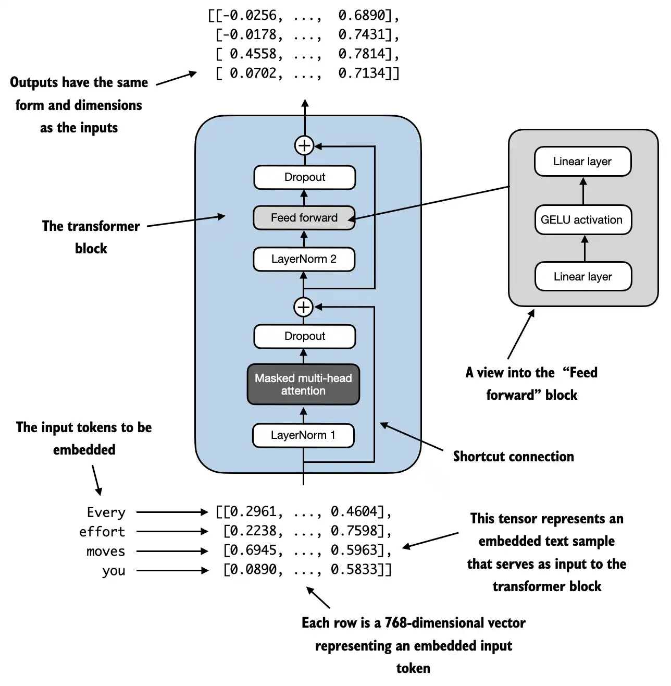
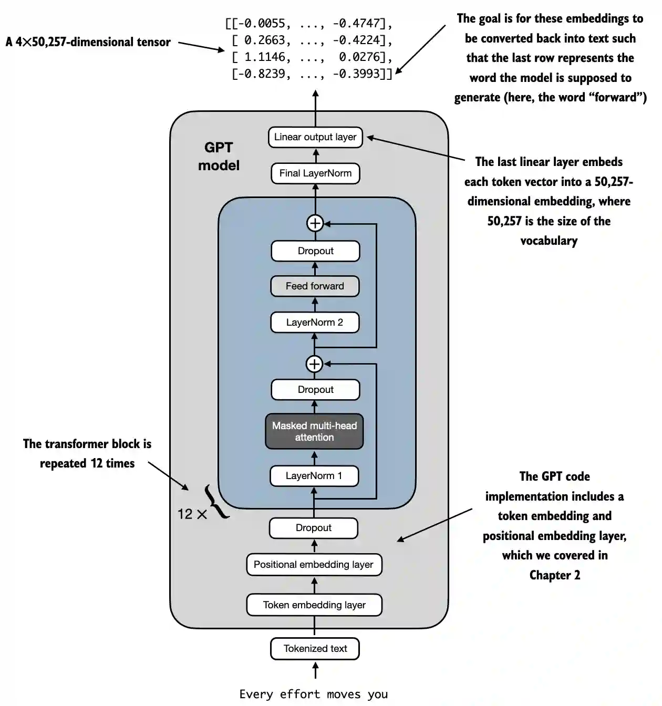
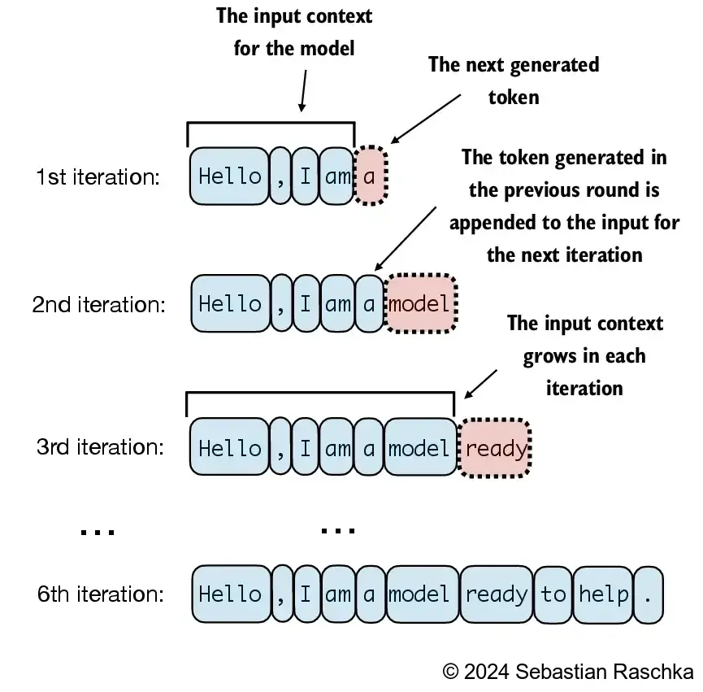

# Transformer：注意力计算与从 0 构建

## 1. 注意力机制：算什么，为什么这样算

### 1.1 Scaled Dot-Product Attention
给定查询、键、值矩阵：

$$
\mathrm{Attention}(Q, K, V) = \mathrm{softmax}\left(\frac{QK^T}{\sqrt{d_k}}\right)V
$$

步骤：
1. `QK^T` 计算 token 间相关性分数。
2. 除以 $\sqrt{d_k}$，避免 softmax 过早饱和。
3. softmax 把分数变成权重。
4. 用权重对 `V` 加权求和得到输出。


### 1.2 多头注意力的数据流
常见形状变化：

`(B, T, C)`
`-> (B, T, H * D)`
`-> (B, H, T, D)`
`-> attention(Q, K, V)`
`-> (B, H, T, D)`
`-> (B, T, H * D)`
`-> (B, T, C)`

其中 `C = H * D`。




## 2. 推理效率：KV Cache 的价值

自回归推理时：
- 不用 KV Cache：每步都重算历史 token 的 `K/V`。
- 用 KV Cache：历史 `K/V` 复用，仅计算新 token 的 `Q/K/V` 并追加缓存。

结果是解码时延显著下降，尤其是长上下文场景。 
参考阅读：<https://spaces.ac.cn/archives/10091>




## 3. Transformer Block 内部结构

一个标准 Pre-LN block（LayerNorm 在子层之前）可以写成两段：
1. 注意力子层：`x -> LayerNorm -> Masked Multi-Head Attention -> Dropout -> Residual Add`
2. 前馈子层：`x -> LayerNorm -> FeedForward(Linear 扩维 -> GELU -> Linear 降维) -> Dropout -> Residual Add`

### 3.1 子层 1：LN + Masked MHA + 残差
- `LN`：先把每个 token 向量做标准化，稳定训练，减少层间分布漂移。
- `Masked MHA`：做因果注意力，位置 `t` 只能看 `<= t` 的 token。
- `Residual Add`：保留原始信息与梯度通路，避免深层退化。

### 3.2 子层 2：LN + FFN + 残差
- `FFN` 通常是 `Linear(C, 4C) -> GELU -> Linear(4C, C)`。
- 第一层扩维用于提升特征组合能力，第二层再投影回模型维度 `C`。
- 这一段不做 token 间交互，而是对每个位置独立地做表示变换。


图解：这张图展示了 LayerNorm 后“均值接近 0、方差接近 1”的效果，说明标准化在每个样本内部生效。


图解：输入从 `(B,T,C)` 映射到 `(B,T,4C)`，激活后再回到 `(B,T,C)`。


图解：流程强调“先放大、再压回”，中间靠非线性激活提升表达能力。

### 3.3 整体 Block 串联关系
- 先做注意力子层，再做前馈子层。
- 两次残差都在子层末尾做相加，输入输出形状保持一致（通常都是 `(B,T,C)`）。
- Dropout 仅在训练阶段启用，推理时会自动关闭。


图解：这张图把两段子层放在同一个 block 中展示，能看到每段都有 `LN + 子层计算 + 残差` 的重复结构。

## 4. GPT 组装与生成流程

GPT 主体可看作：
`Token Embedding + Positional Embedding -> N 个 TransformerBlock -> Final LayerNorm -> LM Head`




## 5. 从 0 构建：可运行实现

`GELU`（Gaussian Error Linear Unit）是 Transformer 常用激活函数。它不是像 ReLU 那样把负值直接截断为 0，而是做“平滑门控”：输入越大越容易通过，输入较小或为负时会被连续抑制。常见近似公式：

$$
\mathrm{GELU}(x) \approx 0.5x\left(1+\tanh\left(\sqrt{\frac{2}{\pi}}\left(x+0.044715x^3\right)\right)\right)
$$

```python
import math
import torch
import torch.nn as nn


class LayerNorm(nn.Module):
    def __init__(self, emb_dim: int):
        super().__init__()
        self.eps = 1e-5
        self.scale = nn.Parameter(torch.ones(emb_dim))
        self.shift = nn.Parameter(torch.zeros(emb_dim))

    def forward(self, x: torch.Tensor) -> torch.Tensor:
        mean = x.mean(dim=-1, keepdim=True)
        var = x.var(dim=-1, keepdim=True, unbiased=False)
        x_hat = (x - mean) / torch.sqrt(var + self.eps)
        return self.scale * x_hat + self.shift


class GELU(nn.Module):
    def forward(self, x: torch.Tensor) -> torch.Tensor:
        # tanh 近似 GELU，且不在 forward 内创建新 tensor，避免 device/dtype 不一致
        return 0.5 * x * (1.0 + torch.tanh(math.sqrt(2.0 / math.pi) * (x + 0.044715 * x.pow(3))))


class FeedForward(nn.Module):
    def __init__(self, cfg: dict):
        super().__init__()
        emb_dim = cfg["emb_dim"]
        self.layers = nn.Sequential(
            nn.Linear(emb_dim, 4 * emb_dim),
            GELU(),
            nn.Linear(4 * emb_dim, emb_dim),
        )

    def forward(self, x: torch.Tensor) -> torch.Tensor:
        return self.layers(x)


class MultiHeadAttention(nn.Module):
    def __init__(
        self,
        d_in: int,
        d_out: int,
        context_length: int,
        num_heads: int,
        dropout: float,
        qkv_bias: bool = False,
    ):
        super().__init__()
        if d_out % num_heads != 0:
            raise ValueError("d_out 必须能被 num_heads 整除")

        self.num_heads = num_heads
        self.head_dim = d_out // num_heads
        self.d_out = d_out

        self.W_q = nn.Linear(d_in, d_out, bias=qkv_bias)
        self.W_k = nn.Linear(d_in, d_out, bias=qkv_bias)
        self.W_v = nn.Linear(d_in, d_out, bias=qkv_bias)
        self.out_proj = nn.Linear(d_out, d_out)
        self.attn_drop = nn.Dropout(dropout)

        mask = torch.triu(torch.ones(context_length, context_length), diagonal=1).bool()
        self.register_buffer("causal_mask", mask, persistent=False)

    def forward(self, x: torch.Tensor) -> torch.Tensor:
        b, t, _ = x.shape

        q = self.W_q(x).view(b, t, self.num_heads, self.head_dim).transpose(1, 2)
        k = self.W_k(x).view(b, t, self.num_heads, self.head_dim).transpose(1, 2)
        v = self.W_v(x).view(b, t, self.num_heads, self.head_dim).transpose(1, 2)

        scores = (q @ k.transpose(-2, -1)) / math.sqrt(self.head_dim)
        scores = scores.masked_fill(self.causal_mask[:t, :t], float("-inf"))

        attn = torch.softmax(scores, dim=-1)
        attn = self.attn_drop(attn)

        context = attn @ v
        context = context.transpose(1, 2).contiguous().view(b, t, self.d_out)
        return self.out_proj(context)


class TransformerBlock(nn.Module):
    def __init__(self, cfg: dict):
        super().__init__()
        self.att = MultiHeadAttention(
            d_in=cfg["emb_dim"],
            d_out=cfg["emb_dim"],
            context_length=cfg["context_length"],
            num_heads=cfg["n_heads"],
            dropout=cfg["drop_rate"],
            qkv_bias=cfg["qkv_bias"],
        )
        self.ff = FeedForward(cfg)
        self.norm1 = LayerNorm(cfg["emb_dim"])
        self.norm2 = LayerNorm(cfg["emb_dim"])
        self.drop_shortcut = nn.Dropout(cfg["drop_rate"])

    def forward(self, x: torch.Tensor) -> torch.Tensor:
        # 子层 1：LN + Masked MHA + Dropout + Residual
        shortcut = x
        x = self.norm1(x)
        x = self.att(x)
        x = self.drop_shortcut(x)
        x = x + shortcut

        # 子层 2：LN + FFN + Dropout + Residual
        shortcut = x
        x = self.norm2(x)
        x = self.ff(x)
        x = self.drop_shortcut(x)
        x = x + shortcut
        return x


class GPTModel(nn.Module):
    def __init__(self, cfg: dict):
        super().__init__()
        self.tok_emb = nn.Embedding(cfg["vocab_size"], cfg["emb_dim"])
        self.pos_emb = nn.Embedding(cfg["context_length"], cfg["emb_dim"])
        self.drop_emb = nn.Dropout(cfg["drop_rate"])
        self.trf_blocks = nn.Sequential(*[TransformerBlock(cfg) for _ in range(cfg["n_layers"])])
        self.final_norm = LayerNorm(cfg["emb_dim"])
        self.out_head = nn.Linear(cfg["emb_dim"], cfg["vocab_size"], bias=False)

    def forward(self, in_idx: torch.Tensor) -> torch.Tensor:
        _, seq_len = in_idx.shape
        tok_embeds = self.tok_emb(in_idx)

        pos = torch.arange(seq_len, device=in_idx.device, dtype=torch.long)
        pos_embeds = self.pos_emb(pos).unsqueeze(0)

        x = tok_embeds + pos_embeds
        x = self.drop_emb(x)
        x = self.trf_blocks(x)
        x = self.final_norm(x)
        return self.out_head(x)
```
