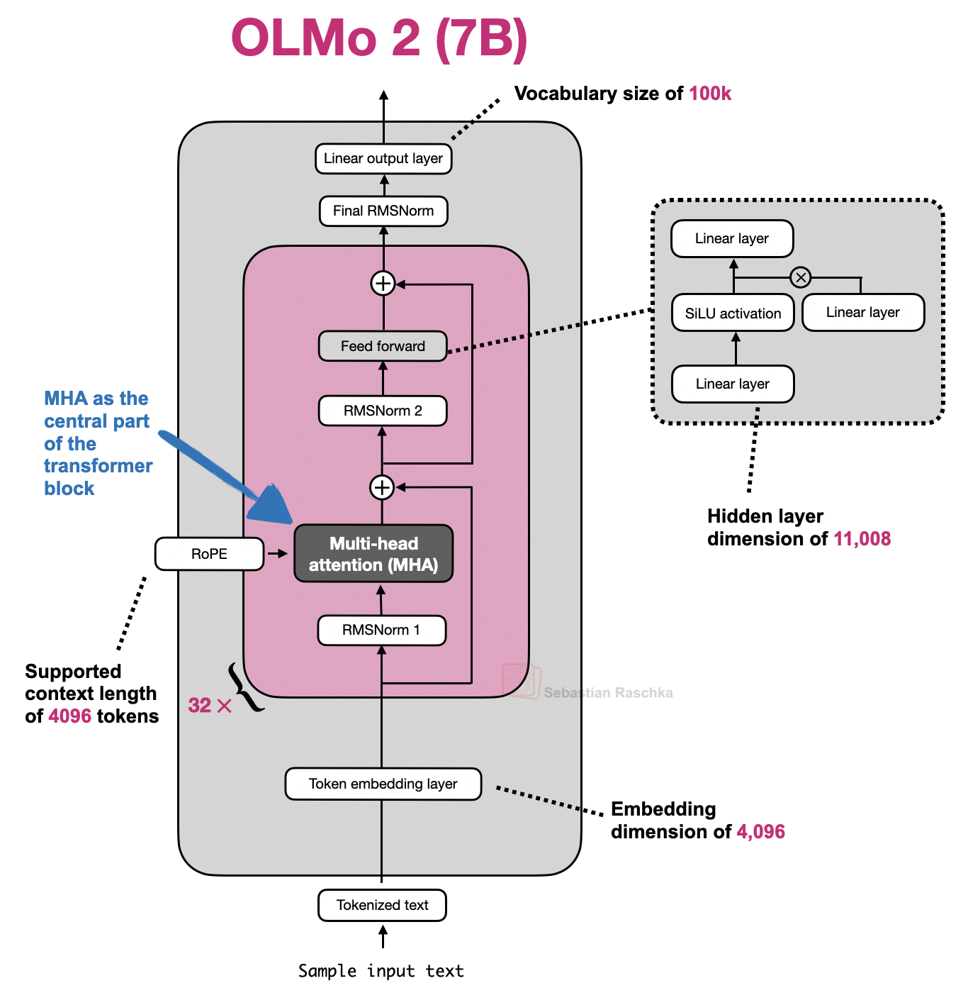
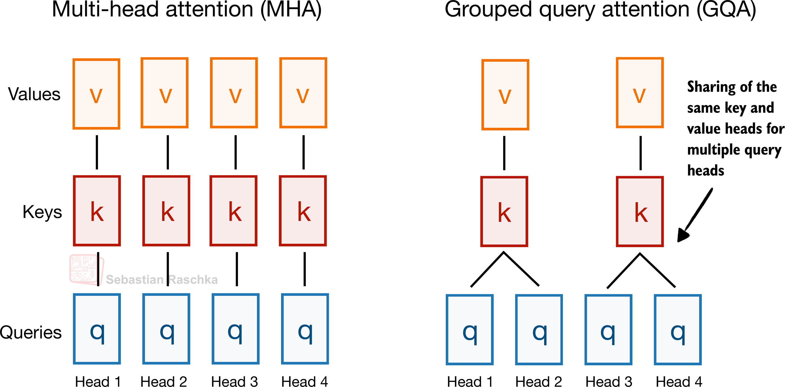
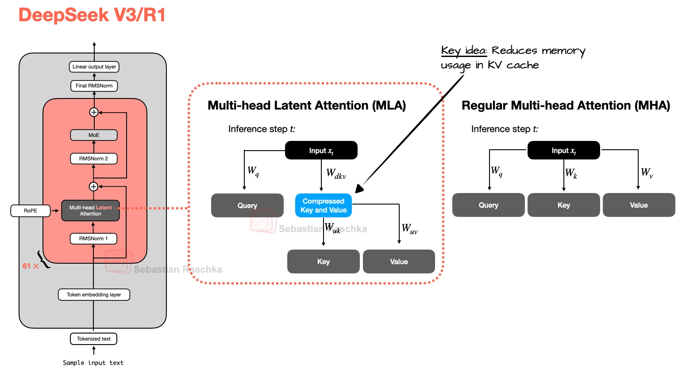
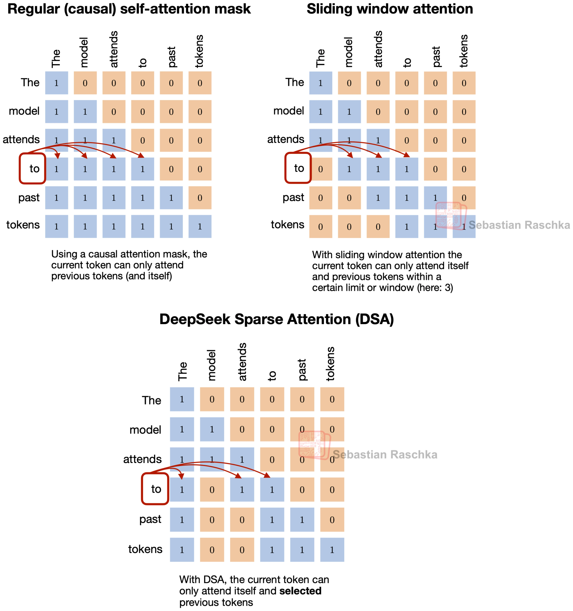
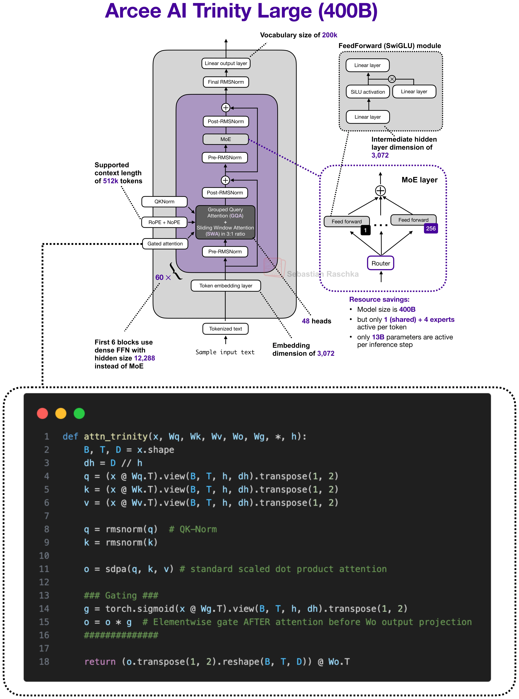
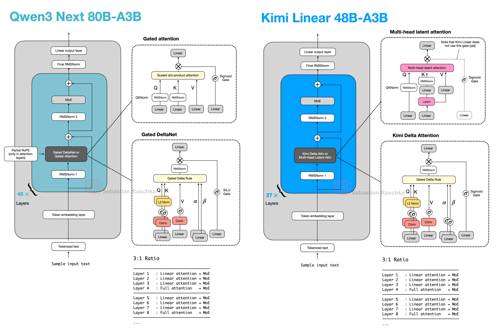

# Visual Attention Variants（2026）

## 文档信息

- 原文：A Visual Guide to Attention Variants in Modern LLMs
- 作者：Sebastian Raschka
- 发布时间：2026-03-22
- 链接：https://magazine.sebastianraschka.com/p/visual-attention-variants
- 整理日期：2026-04-14

---

## TL;DR

这篇文章给出的主线是：LLM 注意力演进并非“单一路线替代”，而是围绕长上下文推理成本，在 `KV 缓存体积`、`可检索范围`、`实现复杂度` 与 `建模质量` 之间做工程化折中。

---

## 1. 七类注意力变体（从经典到前沿）

1. `MHA`（Multi-Head Attention）
标准 Transformer 注意力，每个头都有独立 `Q/K/V` 投影，表达能力强、行为直观，也是多数后续变体的参照基线。  
代价是随着上下文长度增长，`KV cache`、带宽和延迟压力迅速上升，尤其在在线 decode 阶段更明显。

2. `GQA`（Grouped-Query Attention）
通过“更多 query 头共享更少的 K/V 头”来压缩缓存体积，核心收益是显存占用下降、缓存读写压力下降、长上下文吞吐更稳。  
它对现有 Transformer 工程改造较小，因此在产业侧普及很快；实践里常被用作 MHA 的默认降本替代方案。

3. `MLA`（Multi-Head Latent Attention）
和 GQA 一样目标是降 KV 成本，但手段是把缓存对象改为潜空间表示，再在需要时重建可用状态。  
这种“压缩型”路径在大模型与长上下文条件下更有潜力兼顾效率和质量，但实现难度、调参与服务栈复杂度通常高于 GQA。

4. `SWA`（Sliding Window Attention）
核心思想是把“每个 token 看全历史”改为“只看最近窗口”，将全局注意力改为局部注意力。  
它通常不是单独使用，而是和少量全局层按比例混合；工程上关键参数是窗口大小与 local/global 层比。

5. `DSA`（DeepSeek Sparse Attention）
与 SWA 的共同点是都不再关注完整前缀；差异在于 DSA 不用固定窗口，而是学习“哪些历史位置值得看”。  
它通过 `indexer + selector` 先打分再选取高价值历史 token，理论上能在同等预算下获得更高信息密度，但实现链路更复杂。

6. `Gated Attention`
它更像是“改造后的全注意力块”而不是独立家族，重点是稳定性和可控性增强。  
典型做法包括输出门控、QK 归一化变体、partial RoPE 等，常用于 Hybrid 架构里承担周期性“强检索”职责的重层。

7. `Hybrid Attention`
它是架构模式，不是单个算子：多数层换成线性注意力或状态空间模块，少数层保留重注意力做精确内容检索。  
本质是把“计算预算”重分配到最需要的层位，常见结构如 `3:1` 轻重层交替，目标是在超长上下文下获得更优吞吐/显存曲线。

> 图片来源：Sebastian Raschka 原文《A Visual Guide to Attention Variants in Modern LLMs》（2026-03-22）。

---

## 2. 文章中的关键比较逻辑

## 2.1 GQA vs MLA：同目标，不同手段

- 共同目标：都在解决 `KV cache` 的显存与带宽压力，尤其是长上下文 decode 阶段的成本问题。
- GQA 路线：用“共享”换效率，减少 K/V 头数量，改造成本低、兼容性好、训练与部署链路更成熟。
- MLA 路线：用“压缩”换效率，缓存潜表示并在需要时重建，理论上在相同 KV 预算下可能保持更好的建模能力。
- 主要取舍：GQA 更稳健、落地快；MLA 潜力更高，但实现复杂、调参与推理栈要求更高。
- 工程判断：如果目标是快速稳定上线，优先 GQA；如果目标是大模型长上下文效率上限，可评估 MLA。

## 2.2 SWA vs DSA：都在“少看历史”，但选法不同

- 共同点：都不再让每个 token 访问完整历史前缀，从而降低注意力计算与缓存读取开销。
- SWA：固定窗口的局部注意力，行为可解释、参数少、调优边界清晰（窗口大小与 local/global 比例）。
- DSA：学习型稀疏选择，不固定窗口，而是按相关性动态挑选历史 token（indexer + selector）。
- 主要取舍：SWA 简单稳定但可能漏掉远距离关键 token；DSA 更灵活但系统复杂度和实现门槛更高。
- 工程判断：先用 SWA 建立基线最务实；当固定窗口造成明显质量损失时，再考虑 DSA 一类动态稀疏方案。

## 2.3 Hybrid 的核心不是“替代注意力”，而是“分工”

- Hybrid 不是“把注意力删掉”，而是把不同模块放到最擅长的位置上做分工。
- 轻量层（线性注意力/状态空间）承担大部分序列混合，负责压住长上下文的算力与显存增长曲线。
- 重层（全注意力或门控注意力）周期性出现，负责更精确的内容检索与信息回收，避免纯轻量层检索能力不足。
- 常见结构是 `3:1` 的轻重层配比，但轻层实现可以替换（Gated DeltaNet、Kimi Delta、Lightning、Mamba-2）。
- 工程判断：Hybrid 更像“体系级优化”而非单模块替换，收益可观，但需要推理内核、训练配方和监控链路协同升级。

---

## 3. 作者给出的行业信号（截至 2026-03-22）

1. `GQA` 仍是广泛采用的稳健基线，尤其在实现与训练复杂度上更友好。
2. `MLA` 随 DeepSeek 体系扩散后，逐步成为大模型长上下文效率的重要路线。
3. `DSA` 较新、实现复杂，尚未像 GQA 那样普及。
4. `Hybrid` 已从“分支实验”进入部分主线模型，但推理栈优化成熟度仍在发展中。

---

## 4. 可直接落地的选型框架

## 4.1 先收集 5 个输入条件

1. 目标上下文长度：`8k/32k/128k/256k+`
2. 主优化指标：`TTFT`、`tokens/s`、`单位成本`、`质量稳定性`
3. 研发资源：是否有内核改造与训练配方迭代能力
4. 上线节奏：是否必须在短周期内稳定交付
5. 风险承受：能否接受较复杂架构带来的调试与回归成本

## 4.2 决策树（简化版）

1. 如果你优先“短期上线稳定性”，先选 `GQA`。  
2. 如果你已经跑到长上下文瓶颈（如 `128k+`）且吞吐压力高，再评估 `MLA`。  
3. 如果单纯换 `MLA` 仍不能满足成本/吞吐目标，再考虑 `Hybrid`。  
4. 如果固定窗口策略明显损失远距检索质量，才进入 `DSA` 一类动态稀疏方案。  
5. 任何阶段都应先做小规模线上影子流量对照，再扩大替换范围。

## 4.3 三类常见路线

## 路线 A：稳态生产优先（默认推荐）

- 推荐组合：`GQA` +（可选）`SWA`
- 适用：中等上下文、交付周期紧、团队偏应用工程
- 优点：迁移成本低、生态成熟、问题定位容易
- 风险：在超长上下文场景下效率上限可能受限

## 路线 B：长上下文效率优先

- 推荐组合：`MLA`（必要时叠加稀疏策略）
- 适用：大模型、长上下文、高并发 decode 压力
- 优点：同等 KV 预算下更有机会保留质量
- 风险：实现与服务链路更复杂，需要更强基础设施能力

## 路线 C：体系级重构优先

- 推荐组合：`Hybrid`（轻量层 + 周期性重层）
- 适用：明确要冲击超长上下文吞吐/成本边界
- 优点：长序列成本曲线更平缓，扩展潜力大
- 风险：不是“换一个模块”就结束，训练、推理、监控都要一起升级

## 4.4 落地步骤（建议顺序）

1. 用当前模型建立统一基线：质量、TTFT、吞吐、显存、成本。
2. 先做低风险替换：`MHA -> GQA` 或 `GQA + SWA`。
3. 再评估高收益方案：`MLA` 或 `Hybrid` 的小流量 A/B。
4. 对每次变更同时做：离线质量回归 + 在线性能回归 + 稳定性回归。
5. 最后按业务优先级分层发布，不一次性全量切换。

---

## 5. 阅读备注（批判性补充）

1. 文中多数结论来自不同模型/团队的横向对照，训练数据与配方不统一，因此不应直接当作严格“同条件 A/B 结论”。
2. “哪种注意力最好”在实践中通常是“给定任务与预算约束下，哪个系统整体最好”，而非单个模块的绝对优劣。
3. 对业务团队而言，吞吐、延迟、显存、稳定性与研发复杂度的综合成本，往往比单点 benchmark 更重要。

---

## 参考链接

1. 原文（Sebastian Raschka）
   https://magazine.sebastianraschka.com/p/visual-attention-variants
2. GQA 论文（2023）
   https://arxiv.org/abs/2305.13245
3. DeepSeek-V2（MLA）
   https://arxiv.org/abs/2405.04434
4. Gemma 3 报告（SWA 相关）
   https://arxiv.org/abs/2503.19786
5. Gated Attention（文中引用）
   https://arxiv.org/abs/2505.06708
6. Gated Delta Networks（文中引用）
   https://arxiv.org/abs/2412.06464
7. Mamba-3（文末展望）
   https://arxiv.org/abs/2505.17703
