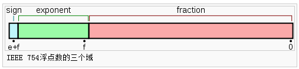

# IEEE 754 浮点数工程备忘

## 一句话结论

浮点数是“有限位宽近似表示”，不是实数。涉及比较、累积运算、浮点转整数时，必须显式定义误差容忍和取整语义。

## 基本格式

IEEE 754 常见二进制格式：

1. `float`（单精度）：`1 + 8 + 23`（符号位 + 指数位 + 尾数位）
2. `double`（双精度）：`1 + 11 + 52`



规约形式可写为：

```text
1.xxxxx... * 2^n
```

机器存储要点：

1. 符号位：`0` 正，`1` 负
2. 指数位：按偏置（bias）存储
3. 尾数位：规约形式中的首位 `1` 不显式存储（隐藏位）

## 规则约定（特殊值）

| 形式 | 指数 | 小数部分 |
| --- | --- | --- |
| 零 | `0` | `0` |
| 非规约形式 | `0` | 非 `0` |
| 规约形式 | `1` 到 `2^e - 2` | 任意 |
| 无穷 | `2^e - 1` | `0` |
| NaN | `2^e - 1` | 非零 |

## 为什么很多小数无法精确表示

像 `0.2` 这样的十进制小数，在二进制里是无限循环小数，只能截断后近似存储。因此：

1. 表示误差在初始赋值时就可能存在
2. 每次运算都会引入新的舍入误差
3. 多步计算后误差会累积

## 浮点比较的推荐做法

不要直接用 `==` 比较多数计算结果，建议使用误差阈值：

```cpp
inline bool nearly_equal(double a, double b, double eps = 1e-8)
{
    return std::fabs(a - b) <= eps;
}
```

当数值量级跨度较大时，优先使用“绝对误差 + 相对误差”组合：

```cpp
inline bool nearly_equal_rel(double a, double b,
                             double abs_eps = 1e-12,
                             double rel_eps = 1e-8)
{
    const double diff = std::fabs(a - b);
    if (diff <= abs_eps) return true;
    return diff <= rel_eps * std::max(std::fabs(a), std::fabs(b));
}
```

## 浮点转整数

常见语义：

1. `floor(x)`: 向下取整（不大于 `x` 的最大整数）
2. `ceil(x)`: 向上取整（不小于 `x` 的最小整数）
3. `round(x)`: 四舍五入到最近整数（遇到中点按语言/库规则）

工程上应优先使用标准库并显式处理范围溢出。

## 关于“魔数加法快速转整型”

历史代码常见写法是把 `d` 与一个大常量相加，再按整数位模式读取结果的低位。常见常量为：

```text
6755399441055744.0 = 1.5 * 2^52
```

其原理依赖 IEEE 754 双精度的 52 位尾数（加隐藏位共 53 位有效精度）：

1. 当 `|d|` 足够小（通常要求整数部分在约 `2^31` 或 `2^52` 范围内，取决于具体实现目的）时，`d + 1.5*2^52` 会先按指数对齐
2. 对齐后，`d` 的小数位被挤到尾数低位，并在“舍入到最近值”规则下发生舍入
3. 舍入后的结果，其尾数低若干位会携带“接近整数值”的信息
4. 通过按位解释（而非数值转换）取出特定位段，可得到整数结果

可以把它理解为：利用浮点加法器的“对齐 + 舍入”硬件路径，间接完成一次取整。

一个直观过程（示意）：

```text
d                = s * 1.xxxxx... * 2^n
magic            = 1.1 * 2^52
d + magic        -> 先对齐到 2^52 量级
                  -> d 的小数部分在尾数截断/舍入中被消掉
                  -> 低位留下整数相关比特
```

这个技巧能工作的前提非常苛刻：

1. 必须是 IEEE 754 双精度布局
2. 默认舍入模式通常要是“round to nearest, ties to even”
3. 依赖字节序与位段提取方式（不同平台结果可能不同）
4. 依赖编译器对类型重解释的处理（`union`/别名规则可能触发未定义或实现定义行为）
5. 必须严格限制输入范围，否则会溢出或得到错误值

负数、临界半整数（如 `x.5`）、超范围输入是最容易踩坑的点。很多旧实现还默认目标是 32 位 `int`，进一步缩小了安全输入域。

结论：该技巧属于“特定时代的性能黑科技”。现代工程除非在受控平台做过完备基准与边界验证，否则应优先使用标准库转换（如 `std::lround`、`std::nearbyint`、`std::lrint`）并配合显式范围检查。

## 实践清单

1. 业务逻辑里把“浮点容差”作为显式参数，不写死在宏里
2. 比较函数统一封装，避免同项目内阈值和语义不一致
3. 金额等强一致场景不用二进制浮点，改用定点整数或十进制类型
4. 浮点转整型前先做范围检查，再执行取整策略
