# Agent 架构演化路径笔记

## 文档信息

- 来源：腾讯技术工程（微信公众号）
- 标题：从0开发大模型的17种Agent架构演进详细拆解
- 作者：linkxzhou，公众号《周末程序猿》
- 发布时间：2026-05-18 17:40
- 原文链接：https://mp.weixin.qq.com/s/5f0I2apY4oFsHrttANBOJg?scene=334
- 参考项目：https://github.com/FareedKhan-dev/all-agentic-architectures
- 整理日期：2026-05-19

---

## TL;DR

Agent 架构的核心不是“更会写 prompt”，而是逐步补齐控制流能力：状态如何表达、下一步如何路由、失败如何验证、外部副作用如何拦截、系统何时停止。

阅读一套 Agent 架构时，优先问三个问题：

1. 新增了什么 `state`？
2. 新增了什么 `router`？
3. 新增了什么 `evaluator`？

答不清这三点，多半只是旧架构换名词。

---

## 1. 单类拓扑图谱

### 1.1 Reflection：线性质量闭环

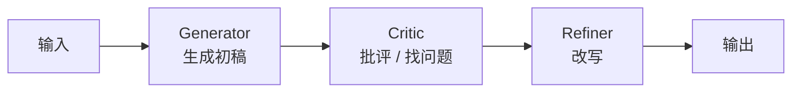

形状：线性链。  
关键变化：把“一次生成”拆成生成、批评、改写三步。

### 1.2 Tool Use：工具调用链

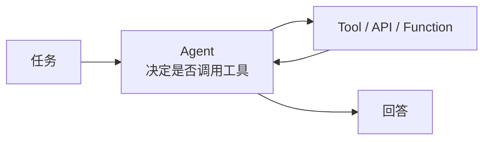

形状：Agent 与工具之间的短回路。  
关键变化：外部世界变成结构化接口，而不是只靠模型记忆。

### 1.3 ReAct：观察-行动循环

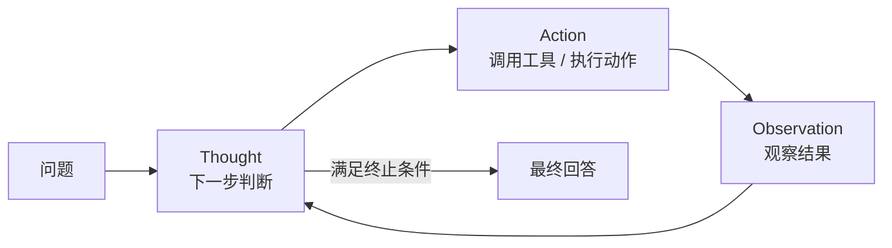

形状：闭环循环。  
关键变化：每一轮观察会改变下一轮行动。

### 1.4 Planning：计划-执行链

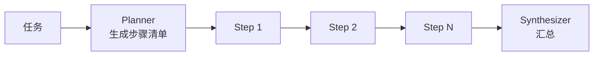

形状：先计划，再线性执行。  
关键变化：控制流本身变成可检查的中间产物。

### 1.5 PEV：验证驱动重规划

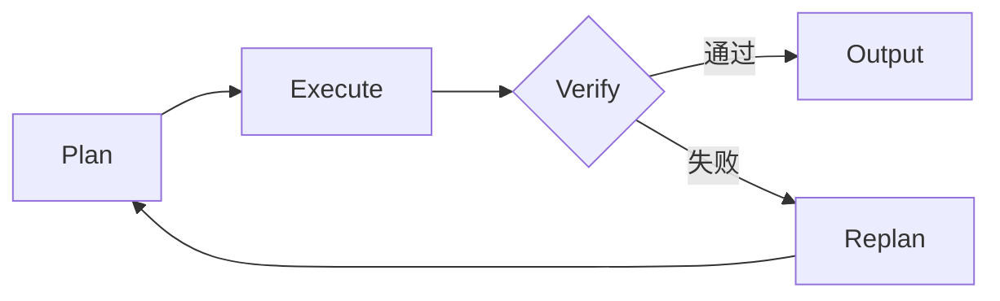

形状：计划-执行-验证回路。  
关键变化：验证不是事后检查，而是路由条件。

### 1.6 Multi-Agent：角色流水线 / 协作图

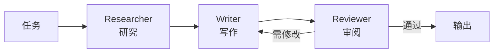

形状：多角色有向图。  
关键变化：把一个 agent 的认知负担拆成多个角色节点。

### 1.7 Blackboard：共享黑板调度

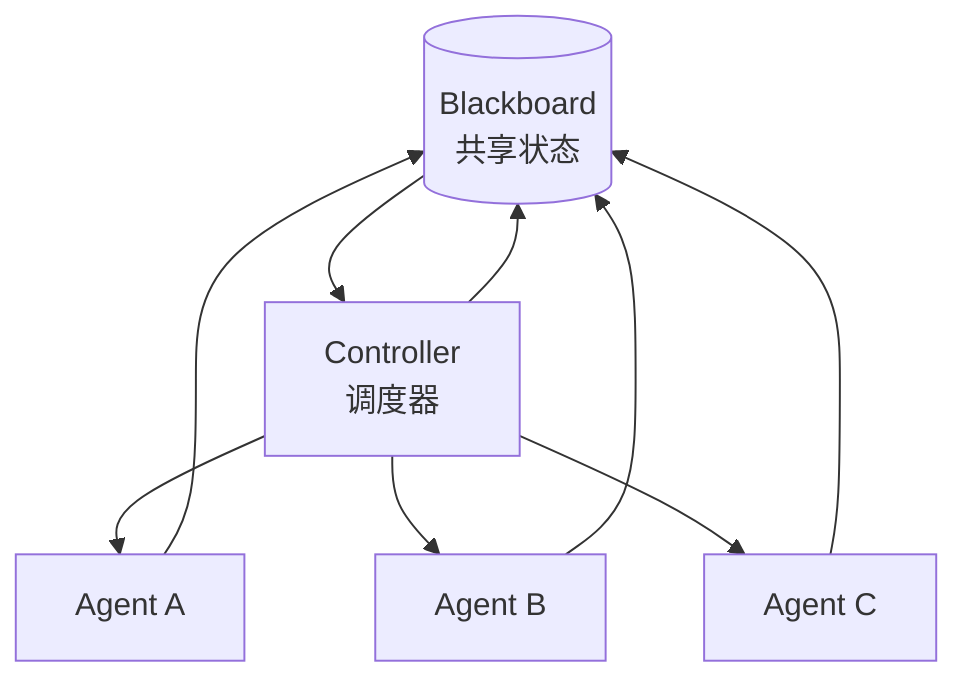

形状：中心共享状态 + 动态调度。  
关键变化：所有中间产物进入黑板，controller 根据当前状态决定下一位执行者。

### 1.8 Meta-Controller：入口路由

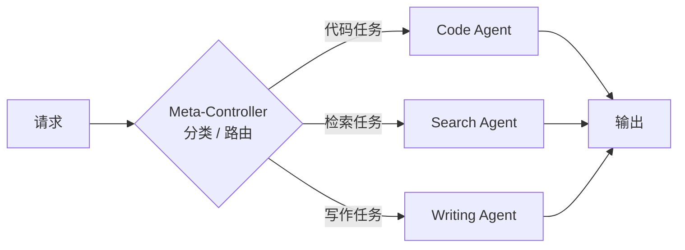

形状：一次性分叉路由。  
关键变化：入口先判断任务类型，避免一个 agent 背所有能力。

### 1.9 Ensemble：并行冗余聚合

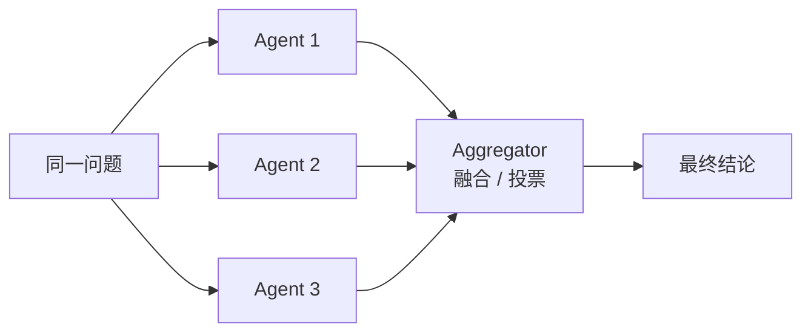

形状：扇出并行 + 汇聚。  
关键变化：不是分工，而是用冗余换可靠性。

### 1.10 Episodic / Semantic Memory：检索增强执行

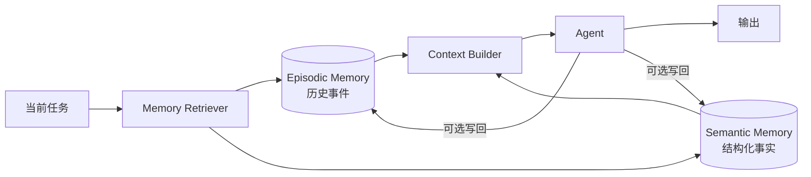

形状：读记忆、组上下文、执行、可选写回。  
关键变化：历史状态成为系统状态的一部分。

### 1.11 Graph / World-Model Memory：关系推理图

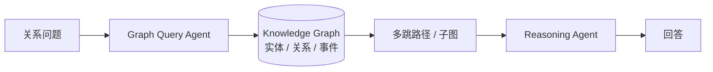

形状：查询图谱后再推理。  
关键变化：从相似召回升级到关系查询和多跳推理。

### 1.12 Tree-of-Thoughts：搜索树

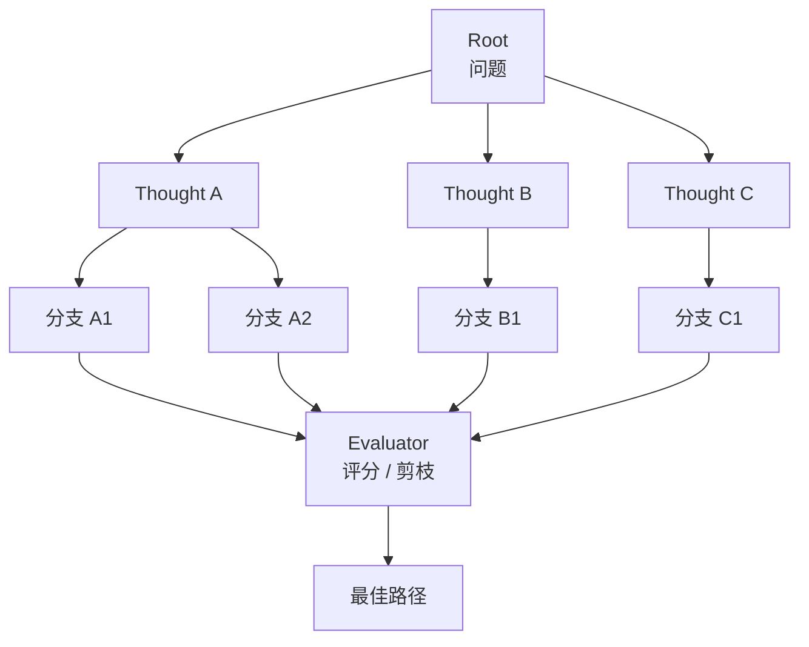

形状：树展开 + 评分剪枝。  
关键变化：推理不再是一条链，而是可回溯搜索。

### 1.13 Mental Loop：行动前模拟

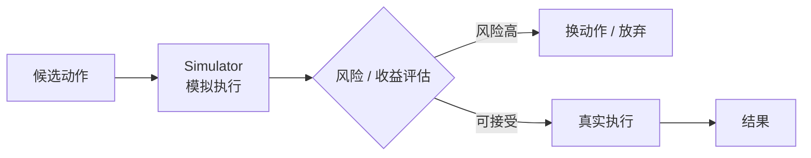

形状：模拟分支先于真实执行。  
关键变化：先在内部世界试错，再决定是否触碰外部世界。

### 1.14 Dry-Run Harness：副作用闸门

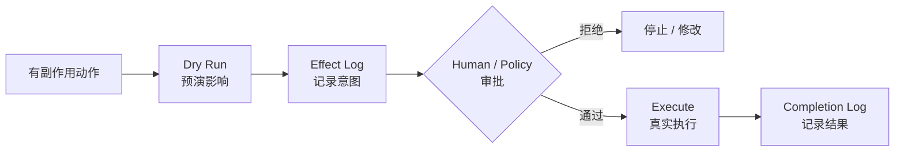

形状：写操作前置闸门。  
关键变化：所有真实副作用都要先预演、审批、记录。

### 1.15 Metacognitive Agent：边界判断路由

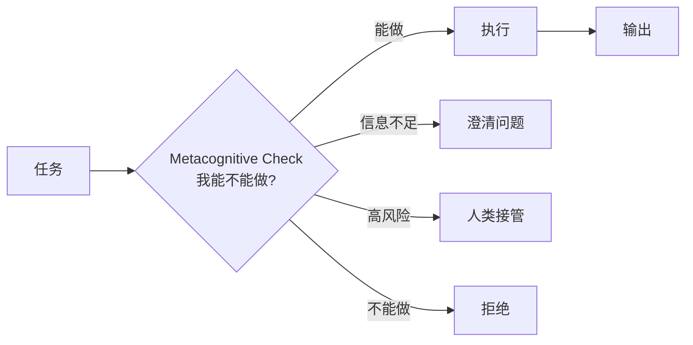

形状：执行前的能力边界路由。  
关键变化：系统显式判断“该不该做”，而不是默认硬答。

### 1.16 Self-Improvement：长期质量循环

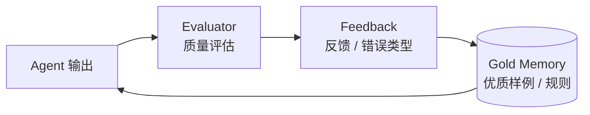

形状：输出、评价、反馈、记忆再进入下一轮。  
关键变化：质量改进跨任务累积，而不是只在单次对话里修正。

### 1.17 Cellular Automata：局部规则网格

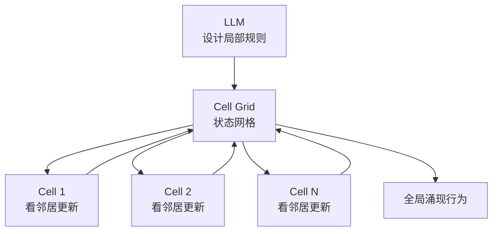

形状：去中心化网格。  
关键变化：LLM 不再控制每一步，只定义局部更新规则。

---

## 2. 演化路径

```text
单次生成
  -> Reflection
     补上最小质量闭环：generator -> critic -> refiner

  -> Tool Use
     补上外部世界接口：模型可以调用 API / 函数 / 数据源

  -> ReAct
     补上观察-行动循环：Thought -> Action -> Observation

  -> Planning
     补上显式计划：先生成可检查的控制流，再执行

  -> PEV
     补上验证回路：Plan -> Execute -> Verify，失败则重规划

  -> Multi-Agent Collaboration
     补上角色分工：研究、执行、写作、审阅拆开

  -> Blackboard
     补上共享状态：中间产物进入黑板，由 controller 动态调度

  -> Meta-Controller
     补上入口分诊：不同请求路由到不同专家

  -> Ensemble
     补上并行冗余：多个独立答案交给 aggregator 融合

  -> Episodic / Semantic Memory
     补上长期状态：记住事件、事实、用户偏好

  -> Graph / World-Model Memory
     补上关系推理：从相似召回升级到多跳关系查询

  -> Tree-of-Thoughts
     补上搜索能力：从一条思路升级到多分支搜索树

  -> Mental Loop
     补上行动前模拟：执行前先评估风险和收益

  -> Dry-Run Harness
     补上副作用闸门：真实写操作必须先预演、审批、封存

  -> Reflexive Metacognitive Agent
     补上边界感知：先判断自己能不能做、该不该做

  -> Self-Improvement Loop
     补上长期优化：从反馈和优质样例中迭代提升

  -> Cellular Automata
     控制中心退场：LLM 只设计局部规则，由系统涌现全局行为
```

这条路径不是“越靠后越高级”，而是控制能力逐层补齐：

1. 从生成质量控制开始：`Reflection`。
2. 到外部交互能力：`Tool Use`、`ReAct`。
3. 到显式控制流：`Planning`、`PEV`。
4. 到组织与调度：`Multi-Agent`、`Blackboard`、`Meta-Controller`、`Ensemble`。
5. 到长期状态：`Episodic / Semantic Memory`、`Graph Memory`。
6. 到复杂求解范式：`Tree-of-Thoughts`、`Mental Loop`、`Cellular Automata`。
7. 到可信边界：`Dry-Run Harness`、`Metacognitive Agent`。

---

## 3. 按缺失能力选架构

| 缺失能力 | 优先选择 | 判断依据 |
|---|---|---|
| 输出质量不稳 | Reflection | 最小成本建立批评-改写闭环 |
| 简单外部查询/操作 | Tool Use | 任务无需多步观察，只需要结构化工具 |
| 多步工具推理 | ReAct | 每一步都依赖上一步观察 |
| 全局步骤控制 | Planning | 需要先审计计划，再执行 |
| 工具容错与可靠性 | PEV | 执行结果必须进入验证回路 |
| 角色分工 | Multi-Agent | 任务天然包含研究、执行、审阅等不同能力 |
| 动态编排 | Blackboard | 中间状态复杂，下一步执行者不固定 |
| 请求分诊 | Meta-Controller | 入口任务类型多，但每类处理链相对固定 |
| 高可靠结论 | Ensemble | 愿意用成本换冗余和去偏 |
| 跨轮历史 | Episodic / Semantic Memory | 需要记住事件、事实、偏好 |
| 关系推理 | Graph Memory | 需要实体关系、多跳查询、因果链 |
| 回溯搜索 | Tree-of-Thoughts | 解空间分支多，线性推理容易走死路 |
| 行动前风险评估 | Mental Loop | 真实执行成本高，适合先模拟 |
| 副作用管控 | Dry-Run Harness | 动作会修改外部世界，需要闸门 |
| 能力边界判断 | Metacognitive Agent | 系统需要知道何时拒绝、转交或求助 |
| 长期质量改进 | Self-Improvement | 需要从历史反馈中持续优化 |
| 去中心化求解 | Cellular Automata | 问题更像局部规则驱动的复杂系统 |

---

## 4. 我的提炼

大多数可落地 Agent 不需要一开始就堆满 17 种架构。更实用的起点是：

1. 先用 `ReAct` 解决多步工具交互。
2. 一旦工具结果会影响后续决策，就加 `PEV`。
3. 一旦动作有真实副作用，就加 `Dry-Run Harness`。
4. 一旦任务跨轮存在，就加记忆，但要先定义写入、检索、遗忘策略。
5. 一旦系统不知道自己能不能做，就加元认知判断，而不是让模型硬答。

真正成熟的 Agent 不是“更敢执行”，而是更清楚什么时候继续、什么时候重试、什么时候拒绝、什么时候让人接管。
