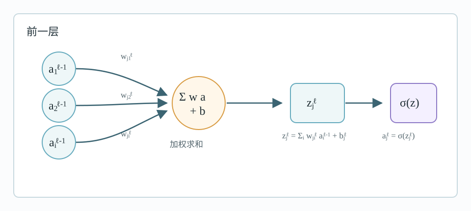
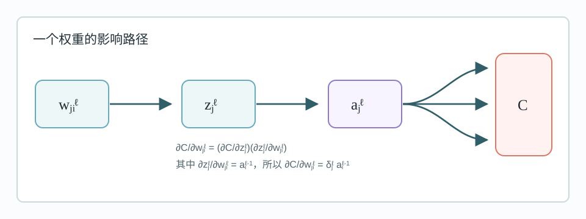
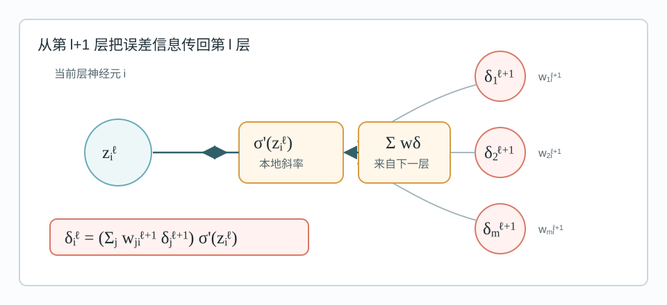
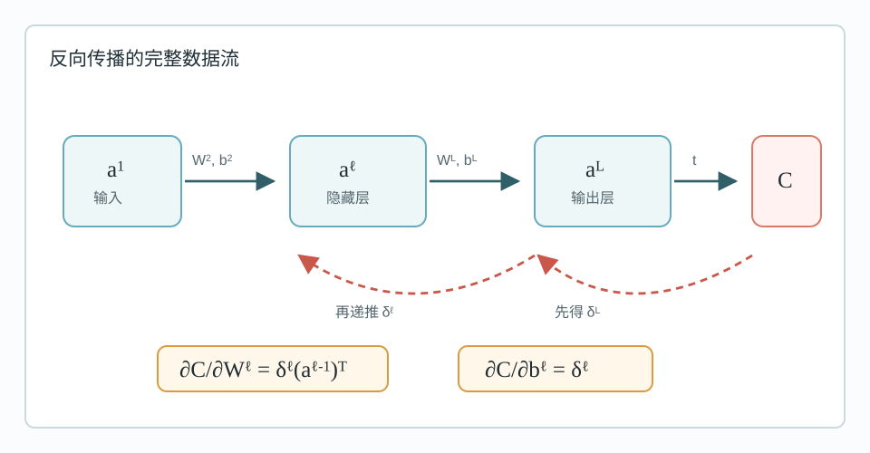
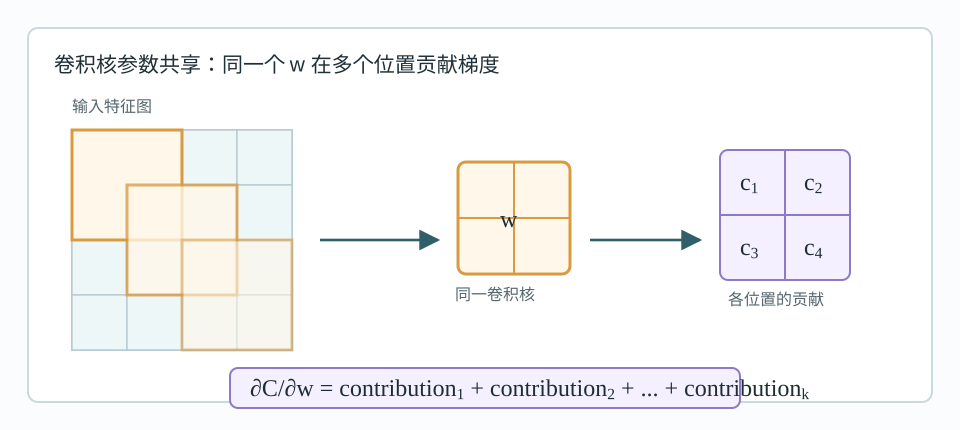

# 反向传播中的数学：从偏导数到矩阵微分

反向传播的核心并不神秘。它主要由三件事组成：

- 多变量函数的偏导数；
- 链式法则；
- 用向量和矩阵记号批量表达重复的偏导计算。

如果只记一句话，可以记成：

> 反向传播就是把损失函数对每个参数的偏导数，通过链式法则从输出层向输入层逐层传回去。

---

## 1. 偏导数：只看一个变量的影响

单变量函数只有一个自变量，例如：

$$
y=f(x)
$$

此时导数描述的是 $x$ 发生微小变化时，$y$ 的变化率：

$$
f'(x)=\lim_{\Delta x\to 0}\frac{f(x+\Delta x)-f(x)}{\Delta x}
$$

多变量函数有多个自变量，例如：

$$
z=f(x,y)
$$

这时如果想知道 $x$ 对 $z$ 的影响，就先把 $y$ 当成常数，只让 $x$ 变化。这就是对 $x$ 的偏导数：

$$
\frac{\partial z}{\partial x}
=
\frac{\partial f(x,y)}{\partial x}
=
\lim_{\Delta x\to 0}
\frac{f(x+\Delta x,y)-f(x,y)}{\Delta x}
$$

同理，对 $y$ 的偏导数是：

$$
\frac{\partial z}{\partial y}
=
\frac{\partial f(x,y)}{\partial y}
=
\lim_{\Delta y\to 0}
\frac{f(x,y+\Delta y)-f(x,y)}{\Delta y}
$$

偏导数的含义是：在其他变量暂时固定时，某一个变量单独变化造成的函数变化率。

---

## 2. 多变量函数的极小值条件

对于单变量函数，若 $f(x)$ 在某点取得局部极小值，常见必要条件是：

$$
f'(x)=0
$$

对于多变量函数：

$$
z=f(x,y)
$$

如果它在某点取得局部极小值，那么在这个点附近，无论沿 $x$ 方向还是 $y$ 方向做微小移动，函数值的一阶变化都不应继续下降。因此必要条件是：

$$
\frac{\partial f}{\partial x}=0,\qquad
\frac{\partial f}{\partial y}=0
$$

推广到 $n$ 个变量：

$$
f=f(x_1,x_2,\dots,x_n)
$$

极值点的一阶必要条件是：

$$
\frac{\partial f}{\partial x_1}=0,\quad
\frac{\partial f}{\partial x_2}=0,\quad
\dots,\quad
\frac{\partial f}{\partial x_n}=0
$$

这只是必要条件，不是充分条件。也就是说，所有偏导数为零的点可能是极小值、极大值，也可能是鞍点。神经网络训练中经常遇到的就是高维非凸优化，所以不能把“梯度为零”简单等同于“找到全局最优”。

---

## 3. 有约束极值与拉格朗日乘子

有时我们不是在整个空间中优化，而是在约束条件下优化。例如：

$$
\min_{x,y} x+y
$$

约束为：

$$
x^2+y^2=1
$$

也就是只允许在单位圆上找最小值。拉格朗日乘子法的做法是构造：

$$
L(x,y,\lambda)=f(x,y)-\lambda g(x,y)
$$

其中：

$$
f(x,y)=x+y
$$

约束可写成：

$$
g(x,y)=x^2+y^2-1=0
$$

于是：

$$
L(x,y,\lambda)=x+y-\lambda(x^2+y^2-1)
$$

令各变量偏导为零：

$$
\frac{\partial L}{\partial x}=1-2\lambda x=0
$$

$$
\frac{\partial L}{\partial y}=1-2\lambda y=0
$$

再加上约束：

$$
x^2+y^2=1
$$

由前两式可得 $x=y$，代入约束：

$$
2x^2=1
$$

所以：

$$
x=y=\pm\frac{1}{\sqrt{2}}
$$

当：

$$
x=y=-\frac{1}{\sqrt{2}}
$$

时，$x+y$ 取得最小值：

$$
-\sqrt{2}
$$

这部分对理解神经网络正则化也有帮助。很多正则化问题，本质上可以理解成“在约束下优化”或“把约束改写进目标函数”。

---

## 4. 一阶近似：用导数估计函数变化

单变量函数的导数定义为：

$$
f'(x)=\lim_{\Delta x\to 0}
\frac{f(x+\Delta x)-f(x)}{\Delta x}
$$

当 $\Delta x$ 很小时，可以近似写成：

$$
f'(x)\approx \frac{f(x+\Delta x)-f(x)}{\Delta x}
$$

移项得到：

$$
f(x+\Delta x)\approx f(x)+f'(x)\Delta x
$$

这就是一阶泰勒近似。它表达的是：如果只移动很小一步，函数变化大致等于“当前斜率乘以步长”。

对二元函数：

$$
z=f(x,y)
$$

如果 $x$ 和 $y$ 都发生微小变化：

$$
x\to x+\Delta x,\qquad y\to y+\Delta y
$$

则函数变化的一阶近似为：

$$
\Delta z
\approx
\frac{\partial z}{\partial x}\Delta x
+
\frac{\partial z}{\partial y}\Delta y
$$

即：

$$
f(x+\Delta x,y+\Delta y)
\approx
f(x,y)
+
\frac{\partial f}{\partial x}\Delta x
+
\frac{\partial f}{\partial y}\Delta y
$$

推广到三个变量：

$$
\Delta z
\approx
\frac{\partial z}{\partial w}\Delta w
+
\frac{\partial z}{\partial x}\Delta x
+
\frac{\partial z}{\partial y}\Delta y
$$

推广到 $n$ 个变量：

$$
\Delta f
\approx
\sum_{i=1}^{n}
\frac{\partial f}{\partial x_i}\Delta x_i
$$

这条式子是理解梯度下降的关键。优化算法每次更新参数，本质上就是选择一个 $\Delta x$，让 $\Delta f$ 尽量为负。

---

## 5. 梯度：偏导数组成的向量

对于多变量函数：

$$
f(x_1,x_2,\dots,x_n)
$$

把所有偏导数组成一个向量：

$$
\nabla f
=
\left(
\frac{\partial f}{\partial x_1},
\frac{\partial f}{\partial x_2},
\dots,
\frac{\partial f}{\partial x_n}
\right)
$$

这个向量称为梯度。

用梯度记号，一阶近似可以写成内积形式：

$$
\Delta f\approx \nabla f\cdot \Delta x
$$

其中：

$$
\Delta x=(\Delta x_1,\Delta x_2,\dots,\Delta x_n)
$$

因为内积满足：

$$
\nabla f\cdot \Delta x
=
\|\nabla f\|\|\Delta x\|\cos\theta
$$

所以在步长固定时，函数增长最快的方向是梯度方向，函数下降最快的方向是负梯度方向。

因此梯度下降的基本更新形式是：

$$
\Delta x=-\eta\nabla f
$$

也就是：

$$
x \leftarrow x-\eta\nabla f
$$

其中 $\eta$ 是学习率。学习率太小，下降慢；学习率太大，可能震荡甚至发散。

---

## 6. 神经网络中的记号

为了写反向传播，需要先统一神经网络中的变量记号。

设网络按层编号：

- 第 $1$ 层：输入层；
- 第 $2,\dots,L-1$ 层：隐藏层；
- 第 $L$ 层：输出层。

常用记号如下。

输入值：

$$
x_i
$$

也可看作输入层激活：

$$
a_i^1=x_i
$$

第 $l$ 层第 $j$ 个神经元的加权输入：

$$
z_j^l
$$

第 $l$ 层第 $j$ 个神经元的偏置：

$$
b_j^l
$$

第 $l-1$ 层第 $i$ 个神经元到第 $l$ 层第 $j$ 个神经元的权重：

$$
w_{ji}^l
$$

第 $l$ 层第 $j$ 个神经元的激活输出：

$$
a_j^l
$$

激活函数记为：

$$
\sigma(\cdot)
$$

则单个神经元有：

$$
z_j^l=\sum_i w_{ji}^l a_i^{l-1}+b_j^l
$$

$$
a_j^l=\sigma(z_j^l)
$$

向量形式更紧凑：

$$
z^l=W^l a^{l-1}+b^l
$$

$$
a^l=\sigma(z^l)
$$

这里 $\sigma$ 对向量逐元素作用。

---

## 7. 损失函数与学习目标

监督学习中，每个样本有目标输出：

$$
t
$$

网络输出为：

$$
a^L
$$

损失函数衡量预测输出和目标输出之间的差距。以平方误差为例：

$$
C=\frac{1}{2}\sum_j(a_j^L-t_j)^2
$$

训练目标是调整所有权重和偏置，使损失函数尽量小：

$$
\min_{W,b} C(W,b)
$$

梯度下降需要计算：

$$
\frac{\partial C}{\partial w_{ji}^l}
$$

以及：

$$
\frac{\partial C}{\partial b_j^l}
$$

问题在于，权重很多。如果对每个权重都从头使用链式法则，计算会非常重复。反向传播的价值就是复用中间导数，把这些偏导组织成高效的递推。

---

## 8. 先看单个权重的链式法则

考虑某一层的权重：

$$
w_{ji}^l
$$

它影响第 $l$ 层神经元的加权输入：

$$
z_j^l=\sum_i w_{ji}^l a_i^{l-1}+b_j^l
$$

再影响激活：

$$
a_j^l=\sigma(z_j^l)
$$

再通过后续层影响最终损失 $C$。

根据链式法则：

$$
\frac{\partial C}{\partial w_{ji}^l}
=
\frac{\partial C}{\partial z_j^l}
\frac{\partial z_j^l}{\partial w_{ji}^l}
$$

而：

$$
\frac{\partial z_j^l}{\partial w_{ji}^l}=a_i^{l-1}
$$

所以：

$$
\frac{\partial C}{\partial w_{ji}^l}
=
\frac{\partial C}{\partial z_j^l}a_i^{l-1}
$$

这里出现了一个非常重要的量：

$$
\frac{\partial C}{\partial z_j^l}
$$

它表示损失函数对某个神经元加权输入的敏感度。反向传播专门给它起了一个名字。

---

## 9. 误差项 delta

定义第 $l$ 层第 $j$ 个神经元的误差项：

$$
\delta_j^l=\frac{\partial C}{\partial z_j^l}
$$

这个 $\delta$ 不是“预测值减真实值”本身，而是损失函数对加权输入 $z_j^l$ 的偏导数。

引入 $\delta$ 后，权重梯度变成：

$$
\frac{\partial C}{\partial w_{ji}^l}
=
\delta_j^l a_i^{l-1}
$$

偏置梯度变成：

$$
\frac{\partial C}{\partial b_j^l}
=
\delta_j^l
$$

因为：

$$
\frac{\partial z_j^l}{\partial b_j^l}=1
$$

所以，只要能算出每层每个神经元的 $\delta$，所有权重和偏置的梯度就都很容易得到。

反向传播的关键问题变成：

> 如何高效计算所有层的 $\delta$？

---

## 10. 输出层误差

先看输出层。输出层第 $j$ 个神经元有：

$$
a_j^L=\sigma(z_j^L)
$$

根据 $\delta$ 的定义：

$$
\delta_j^L
=
\frac{\partial C}{\partial z_j^L}
$$

使用链式法则：

$$
\delta_j^L
=
\frac{\partial C}{\partial a_j^L}
\frac{\partial a_j^L}{\partial z_j^L}
$$

因为：

$$
\frac{\partial a_j^L}{\partial z_j^L}
=
\sigma'(z_j^L)
$$

所以：

$$
\delta_j^L
=
\frac{\partial C}{\partial a_j^L}\sigma'(z_j^L)
$$

如果使用平方误差：

$$
C=\frac{1}{2}\sum_j(a_j^L-t_j)^2
$$

则：

$$
\frac{\partial C}{\partial a_j^L}=a_j^L-t_j
$$

因此：

$$
\delta_j^L=(a_j^L-t_j)\sigma'(z_j^L)
$$

向量形式：

$$
\delta^L=(a^L-t)\odot\sigma'(z^L)
$$

其中 $\odot$ 表示逐元素相乘。

---

## 11. 隐藏层误差递推

隐藏层没有直接连接到损失函数，但它会影响下一层，下一层再影响损失。

对第 $l$ 层第 $i$ 个神经元：

$$
\delta_i^l=\frac{\partial C}{\partial z_i^l}
$$

它通过激活：

$$
a_i^l=\sigma(z_i^l)
$$

影响下一层每个神经元的加权输入：

$$
z_j^{l+1}=\sum_i w_{ji}^{l+1}a_i^l+b_j^{l+1}
$$

所以根据链式法则：

$$
\frac{\partial C}{\partial z_i^l}
=
\sum_j
\frac{\partial C}{\partial z_j^{l+1}}
\frac{\partial z_j^{l+1}}{\partial a_i^l}
\frac{\partial a_i^l}{\partial z_i^l}
$$

其中：

$$
\frac{\partial C}{\partial z_j^{l+1}}=\delta_j^{l+1}
$$

$$
\frac{\partial z_j^{l+1}}{\partial a_i^l}=w_{ji}^{l+1}
$$

$$
\frac{\partial a_i^l}{\partial z_i^l}=\sigma'(z_i^l)
$$

因此：

$$
\delta_i^l
=
\left(
\sum_j w_{ji}^{l+1}\delta_j^{l+1}
\right)
\sigma'(z_i^l)
$$

如果第 $l+1$ 层有 $m$ 个神经元，则展开为：

$$
\delta_i^l
=
\left(
w_{1i}^{l+1}\delta_1^{l+1}
+
w_{2i}^{l+1}\delta_2^{l+1}
+
\cdots
+
w_{mi}^{l+1}\delta_m^{l+1}
\right)
\sigma'(z_i^l)
$$

向量形式：

$$
\delta^l
=
\left((W^{l+1})^T\delta^{l+1}\right)
\odot
\sigma'(z^l)
$$

这就是误差从后一层传回前一层的递推公式。

---

## 12. 反向传播算法总览

对一个样本，完整流程可以写成四步。

第一步，前向传播：

$$
z^l=W^l a^{l-1}+b^l
$$

$$
a^l=\sigma(z^l)
$$

从 $l=2$ 一直算到 $L$。

第二步，计算输出层误差：

$$
\delta^L
=
\nabla_{a^L}C
\odot
\sigma'(z^L)
$$

如果是平方误差：

$$
\delta^L=(a^L-t)\odot\sigma'(z^L)
$$

第三步，反向递推隐藏层误差：

$$
\delta^l
=
\left((W^{l+1})^T\delta^{l+1}\right)
\odot
\sigma'(z^l)
$$

其中：

$$
l=L-1,L-2,\dots,2
$$

第四步，计算梯度：

$$
\frac{\partial C}{\partial W^l}
=
\delta^l(a^{l-1})^T
$$

$$
\frac{\partial C}{\partial b^l}
=
\delta^l
$$

最后使用梯度下降更新：

$$
W^l\leftarrow W^l-\eta\frac{\partial C}{\partial W^l}
$$

$$
b^l\leftarrow b^l-\eta\frac{\partial C}{\partial b^l}
$$

---

## 13. 为什么反向传播减少了重复计算

假设网络输出层有很多输出，某个早期权重会通过大量路径影响最终损失。

如果对每个权重单独从头求导，就会重复计算许多相同的中间导数。反向传播的改进在于：

- 先把输出层误差算出来；
- 再把后一层的误差信息传回前一层；
- 每一层的 $\delta$ 只计算一次；
- 由 $\delta$ 直接得到该层所有权重和偏置的梯度。

这和动态规划很像：不是枚举所有路径重新计算，而是缓存局部结果，再逐层复用。

以权重梯度为例：

$$
\frac{\partial C}{\partial w_{ji}^l}
=
\delta_j^l a_i^{l-1}
$$

一旦 $\delta_j^l$ 已经算好，第 $j$ 个神经元连入的所有权重都只需要乘以前一层对应激活值即可。

---

## 14. 卷积层与参数共享的直觉

卷积层与普通全连接层最大的不同是参数共享。

在全连接层中，不同连接通常有不同权重。卷积层中，一个卷积核会在输入图像的不同位置滑动，同一组卷积核参数被重复使用。

这会影响梯度计算。

如果某个卷积核参数 $w$ 在多个空间位置都被用到，那么总损失对该参数的导数是它在所有使用位置贡献的总和：

$$
\frac{\partial C}{\partial w}
=
\sum_{\text{positions}}
\frac{\partial C_{\text{position}}}{\partial w}
$$

这就是截图中强调的“利用图像实例的简单求和性质”。与其对每个位置分别完整求导，不如先写出单个位置的梯度贡献，再对所有位置求和。

这和全连接网络中的反向传播思想一致：同样是用链式法则，只是卷积层因为共享参数，需要把所有共享位置的梯度累加。

---

## 15. 梯度的定义与 Jacobian 的转置

先固定本文后面使用的约定：向量都按列向量理解，梯度也按列向量理解。

设：

$$
f:\mathbb{R}^n\to\mathbb{R},\qquad
x=
\begin{bmatrix}
x_1\\
x_2\\
\vdots\\
x_n
\end{bmatrix}
$$

当 $x$ 发生一个微小变化 $dx$ 时，$f$ 的一阶变化是：

$$
df
=
\sum_{i=1}^{n}
\frac{\partial f}{\partial x_i}dx_i
$$

梯度定义为唯一满足下面关系的列向量：

$$
df=(\nabla_x f)^Tdx
$$

也就是说：

$$
\nabla_x f
=
\begin{bmatrix}
\frac{\partial f}{\partial x_1}\\
\frac{\partial f}{\partial x_2}\\
\vdots\\
\frac{\partial f}{\partial x_n}
\end{bmatrix}
$$

微分 $df$ 本质上是一个线性函数：它接收一个输入位移 $dx$，输出一个标量变化 $df$。梯度则是在欧氏内积下表示这个线性函数的向量。从这个定义出发，可以直接推出反向传播里常见的转置。

设前向映射为：

$$
y=Ax,\qquad A\in\mathbb{R}^{m\times n}
$$

其中：

$$
x\in\mathbb{R}^n,\qquad y\in\mathbb{R}^m
$$

微分为：

$$
dy=A\,dx
$$

现在令损失为标量函数：

$$
L=L(y)
$$

根据梯度定义：

$$
dL=(\nabla_y L)^Tdy
$$

代入 $dy=A\,dx$：

$$
dL=(\nabla_y L)^TA\,dx
$$

但如果要得到 $L$ 对 $x$ 的梯度，就必须把它重新整理成定义中的标准形式：

$$
dL=(\nabla_x L)^Tdx
$$

利用恒等式：

$$
u^TAv=(A^Tu)^Tv
$$

可得：

$$
dL=(A^T\nabla_y L)^Tdx
$$

和标准形式比较：

$$
\nabla_x L=A^T\nabla_y L
$$

这就是线性映射下的反向传播规则。

更一般地，若：

$$
y=g(x),\qquad J=\frac{\partial y}{\partial x}
$$

则局部一阶近似为：

$$
dy=J\,dx
$$

同样代入梯度定义：

$$
dL=(\nabla_y L)^Tdy
=(\nabla_y L)^TJ\,dx
=(J^T\nabla_y L)^Tdx
$$

因此：

$$
\nabla_x L=J^T\nabla_y L
$$

这就是多变量链式法则在反向传播中的核心形式。前向传播用 Jacobian $J$ 把输入位移 $dx$ 映射成输出位移 $dy$；反向传播用 $J^T$ 把输出侧梯度拉回输入侧梯度。

---

## 16. 矩阵变元的梯度定义

矩阵变量的梯度仍然沿用同一个思想：先定义微分，再用内积表示微分。

设：

$$
f:\mathbb{R}^{m\times n}\to\mathbb{R}
$$

输入是矩阵：

$$
X=
\begin{bmatrix}
x_{11} & x_{12} & \cdots & x_{1n}\\
x_{21} & x_{22} & \cdots & x_{2n}\\
\vdots & \vdots & \ddots & \vdots\\
x_{m1} & x_{m2} & \cdots & x_{mn}
\end{bmatrix}
$$

它的微小变化是同形状矩阵：

$$
dX=
\begin{bmatrix}
dx_{11} & dx_{12} & \cdots & dx_{1n}\\
dx_{21} & dx_{22} & \cdots & dx_{2n}\\
\vdots & \vdots & \ddots & \vdots\\
dx_{m1} & dx_{m2} & \cdots & dx_{mn}
\end{bmatrix}
$$

一阶变化为：

$$
df
=
\sum_{i=1}^{m}\sum_{j=1}^{n}
\frac{\partial f}{\partial x_{ij}}dx_{ij}
$$

矩阵空间里的标准内积是 Frobenius 内积：

$$
\langle A,B\rangle
=
\sum_{i,j}A_{ij}B_{ij}
$$

它也可以写成 trace 形式：

$$
\langle A,B\rangle
=
\operatorname{tr}(A^TB)
$$

矩阵梯度定义为唯一满足下面关系的矩阵：

$$
df=\langle \nabla_X f,dX\rangle
$$

等价地：

$$
df
=
\operatorname{tr}\left((\nabla_X f)^TdX\right)
$$

因此：

$$
\nabla_X f
=
\begin{bmatrix}
\frac{\partial f}{\partial x_{11}} & \frac{\partial f}{\partial x_{12}} & \cdots & \frac{\partial f}{\partial x_{1n}}\\
\frac{\partial f}{\partial x_{21}} & \frac{\partial f}{\partial x_{22}} & \cdots & \frac{\partial f}{\partial x_{2n}}\\
\vdots & \vdots & \ddots & \vdots\\
\frac{\partial f}{\partial x_{m1}} & \frac{\partial f}{\partial x_{m2}} & \cdots & \frac{\partial f}{\partial x_{mn}}
\end{bmatrix}
$$

这和第 15 节的向量定义完全平行：

$$
df=(\nabla_x f)^Tdx
$$

只是这里把向量内积换成了矩阵内积：

$$
df=\langle \nabla_X f,dX\rangle
$$

一个简单例子是：

$$
f(X)=\|X\|_F^2
=
\sum_{i,j}x_{ij}^2
$$

微分为：

$$
df
=
\sum_{i,j}2x_{ij}dx_{ij}
=
\langle 2X,dX\rangle
$$

根据矩阵梯度定义：

$$
\nabla_X f=2X
$$

这给出后面矩阵微分的基本读法。如果在推导中把某一项整理成：

$$
df_X=\operatorname{tr}(A^TdX)
$$

由于：

$$
\operatorname{tr}(A^TdX)=\langle A,dX\rangle
$$

就可以直接读出：

$$
\nabla_X f=A
$$

后面线性层推导中出现的 $W^T$、$X^T$ 或 $A^T$，本质上仍然来自第 15 节的同一个原则：前向微分把输入位移映射到输出位移；反向梯度通过这个线性映射的伴随算子传回去。在欧氏内积和 Frobenius 内积下，伴随算子就是转置。

---

## 17. 用矩阵微分看线性层

本节先用**单样本列向量约定**推导：

$$
z=W_{\text{col}}a+b
$$

其中 $a$、$b$、$z$ 和 $\delta=\partial C/\partial z$ 都按列向量理解，矩阵梯度 $\partial C/\partial W_{\text{col}}$ 的形状与 $W_{\text{col}}$ 相同。

然后再给出深度学习框架中更常见的 **batch 行样本约定**：

$$
Y=XW_{\text{batch}}+b
$$

其中 $X$ 的每一行是一个样本。batch 为 1 时：

$$
W_{\text{batch}}=W_{\text{col}}^T
$$

### 17.1 单样本列向量形式

考虑线性层：

$$
z=Wa+b
$$

其中：

- $W\in\mathbb{R}^{m\times n}$；
- $a\in\mathbb{R}^{n\times 1}$；
- $b\in\mathbb{R}^{m\times 1}$；
- $z\in\mathbb{R}^{m\times 1}$。

设损失为 $C$，且已知：

$$
\delta=\frac{\partial C}{\partial z}
$$

线性层的微分是：

$$
dz=dW\,a+W\,da+db
$$

这表示 $z$ 的变化来自三部分：权重变化、输入变化、偏置变化。

损失微分为：

$$
dC=\delta^T dz
$$

代入：

$$
dC=\delta^T(dW\,a+W\,da+db)
$$

展开：

$$
dC=\delta^T dW\,a+\delta^T W\,da+\delta^T db
$$

先看对 $W$ 的梯度。使用迹的循环性质：

$$
dC_W=\delta^T dW\,a
$$

由于标量等于自身的 trace：

$$
dC_W=\operatorname{tr}(\delta^T dW\,a)
$$

循环移动：

$$
dC_W=\operatorname{tr}(a\delta^T dW)
$$

为了读出矩阵梯度，需要整理成第 16 节的标准形式：

$$
dC_W=\operatorname{tr}\left(
\left(\frac{\partial C}{\partial W}\right)^T dW
\right)
$$

而：

$$
a\delta^T=(\delta a^T)^T
$$

所以：

$$
dC_W=\operatorname{tr}((\delta a^T)^T dW)
$$

因此：

$$
\frac{\partial C}{\partial W}=\delta a^T
$$

这正好对应反向传播中的权重梯度：

$$
\frac{\partial C}{\partial W^l}
=
\delta^l(a^{l-1})^T
$$

再看对输入 $a$ 的梯度：

$$
dC_a=\delta^T W\,da
$$

整理为：

$$
dC_a=(W^T\delta)^T da
$$

因此：

$$
\frac{\partial C}{\partial a}=W^T\delta
$$

这就是“误差通过权重矩阵的转置向前一层传播”的来源。

最后看对偏置的梯度：

$$
dC_b=\delta^T db
$$

因此：

$$
\frac{\partial C}{\partial b}=\delta
$$

单样本列向量形式的线性层 backward 可以总结为：

$$
\boxed{
\frac{\partial C}{\partial a}=W^T\delta,\qquad
\frac{\partial C}{\partial W}=\delta a^T,\qquad
\frac{\partial C}{\partial b}=\delta
}
$$

### 17.2 Batch 矩阵形式

实际训练通常一次处理一个 batch。设：

$$
Y=XW+b
$$

其中：

- $X\in\mathbb{R}^{B\times d_{\text{in}}}$，每一行是一个样本的输入；
- $W\in\mathbb{R}^{d_{\text{in}}\times d_{\text{out}}}$；
- $Y\in\mathbb{R}^{B\times d_{\text{out}}}$；
- $b\in\mathbb{R}^{d_{\text{out}}}$，通过 broadcast 加到每一行；
- $B$ 是 batch size。

设上游梯度为：

$$
G=\frac{\partial C}{\partial Y}
$$

其形状与 $Y$ 相同：

$$
G\in\mathbb{R}^{B\times d_{\text{out}}}
$$

线性层微分为：

$$
dY=dX\,W+X\,dW+db
$$

这里的 $db$ 更严格地说是把 $db$ broadcast 到 batch 的每一行。

按第 16 节的矩阵内积记号，标量损失 $C$ 的微分可以写成：

$$
dC=\langle G,dY\rangle
$$

也就是：

$$
dC=\operatorname{tr}(G^T dY)
$$

代入 $dY$：

$$
dC
=
\operatorname{tr}(G^T dX\,W)
+
\operatorname{tr}(G^T X\,dW)
+
\operatorname{tr}(G^T db)
$$

对 $X$ 的梯度来自第一项：

$$
\operatorname{tr}(G^T dX\,W)
=
\operatorname{tr}(W G^T dX)
$$

标准形式是：

$$
\operatorname{tr}\left(
\left(\frac{\partial C}{\partial X}\right)^T dX
\right)
$$

由于：

$$
W G^T=(G W^T)^T
$$

因此：

$$
\frac{\partial C}{\partial X}=G W^T
$$

维度检查：

$$
(B\times d_{\text{out}})
(d_{\text{out}}\times d_{\text{in}})
=
B\times d_{\text{in}}
$$

正好和 $X$ 一样。

对 $W$ 的梯度来自第二项：

$$
\operatorname{tr}(G^T X\,dW)
$$

因为：

$$
G^T X\in\mathbb{R}^{d_{\text{out}}\times d_{\text{in}}}
$$

而 $W$ 的梯度应该是：

$$
d_{\text{in}}\times d_{\text{out}}
$$

所以写成：

$$
G^T X=(X^T G)^T
$$

从标准形式读出：

$$
\frac{\partial C}{\partial W}=X^T G
$$

维度检查：

$$
(d_{\text{in}}\times B)(B\times d_{\text{out}})
=
d_{\text{in}}\times d_{\text{out}}
$$

正好和 $W$ 一样。

对偏置，由于同一个 $b$ 被加到 batch 的每一行：

$$
Y_{ij}=\sum_k X_{ik}W_{kj}+b_j
$$

所以：

$$
\frac{\partial C}{\partial b_j}
=
\sum_{i=1}^{B}
\frac{\partial C}{\partial Y_{ij}}
$$

也就是对 batch 维度求和：

$$
\frac{\partial C}{\partial b}
=
\sum_{i=1}^{B}G_i
$$

其中 $G_i$ 表示 $G$ 的第 $i$ 行。

因此 batch 形式的线性层 backward 为：

$$
\boxed{
\frac{\partial C}{\partial X}=G W^T,\qquad
\frac{\partial C}{\partial W}=X^T G,\qquad
\frac{\partial C}{\partial b}=\sum_{i=1}^{B}G_i
}
$$

## 18. 一个最小反传例子

考虑一个非常小的网络：

$$
x \to z^2 \to a^2 \to z^3 \to a^3 \to C
$$

第 2 层是隐藏层，第 3 层是输出层。

前向传播：

$$
z^2=W^2x+b^2
$$

$$
a^2=\sigma(z^2)
$$

$$
z^3=W^3a^2+b^3
$$

$$
a^3=\sigma(z^3)
$$

设平方误差：

$$
C=\frac{1}{2}\|a^3-t\|^2
$$

输出层误差：

$$
\delta^3=(a^3-t)\odot\sigma'(z^3)
$$

输出层参数梯度：

$$
\frac{\partial C}{\partial W^3}=\delta^3(a^2)^T
$$

$$
\frac{\partial C}{\partial b^3}=\delta^3
$$

隐藏层误差：

$$
\delta^2=((W^3)^T\delta^3)\odot\sigma'(z^2)
$$

隐藏层参数梯度：

$$
\frac{\partial C}{\partial W^2}=\delta^2x^T
$$

$$
\frac{\partial C}{\partial b^2}=\delta^2
$$

更新：

$$
W^3\leftarrow W^3-\eta\delta^3(a^2)^T
$$

$$
b^3\leftarrow b^3-\eta\delta^3
$$

$$
W^2\leftarrow W^2-\eta\delta^2x^T
$$

$$
b^2\leftarrow b^2-\eta\delta^2
$$

这个例子已经包含了反向传播的全部结构。更深的网络只是重复更多层。

---

## 19. 总结

反向传播可以分成三层理解。

第一层是微积分：

$$
\Delta f\approx \nabla f\cdot\Delta x
$$

梯度告诉我们函数对变量变化的局部敏感度。

第二层是链式法则：

$$
\frac{\partial C}{\partial w}
=
\frac{\partial C}{\partial z}
\frac{\partial z}{\partial w}
$$

神经网络是很多函数复合而成的结构，因此求参数梯度必然依赖链式法则。

第三层是动态规划式复用：

$$
\delta^l
=
((W^{l+1})^T\delta^{l+1})
\odot\sigma'(z^l)
$$

把后一层已经算好的误差传回前一层，避免对每个参数重复展开完整链路。
