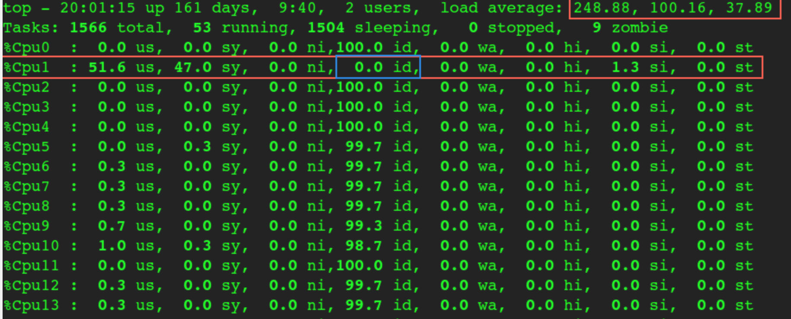
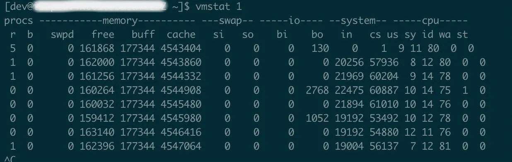

# Linux load 与 iowait 排障笔记

## 核心判断

`load average` 和 `iowait` 都容易被误读。它们不是“系统慢”的同义词，也不能单独证明瓶颈在哪里。

更稳妥的理解方式是：

- `load average` 看的是一段时间内的活跃任务数量，主要包括正在运行或等待 CPU 的任务，以及处于不可中断睡眠的任务。
- `iowait` 是 CPU 空闲时，系统中仍有 I/O 请求未完成的时间比例。
- CPU 使用率低但 load 高，通常说明任务在排队或阻塞，但不一定是 CPU 算力不够。
- iowait 高说明 CPU 有大量空闲时间被归类为等待 I/O，但 iowait 低不能反推 I/O 一定没有问题。

因此，排查时不要问“load 高是不是 CPU 不够”，而要先拆成两个问题：

1. 哪些任务被计入了 load？
2. 它们是在等 CPU、等 I/O、还是被调度/锁/中断等因素拖住？

## load average 到底统计什么

Linux 的平均负载不是 CPU 使用率。它更接近“系统里有多少活跃任务需要被处理”。

常见进程状态：

| 状态 | 含义 | 是否常影响 load |
| --- | --- | --- |
| `R` | 正在运行，或已经可运行但还在运行队列中 | 是 |
| `D` | 不可中断睡眠，常见于 I/O、内核锁、部分设备等待 | 是 |
| `S` | 可中断睡眠，通常是在等事件、网络、定时器等 | 通常否 |
| `Z` | 僵尸进程，已经退出但父进程尚未回收 | 通常否 |
| `T` | 被暂停或正在被追踪 | 通常否 |

如果 load 高，要先看 `R` 和 `D` 哪个多：

- `R` 多：重点看 CPU 运行队列、绑核、线程数、上下文切换。
- `D` 多：重点看磁盘、网络文件系统、块设备、内核等待点。

## iowait 的边界

`iowait` 不是“磁盘繁忙度”，而是 CPU 时间的一种分类。只有当 CPU 没有别的可运行任务，并且系统中存在未完成 I/O 时，这段空闲时间才可能被算进 iowait。

这会带来两个反直觉现象。

第一，iowait 很高时，CPU 不一定完全失去工作能力。只要有计算任务进入运行队列，CPU 仍然可以执行它们。

第二，I/O 压力很大时，iowait 也可能不高。如果同时有大量计算任务把 CPU 填满，CPU 时间会更多落到 `user` 或 `system`，而不是 `iowait`。

所以，`iowait` 适合回答的是：

> CPU 空闲的时候，有多少时间是在等 I/O？

它不适合单独回答：

> 磁盘是不是瓶颈？

## 典型误判

### 误判一：iowait 低，所以不是 I/O 问题

如果业务线程大量卡在 I/O 上，同时机器还有其他 CPU 密集型任务在跑，CPU 可能并不空闲，`iowait` 就不会明显升高。

这种情况下要看块设备层和进程层指标，例如：

```bash
iostat -c -h -d -x 2
iotop
pidstat -d 1
```

重点关注：

- `iostat` 的 `util`、`await`、`aqu-sz`；
- 单个进程的读写速率；
- 是否存在某个设备延迟明显偏高；
- 是否有大量任务处于 `D` 状态。

### 误判二：CPU 使用率低，所以 CPU 没问题

CPU 总使用率低，只能说明全局看还有空闲核，不代表每个运行队列都健康。

如果很多线程被绑到同一个 CPU，或者某个热点线程只能在固定核心运行，就可能出现“整体 CPU 很闲，但单核排队严重”的情况。



上图这类现象的重点不是平均 CPU 使用率，而是单个 CPU 的空闲率、系统态占比和运行队列长度。排查时需要按 CPU 维度看，而不是只看总览。

可用命令：

```bash
mpstat -P ALL 1
top
ps -eLo pid,tid,psr,stat,comm | sort -k3,3n
taskset -pc <pid>
```

### 误判三：CPU、内存、I/O 都不高，所以 load 高没原因

还有一类问题来自频繁上下文切换、中断、锁竞争或调度开销。表面看 CPU 利用率不高，I/O 也不突出，但系统在大量切换任务，真正用于业务执行的时间被稀释。



这时可以先用 `vmstat` 看系统级信号：

```bash
vmstat 1
```

重点关注：

- `r`：等待运行的任务数；
- `b`：不可中断睡眠任务数；
- `in`：每秒中断数；
- `cs`：每秒上下文切换次数；
- `us`、`sy`、`id`、`wa`：CPU 时间分布。

如果 `cs` 或 `in` 异常高，下一步要定位来源：

```bash
pidstat -w 1
mpstat -I ALL 1
perf top
```

## 排查路径

### 1. 先确认 load 来源

```bash
uptime
top
ps -e -o state,pid,ppid,comm,wchan:32 --sort=state
```

判断重点：

- `R` 多：看 CPU 队列和线程调度。
- `D` 多：看 I/O、设备、内核等待点。
- `S` 多但 load 高：需要再确认是否有短周期任务或采样窗口误差。

### 2. 再看 CPU 是忙、闲，还是偏科

```bash
mpstat -P ALL 1
pidstat -u -t 1
```

判断重点：

- 总 CPU 忙：可能是真正算力不足。
- 单核忙、其他核闲：看绑核、线程模型、热点锁。
- `sy` 高：看系统调用、内核路径、中断、网络栈。
- `cs` 高：看线程过多、锁竞争、频繁唤醒。

### 3. 并行检查 I/O

```bash
iostat -c -h -d -x 2
iotop
pidstat -d 1
```

判断重点：

- `await` 高：I/O 延迟高。
- `aqu-sz` 高：设备队列积压。
- 单进程 I/O 量异常：可能是业务或后台任务放大。
- `D` 状态集中在某些进程：结合 `wchan` 和调用栈继续看。

### 4. 最后定位具体等待点

如果常规指标只能证明“确实卡住”，还需要进入进程和内核视角：

```bash
strace -tt -T -p <pid>
perf top
cat /proc/<pid>/stack
cat /proc/<pid>/wchan
```

注意：`strace` 和 `perf` 对生产环境有额外开销，使用前要控制采样时间和目标进程范围。

## 快速判断表

| 现象 | 更可能的方向 | 下一步 |
| --- | --- | --- |
| load 高，`R` 多，CPU 总体忙 | CPU 算力不足或线程过多 | `pidstat -u -t 1`、`perf top` |
| load 高，`R` 多，单核忙 | 绑核、热点线程、锁竞争 | `mpstat -P ALL 1`、`taskset`、线程栈 |
| load 高，`D` 多 | I/O 或内核不可中断等待 | `iostat -x 2`、`wchan`、`/proc/<pid>/stack` |
| CPU 低，load 高，`cs` 高 | 上下文切换过多 | `vmstat 1`、`pidstat -w 1` |
| iowait 高 | CPU 空闲时间大量在等 I/O | `iostat`、`iotop`、业务 I/O 路径 |
| iowait 低但业务慢 | 不能排除 I/O；可能 CPU 被其他任务占用 | 同时看 `iostat`、`pidstat`、进程状态 |

## 结论

排查 load 高时，最重要的是不要把指标当成结论。

`load average` 告诉你“活跃任务多不多”，但不告诉你为什么多。`iowait` 告诉你“CPU 空闲时是否在等 I/O”，但不等于设备繁忙度。真正的定位需要把进程状态、CPU 分布、I/O 延迟、上下文切换和单核队列放在一起看。

一个实用的顺序是：

```text
load 高
  -> 看 R/D 状态
  -> 看每核 CPU 与运行队列
  -> 看 iostat/iotop/pidstat
  -> 看 vmstat 的 in/cs
  -> 必要时看 wchan、进程栈、perf
```
