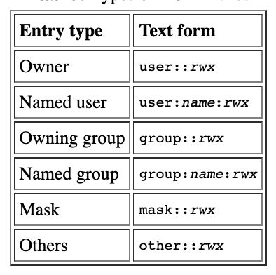
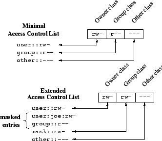

# Linux 安全机制演进：从 DAC、chroot 到 namespace 与 capability

Linux 的安全模型不是一次设计完成的，而是在 Unix 传统权限模型之上逐步补齐细粒度授权、隔离边界和特权拆分能力。理解这条演进线，比单独记忆某个命令或内核特性更有用：很多看似分散的机制，本质上都在回答同一个问题：一个进程到底能访问什么、能影响什么、以及它的“特权”应该作用在哪个范围内。

可以把这条线索粗略分成三组：

- 文件访问控制：从 Unix DAC 到 POSIX ACL。
- 文件系统视图隔离：从 `chroot` 到 namespaces。
- 超级用户特权拆分：从 root / non-root 到 POSIX capabilities，再到 user namespace 中有范围的 capabilities。

## 从 Unix DAC 到 POSIX ACL

传统 Unix 文件权限是 DAC（Discretionary Access Control，自主访问控制）。它把访问主体分成三类：owner、group、other；每一类有 `rwx` 三个位。这个模型简单、稳定，也非常适合早期多用户系统，但它的表达能力有限。

典型问题是：如果一个文件需要让多个特定用户、多个特定组拥有不同权限，传统 `user/group/other` 三段权限就不够用了。你可以通过新增组、调整主组、复制文件等方式绕过去，但这些做法会把授权关系挤压到系统账户和组管理里，长期维护成本很高。

POSIX ACL（Access Control Lists）扩展了文件权限表达能力。它允许文件除了拥有者、所属组和其他人之外，额外指定 named user 和 named group 的权限。一个 ACL entry 大致可以分成下面几类：



关键点不只是“多了几个 entry”，而是 POSIX ACL 必须兼容只理解传统 Unix 权限位的程序。这个兼容性要求引出了 `mask` 的设计。

### group class 与 mask

在传统 Unix 权限里，`ls -l` 显示的 group 权限就是 owning group 的权限。但在扩展 ACL 里，权限对象不再只有 owning group，还包括 named user 和 named group。POSIX ACL 因此引入了 group class：owning group、named user、named group 都被归入这个 class。

当 ACL 是 minimal ACL，也就是只包含 owner、group、other 三类传统 entry 时，group class 权限仍然映射到 owning group 权限。

当 ACL 是 extended ACL，也就是出现 named user 或 named group 时，group class 权限改为映射到 `mask` entry。这个 `mask` 不是一个独立用户的权限，而是 group class 中所有 entry 的有效权限上限。

换句话说，即使某个 named user entry 写着 `rwx`，只要 `mask::r--`，它最终最多也只能得到读权限。这个设计保证了旧程序不会因为系统开始支持 ACL，就在不知情的情况下突然放大 group 相关权限。

### 默认 ACL 与继承

POSIX ACL 还有一个容易误解的机制：default ACL。它只存在于目录上，用来决定该目录中新建对象的初始 ACL。

如果一个目录带有 default ACL，那么在它下面创建新目录时，新目录会同时继承两份东西：

- 将父目录的 default ACL 作为自己的 access ACL。
- 将父目录的 default ACL 作为自己的 default ACL。

如果在这个目录下创建的是普通文件或其他非目录对象，那么对象只会把父目录的 default ACL 继承为自己的 access ACL，不会拥有 default ACL。

这里还要注意 `mode` 与 `umask` 的关系。创建文件系统对象的系统调用通常会传入一个 `mode` 参数，例如 `open(..., 0644)` 或 `mkdir(..., 0755)`。当父目录存在 default ACL 时，新对象继承来的 access ACL 还会被 `mode` 进一步收窄：owner、group、other 三类的有效权限会取 ACL 与 `mode` 中对应权限位的交集。

如果父目录没有 default ACL，新对象权限才按传统 POSIX 规则计算：`mode` 减去当前进程的 `umask`。也就是说，父目录存在 default ACL 时，`umask` 不再参与最终权限计算；真正参与收窄的是创建调用传入的 `mode`。



### ACL 的访问判定流程

当一个进程请求访问某个文件系统对象时，ACL 判定可以拆成两步。

第一步，选择最匹配该进程身份的 ACL entry。匹配顺序是：

1. owner entry。
2. named user entry。
3. owning group 或 named group entry。
4. other entry。

第二步，用被选中的 entry 判断请求权限是否足够。这里有一个细节：进程可能同时属于多个 group，因此 group entry 可能有多个匹配项。如果任意一个匹配的 group entry 含有所需权限，就可以选择那个 entry 并允许访问；如果所有匹配的 group entry 都不包含所需权限，则访问被拒绝。

这套规则让 POSIX ACL 在兼容传统权限位的同时，提供了更细的文件访问授权能力。不过它仍然主要解决“文件系统对象访问”问题，并不负责进程的运行环境隔离。

## 从 chroot 到 namespaces

`chroot` 是早期常见的文件系统视图隔离手段。它把进程看到的根目录改到某个指定目录下，让进程以为那个目录就是 `/`。

这个机制很实用，但它的安全边界并不完整。`chroot` 主要改变路径解析的起点，并不会隔离进程号、网络栈、挂载表、IPC、hostname，也不会自动剥夺进程已有的特权。如果进程仍然保留足够权限，或者在进入 `chroot` 前已经打开了外部目录的 file descriptor，就可能绕过预期边界。

Linux namespaces 把隔离从“只改变根目录”推进到“隔离内核资源视图”。不同 namespace 负责不同资源：

- mount namespace：隔离挂载点视图。
- PID namespace：隔离进程号空间。
- network namespace：隔离网络设备、路由表、防火墙规则等网络栈资源。
- IPC namespace：隔离 System V IPC、POSIX message queues 等 IPC 资源。
- UTS namespace：隔离 hostname 和 domain name。
- user namespace：隔离用户、组 ID 映射，并改变 capabilities 的作用范围。
- cgroup namespace：隔离进程看到的 cgroup 层级视图。
- time namespace：隔离部分系统时间视图。

容器并不是单一内核特性，而是把 namespaces、cgroups、capabilities、seccomp、LSM、rootfs 等机制组合起来。namespaces 解决的是“进程看到的是哪一组资源”；cgroups 解决的是“进程最多能用多少资源”；capabilities、seccomp 和 LSM 则进一步限制“进程即使看到了资源，也能不能执行某些高风险操作”。

因此，把 `chroot` 理解为容器的前身是可以的，但不能把它理解为完整沙箱。它只是文件系统路径视图上的一种局部隔离。

## 从 root / non-root 到 POSIX capabilities

传统 Unix 特权模型非常粗：要么是 UID 0 的 root，要么不是 root。很多操作都被绑定到 root 身份上，例如绑定低端口、修改网络配置、加载内核模块、改变文件所有者等。

问题在于，程序经常只需要 root 的一小部分能力，却不得不以完整 root 权限运行。一旦程序被攻破，攻击者拿到的也是完整 root 权限。

POSIX capabilities 的目标是拆分 root 特权。内核把超级用户权限拆成多个独立能力，例如：

- `CAP_NET_BIND_SERVICE`：绑定小于 1024 的 TCP/UDP 端口。
- `CAP_NET_ADMIN`：执行网络管理操作。
- `CAP_SYS_ADMIN`：大量系统管理操作，范围很广，也因此风险很高。
- `CAP_CHOWN`：修改文件所有者。
- `CAP_DAC_OVERRIDE`：绕过 DAC 文件权限检查。
- `CAP_KILL`：向不属于自己的进程发送信号。

这样，一个服务如果只需要监听 80 端口，可以只授予 `CAP_NET_BIND_SERVICE`，而不是让整个进程以 root 身份运行。

### capability 的集合

Linux 中 capabilities 不只是一个布尔列表。进程通常会涉及几组 capability set：

- permitted：进程理论上可以启用的 capability 上限。
- effective：当前权限检查实际使用的 capability。
- inheritable：跨 `execve` 时可继承给新程序的 capability。
- bounding：整个进程树可获得 capability 的上限。
- ambient：为非特权程序跨 `execve` 保留能力的一组机制。

实际排障时，常见查看方式是读 `/proc/<pid>/status`：

```bash
grep '^Cap' /proc/<pid>/status
```

也可以使用 `capsh` 或 `getcap` / `setcap` 观察和设置能力。例如只允许某个二进制绑定低端口：

```bash
setcap cap_net_bind_service=+ep /path/to/server
getcap /path/to/server
```

capabilities 让权限最小化成为可能，但它不是自动安全。尤其是 `CAP_SYS_ADMIN` 覆盖面很大，在很多场景里接近“半个 root”。授予 capability 时要关注具体能力能触达哪些内核对象，而不是只看名字是否看起来狭窄。

## user namespace 中的 capabilities

user namespace 是理解现代容器安全的关键之一。它允许一个进程在 namespace 内看起来是 root，但在外层宿主机上并不等同于真实 root。

内核会给新 user namespace 中的初始进程授予一组完整 capabilities。但这些 capabilities 的作用范围受 namespace 限制：它们只对由该 user namespace 管辖的对象生效。

这背后有一个重要关联：Linux 会把每个非 user namespace 实例关联到某个 user namespace。也就是说，一个 mount namespace、PID namespace 或 network namespace 并不是脱离权限体系独立存在的；它们受某个 user namespace 管辖。进程在某个 namespace 中是否拥有管理能力，要看它在管辖该 namespace 的 user namespace 中是否拥有对应 capability。

这个设计让“容器内 root”与“宿主机 root”之间有了边界。容器内进程可以在自己的 namespace 范围内执行一些管理操作，但这些能力不会自然扩展到宿主机全局资源。

当然，边界不是魔法。namespace、capabilities、挂载配置、设备暴露、内核漏洞、LSM 策略都会共同决定最终安全性。把容器进程设置成非 root、减少 capabilities、启用只读 rootfs、限制设备访问、配合 seccomp 和 AppArmor / SELinux，仍然是实际部署中需要一起考虑的措施。

## 总结

Linux 安全机制的演进可以看成三个方向的逐步细化。

第一，访问控制从传统 `user/group/other` 走向 POSIX ACL，让文件权限可以表达 named user、named group 和默认继承规则，同时通过 `mask` 保持对旧权限模型的兼容。

第二，隔离机制从 `chroot` 这种文件系统路径视图限制，发展到 namespaces 对进程、网络、挂载、IPC、hostname、用户 ID 等内核资源视图的分维度隔离。

第三，特权模型从 root / non-root 的二元结构，拆成 capabilities，并进一步通过 user namespace 给 capabilities 加上作用范围。

这三条线合在一起，构成了现代 Linux 安全与容器隔离的基础：ACL 控制“谁能访问文件”，namespaces 控制“进程看到哪套世界”，capabilities 控制“进程在这个世界里能做哪些高权限操作”。

## 参考资料

- [Overview of Linux Kernel Security Features](https://www.linux.com/training-tutorials/overview-linux-kernel-security-features/)
- [POSIX Access Control Lists on Linux](https://www.usenix.org/legacy/publications/library/proceedings/usenix03/tech/freenix03/full_papers/gruenbacher/gruenbacher_html/main.html)
