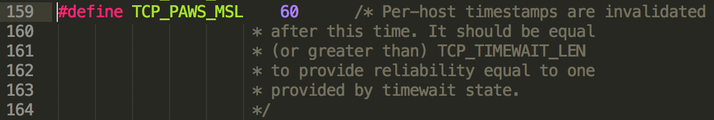
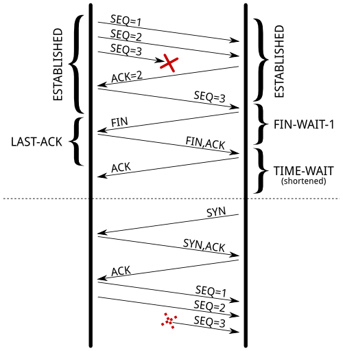
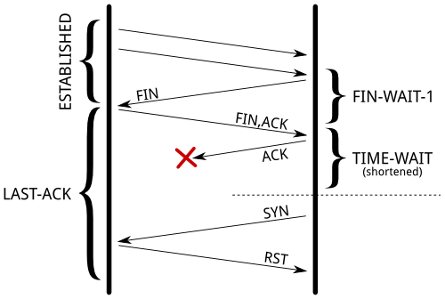
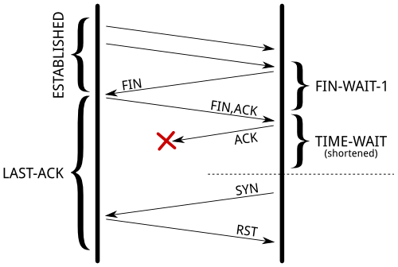
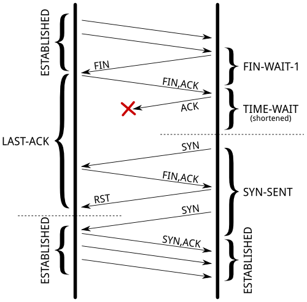

# TCP TIME_WAIT 逻辑笔记

来源：[Coping with the TCP TIME-WAIT state on busy Linux servers](https://vincent.bernat.im/en/blog/2014-tcp-time-wait-state-linux)

## 核心结论

1. `TIME_WAIT` 状态不是多余负担，而是 TCP 正确性的一部分；处理不当甚至会带来安全风险。
2. `TIME_WAIT` 通常出现在主动关闭连接的一方；被动关闭方在等待最后确认时会处于 `LAST_ACK`。
3. 即使启用历史上的快速复用或回收机制，TCP 栈也需要依靠序列号、timestamp 和状态检查，尽量维持不弱于标准 `TIME_WAIT` 的安全性。
4. 如果协议和系统都可控，让服务端承担 `TIME_WAIT` 往往更可靠，因为服务端行为更容易统一治理，不能假设所有客户端都正确、稳定、可配置。
5. `tcp_tw_reuse`、`tcp_max_tw_buckets`、可用本地端口范围之间有关联，调参时不能只看单个指标。

PAWS（Protect Against Wrapped Sequence numbers）利用 TCP timestamp 辅助判断报文新旧，降低序列号回绕或旧报文误收的风险。



## `TIME_WAIT` 的两个目的

### 防止旧报文污染新连接

TCP 连接由四元组标识：

```text
source address, source port, destination address, destination port
```

如果一个连接关闭后，新的连接很快复用了同一个四元组，旧连接中延迟到达的 TCP segment 就可能被新连接误收。序列号检查可以缩小这个问题，但不能彻底消除风险；在高速链路和较大接收窗口下，旧报文仍可能落入可接受范围。

这也是 RFC 1337 讨论的典型问题：如果 `TIME_WAIT` 被过度缩短，旧连接的延迟 segment 可能进入一个无关的新连接。



### 确保对端完成关闭

`TIME_WAIT` 的另一个目的，是给最后一个 `ACK` 留出重传和确认空间。

如果最后的 `ACK` 丢失，对端会继续停留在 `LAST_ACK`，并认为旧连接还没有完全关闭。此时如果本端马上用同一个四元组发起新连接，对端可能把新的 `SYN` 当成旧连接上的异常报文处理，并返回 `RST`，导致新连接失败。



处于 `LAST_ACK` 的对端会持续重传 `FIN`，直到发生以下情况之一：

1. 重试超时，放弃并销毁连接；
2. 收到等待中的 `ACK`，正常销毁连接；
3. 收到 `RST`，直接销毁连接。

## 主动发起连接时的复用

客户端发起新连接时，如果系统启用了 `net.ipv4.tcp_tw_reuse` 且启用了 `tcp_timestamps`，Linux 可以为新的出站连接复用一个处于 `TIME_WAIT` 的四元组。

复用条件的关键是：新连接的 timestamp 必须严格大于旧连接记录的最近 timestamp。满足条件时，处于 `TIME_WAIT` 的出站连接最快约 1 秒后可以被复用。

如果没有启用相关机制，内核通常会选择新的四元组，或者在本地端口耗尽时返回失败。

## 服务端收到连接时的状态处理

下面的逻辑可以理解为同一个目标：即使内核允许快速复用或历史上的快速回收，也必须避免新旧连接状态相互污染。

### 对应四元组处于 `LAST_ACK`

如果服务端收到新连接时，旧连接仍处于 `LAST_ACK`，直接处理不当会让新连接被旧状态打断。

一种结果是旧状态返回 `RST`：



另一种带 timestamp 的路径是：

1. 新连接替换本地 `TIME_WAIT` 条目；
2. 新连接的初始 `SYN` 因 timestamp 检查被忽略，不直接回复 `RST`；
3. 对端旧连接继续重传 `FIN`；
4. 本地新连接处于 `SYN_SENT`，收到旧 `FIN` 后回复 `RST`；
5. 这个 `RST` 让对端旧连接退出 `LAST_ACK`；
6. 新连接的 `SYN` 超时后重传，最终建立连接，只是多了一点延迟。



### 对应四元组处于 `TIME_WAIT`

如果服务端发现对应四元组处于 `TIME_WAIT`，是否接受新连接取决于报文是否可以被证明属于更新的连接，例如：

- sequence number 明显更新；
- timestamp 明显更新。

如果不能证明新连接足够新，就应拒绝，避免延迟报文或旧状态污染新连接。

### `tcp_tw_recycle` 的历史问题

`tcp_tw_recycle` 是历史上的快速回收机制，依赖 peer timestamp 记录来判断来自同一 IP 的新连接是否足够新。

它的问题在于：同一个公网 IP 后面可能有多个客户端，尤其是 NAT 场景。不同客户端的 timestamp 不一定单调递增，内核如果只按 peer IP 记录最近 timestamp，就可能错误拒绝合法连接。因此这个机制不适合作为通用优化手段，后来的 Linux 内核也已移除它。

## 调参提醒

- `tcp_tw_reuse` 主要影响出站连接的 `TIME_WAIT` 复用，不是服务端通用“清理 TIME_WAIT”开关。
- `tcp_max_tw_buckets` 限制系统保留的 `TIME_WAIT` 数量，调小可能缓解表面压力，但会降低 TCP 对旧报文和旧状态的保护。
- 扩大可用临时端口范围通常比粗暴缩短 `TIME_WAIT` 更稳妥。
- 如果客户端临时端口压力很高，可以从协议关闭方向、连接池、长连接、`IP_BIND_ADDRESS_NO_PORT`、端口范围和出站地址扩展等角度综合处理。

## 记忆要点

`TIME_WAIT` 的本质不是“关闭太慢”，而是为四元组复用提供安全间隔。  
想优化它，应优先减少不必要的短连接和端口争用，再谨慎使用内核复用机制。
