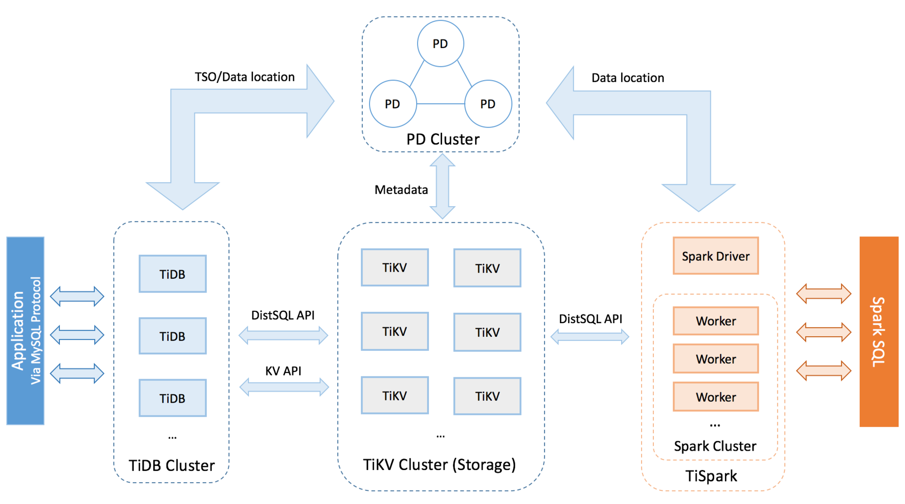

# 常见时钟方案

1995 年，Hal Berenson 等人在《A critique of ANSI SQL Isolation Levels》中提出了 Snapshot Isolation（SI，快照隔离）的概念。SI 的核心思想是：事务从一个已经提交的数据快照中读取，提交时再检查写写冲突。

在 Berenson 论文的异常分类中，SI 可以避免 P0（Dirty Write）、P1（Dirty Read）、P2（Fuzzy Read）、P3（Phantom）、P4（Lost Update）、P4C（Cursor Lost Update）和 A5A（Read Skew），但仍可能出现 A5B（Write Skew）。因此，SI 比传统 Read Committed / Repeatable Read 更强，但并不等同于 Serializable。

## 1. Snapshot Isolation 的基本实现

论文中给出的 SI 实现可以简化为以下步骤：

- 事务读取已经提交的数据快照。快照时间可以选择在事务第一次读操作之前的任意时间，记为 `StartTimestamp`。
- 事务准备提交时，系统分配一个 `CommitTimestamp`。它需要大于当前系统中已经存在的 `StartTimestamp` 和 `CommitTimestamp`。
- 事务提交时执行冲突检查：如果没有其他事务在 `[StartTS, CommitTS]` 区间内提交过与本事务 `WriteSet` 有交集的数据，则本事务可以提交；否则本事务需要 abort。这个检查可以阻止 Lost Update。
- SI 允许事务使用较旧的 `StartTS` 读取历史快照，因此读操作通常不会被写操作阻塞。但如果一个事务基于很旧的 `StartTS` 执行写入，提交时更容易遇到写写冲突而 abort。

从这个模型可以看出，系统需要为事务分配可比较的时间戳，用于表达快照版本和提交顺序。分布式存储系统常见的时间戳方案可以粗略分为两类：

- **全局发号器**：由中心化服务分配全局单调递增的时间戳，例如 Percolator / TiDB 的 TSO。
- **时钟方案**：利用物理时钟、逻辑时钟或二者的组合生成时间戳，例如 TrueTime、Lamport Clock、Vector Clock、Hybrid Logical Clock。

需要注意的是，时间戳方案只是事务协议的基础组件。它能帮助系统定序，但并不单独决定数据库最终提供 SI、Serializable、Linearizable 还是 Strict Serializable。

## 2. 常见时钟方案对比

| 方案 | 核心思想 | 优点 | 局限 |
| --- | --- | --- | --- |
| Logical Clock | 用逻辑计数器维护事件的 `happens-before` 顺序 | 不依赖物理时钟，可以表达已知通信链路上的因果先后 | 不能表达真实物理时间；Lamport Clock 不能判断两个事件是否并发 |
| Vector Clock | 每个节点维护一个向量，用向量偏序判断因果关系 | 可以判断事件之间的因果关系和并发关系 | 空间复杂度为 `O(n)`，节点数变化时维护成本高 |
| Physical Clock | 直接使用机器本地物理时钟 | 与现实时间直接对应，便于生成可读时间和做时间窗口查询 | 多节点时钟存在漂移，只有在误差有界时才能安全用于定序 |
| TrueTime | 返回带不确定性的时间区间，并通过 commit wait 消除不确定窗口 | 可以在全球多副本场景中支持外部一致性 | 依赖 GPS、原子钟和复杂基础设施，建设和运维成本高 |
| Hybrid Logical Clock | 用物理时间加逻辑计数器组合生成时间戳 | 兼顾物理时间接近性和因果单调性，空间复杂度为 `O(1)` | 不能像 TrueTime 一样直接给出绝对时间的严格误差边界，仍需处理 uncertainty window |

## 3. 全局发号器

### 3.1 核心原理

全局发号器通过一个中心化时间戳服务生成严格单调递增的时间戳。因为所有时间戳都来自同一个服务，系统可以对并发事务建立一个全局顺序，再基于这个顺序实现 MVCC、SI 或更强的事务隔离级别。

Percolator 论文中将这个中心服务称为 TSO（Timestamp Oracle）。TSO 的优点是模型简单、全局定序明确、容易和事务协议结合。很多分布式数据库采用了类似设计。

TSO 的主要问题也比较直接：

- **高可用依赖**：整个系统依赖 TSO 的可用性。可以用 Paxos / Raft 等共识协议构建多副本 TSO，但网络分区或重新选主期间仍可能影响发号。
- **跨地域延迟**：获取时间戳需要客户端和 TSO 进行 RPC 交互。如果客户端与 TSO 不在同一机房，延迟会升高；在全球多地域部署下，这个问题更明显。常见替代方向是 TrueTime、HLC 或区域化时间戳方案。

### 3.2 Percolator

Percolator 是典型使用 TSO 的系统。每个事务通常需要和 TSO 交互两次：开始事务时获取 `StartTS`，提交事务时获取 `CommitTS`。因此，TSO 的吞吐能力非常关键。

Percolator 的 TSO 会定期分配一段连续递增的时间戳，并把这段区间中的最大时间戳写入持久存储。之后，TSO 可以直接从内存中分配时间戳；当区间耗尽后，再申请下一段区间。如果 TSO 重启，则从持久化记录的最大时间戳之后继续分配，避免时间戳回退。

为了减少 RPC 开销，客户端可以通过 batch 在一次 RPC 中获取多个时间戳。并发事务越多，batch 效果越明显。Percolator 论文中提到 TSO 可以达到每秒约 200 万次发号，通常不会成为系统瓶颈。

### 3.3 TiDB

TiDB 是一款面向 HTAP（Hybrid Transactional/Analytical Processing）的分布式数据库，兼容 MySQL 协议，支持水平扩展、分布式事务、多副本强一致和实时 OLAP。

TiDB 采用了与 Percolator 类似的 TSO 方案，通过中心化服务获取全局一致的版本号，并保证事务版本号单调递增。TSO 模块位于 TiDB 的全局中心控制节点 PD 中。PD 基于 etcd 保证持久化元数据的强一致性，并支持自动故障切换，从而缓解中心化服务带来的单点问题。



引自：<https://pingcap.com/docs-cn/stable/architecture/>

## 4. TrueTime

TrueTime 是 Google 在 Spanner 论文中提出的时间 API。Spanner 同时使用了 2PL、2PC、Paxos 等传统分布式系统技术，但 TrueTime 是它实现全球范围外部一致性的重要基础。

TrueTime 基于 GPS 和原子钟构建。它并不返回一个“绝对正确的当前时间点”，而是返回一个包含真实时间的区间。系统通过等待不确定区间过去，确保事务提交时间戳已经落在真实时间之后，从而把物理时间和事务顺序联系起来。

### 4.1 核心原理

在分布式系统中，各节点本地时钟可能存在偏移和漂移。如果直接使用本地物理时钟生成时间戳，不同节点产生的时间戳不一定能安全表达事件顺序。NTP 可以校准机器时间，但普通环境中的误差上限和异常情况很难直接支撑强一致事务定序。

TrueTime 的关键是显式暴露时间不确定性。调用 `TT.now()` 会返回一个 `TTinterval`：

```text
TTinterval = [earliest, latest]
```

其中 `earliest <= Tabs(now) <= latest`，`Tabs(now)` 表示真实绝对时间。也就是说，真实时间一定落在这个区间内。

事务选择提交时间戳 `s` 时，会选择一个不小于 `TT.now().latest` 的值。随后系统执行 commit wait，一直等待到 `TT.now().earliest > s`。此时可以确定真实时间已经超过提交时间戳 `s`，从而保证事务提交顺序与真实时间顺序一致。

Spanner 是分布式事务系统，最终提交时间戳还要综合多个参与副本的约束来选择；但核心思想仍然是通过时间区间和等待消除不确定性。

### 4.2 典型实现

TrueTime 由每个数据中心的一组 Time Master 和每台机器上的 Time Slave daemon 共同实现。

多数 Time Master 配备带专用天线的 GPS 接收器，并且在物理上相互隔离，以减少共同故障风险。部分 Time Master 配备原子钟，论文中称为 Armageddon Master。所有 Master 会相互校验时间参考值；如果某个 Master 的时间参考值与本地时间偏差过大，它会被驱逐。

每台机器上的 Time Slave daemon 会从多个 Time Master 获取时间，包括本地数据中心和邻近数据中心的 GPS Master，以及 Armageddon Master。Slave daemon 使用 Marzullo 算法的变种计算可信时间区间，并将结果与本地时钟比较。如果本地时钟频繁超出允许边界，该机器也会被驱逐。

在两次同步之间，Time Slave daemon 会根据最坏时钟漂移率逐渐增大时间不确定性。Spanner 论文中用 `ε` 表示这种不确定性。在 Google 的生产环境中，`ε` 通常在 1ms 到 7ms 之间呈锯齿形变化，平均值约为 4ms。同步间隔约为 30 秒，时钟漂移率按 200 微秒/秒保守计算，两者带来约 0 到 6ms 的不确定性；剩余约 1ms 主要来自与 Time Master 通信的延迟。

## 5. 混合逻辑时钟

混合逻辑时钟（HLC，Hybrid Logical Clock）结合了物理时钟和逻辑时钟。它既保留了与真实时间接近的性质，又能在事件存在因果关系时保持时间戳单调。

HLC 不是向量时钟。它通常由物理时间部分和逻辑计数器组成，因此空间复杂度为 `O(1)`，不会随节点数量线性增长。

### 5.1 核心原理

HLC 的设计目标包括：

- 如果事件 `e` happens-before 事件 `f`，则有 `hlc.e < hlc.f`。这保留了逻辑时钟的因果单调性。
- 存储 `hlc.e` 所需空间为 `O(1)`，与向量时钟的 `O(n)` 形成对比。
- `hlc.e` 与事件发生机器上的物理时钟 `pt.e` 的差值有界，使 HLC 仍然接近物理时间。

典型 HLC 时间戳可以表示为：

```text
HLC = (physical_time, logical_counter)
```

HLC 通常在本地事件、发送消息和接收消息时更新。发送消息可以视为一次本地事件，并把更新后的 HLC 附带到消息中。简化伪代码如下：

```text
state:
    hlc = (l, c)

local_event():
    pt = physical_now()
    if pt > l:
        l = pt
        c = 0
    else:
        c = c + 1
    return (l, c)

send_message():
    ts = local_event()
    message.hlc = ts

receive_message(message):
    pt = physical_now()
    remote = message.hlc

    next_l = max(pt, l, remote.l)

    if next_l == l and next_l == remote.l:
        c = max(c, remote.c) + 1
    else if next_l == l:
        c = c + 1
    else if next_l == remote.l:
        c = remote.c + 1
    else:
        c = 0

    l = next_l
    return (l, c)
```

这套规则的核心是：HLC 不允许本地时间戳回退；当物理时间超过已有 HLC 时，逻辑计数器可以归零；当本地 HLC 或远端 HLC 已经领先于本机物理时间时，通过递增逻辑计数器维持单调性。接收消息时把远端 HLC 纳入计算，可以传播跨节点通信形成的 `happens-before` 关系。

### 5.2 Uncertainty Interval

HLC 接近物理时间，但它不能像 TrueTime 一样直接证明“当前真实时间已经超过某个时间戳”。因此需要处理 uncertainty interval。

假设事务 `e` 的读取时间戳为 `hlc.e`，集群允许的最大时钟偏移为 `MaxOffset`。事务读到另一个版本 `g` 时，可以粗略分为三类：

- 如果 `hlc.g <= hlc.e`，说明版本 `g` 不晚于事务快照时间，事务可以读取它。
- 如果 `hlc.g > hlc.e + MaxOffset`，说明版本 `g` 已经超出事务可能的不确定窗口，通常可以判断它发生在事务快照之后，不应被当前快照读取。
- 如果 `hlc.e < hlc.g <= hlc.e + MaxOffset`，版本 `g` 落在 uncertainty interval 内。此时系统无法仅凭 HLC 判断 `g` 的真实物理时间是否一定晚于事务 `e` 的快照时间。

这里的判断要区分“MVCC 版本顺序”和“真实物理时间顺序”。`hlc.g <= hlc.e` 并不等于证明版本 `g` 的真实物理提交时间一定早于事务 `e` 的开始时间；它表示在数据库采用的 HLC/MVCC 时间戳顺序中，版本 `g` 被排在事务 `e` 的快照时间之前，因此可以纳入当前快照。对于真实时间上并发的事务，数据库可以选择一个与冲突关系一致的逻辑串行顺序，把 `g` 排在 `e` 之前。

uncertainty interval 主要处理相反方向的风险：当 `hlc.g > hlc.e` 时，普通 MVCC 规则会倾向于把 `g` 当成快照之后的版本跳过。但如果 `g` 来自一个物理时钟偏快的节点，它可能在真实时间上已经早于事务 `e` 开始前提交。此时直接跳过 `g` 可能导致后开始的事务漏读已经完成的写入，破坏外部时间顺序。因此，不确定性窗口关注的是“看起来晚于快照的版本是否其实应该被看见”，而不是重新怀疑所有已经落入快照内的版本。

遇到 uncertainty interval 时，不能简单读取该版本，否则可能破坏快照一致性。常见处理方式是事务刷新读取时间戳、重试，或在必要时等待不确定窗口过去。

### 5.3 能力边界

HLC 是一种时间戳机制，不是完整的隔离级别实现。数据库能否提供 Serializable、Linearizable 或 Strict Serializable，还取决于事务协议、复制协议、读路径、冲突检测和等待策略。

- HLC 可以帮助系统在大多数情况下减少中心化授时依赖。
- HLC 可以支撑事务时间戳、MVCC 版本和因果传播。
- 单靠 HLC 不能提供 TrueTime 式的外部一致性保证；系统仍需要额外机制处理不确定窗口、冲突、重启或等待。

### 5.4 MongoDB 的 HLC 实现

MongoDB 的 `$clusterTime` 是对外暴露的集群逻辑时间，格式是 BSON `Timestamp(secs, inc)`：`secs` 接近物理秒，`inc` 是同一秒内的逻辑递增部分。它不是中心化 TSO，而是更接近 HLC 的时间戳，用来维持跨节点、跨请求的单调顺序。`clusterTime` 的权威推进主要和写入相关：primary 产生 oplog timestamp，节点应用 oplog 后推进自己的时间；节点也可以因为收到更大的、验证通过的 `$clusterTime` 而把内存中的逻辑时钟向前推进，但这不等于本节点已经有对应时间点的 majority-committed 数据。

客户端通过 gossip 参与 `clusterTime` 传播。服务器在普通命令响应里返回 `$clusterTime`；驱动记录当前 `MongoClient` 或 `ClientSession` 见过的最大值，并在后续非 SDAM 命令中带回给服务器。服务器收到后只会向前合并，不会回退。分片集群中，`mongos` 也利用这套时间传播和选择机制，为跨 shard snapshot read 选择共同的 `atClusterTime`，让多个 shard 对齐到同一个逻辑快照时间。

因果一致性建立在会话时间传播之上。一个 causally consistent session 会维护本会话观察到的 `clusterTime` 和 `operationTime`；后续操作会把这些时间带给服务器，使读写至少不早于本会话已经观察到的历史。这样 MongoDB 可以提供 read-your-writes、monotonic reads、monotonic writes、writes-follow-reads 等会话保证。如果希望这些保证同时具备持久性，通常需要 `readConcern: "majority"` 与 `writeConcern: "majority"` 配合。

没有真实业务写入时，MongoDB 仍需要让 oplog 时间向前走，否则 change stream、`afterClusterTime` 等等待逻辑可能被长期卡在旧时间。做法不是让读请求直接生成新快照，而是由 primary 的 `NoopWriter` 周期性写入 no-op oplog entry，可以把它理解成内部的“ping 写入”。默认参数 `writePeriodicNoops` 为 true，`periodicNoopIntervalSecs` 默认为 10 秒；config server 会把这个间隔调到 1 秒，以免拖慢集群级 change stream。这个 no-op entry 有 oplog timestamp，因此会像普通写入一样被复制、提交，并推进可见的 `clusterTime` / majority commit point。

## 6. 总结

分布式数据库中的事务一致性依赖多层机制：时间戳生成、MVCC、冲突检测、复制协议、提交协议和读路径都很重要。时钟方案只是其中一层，但会深刻影响系统的延迟、可用性和一致性边界。

- **全局发号器**模型简单，能提供清晰的全局事务顺序，适合单地域或区域化部署；主要代价是中心化依赖和跨地域 RPC 延迟。
- **TrueTime** 通过显式时间不确定性和 commit wait 支撑全球范围的外部一致性；主要代价是专用硬件、复杂基础设施和等待成本。
- **HLC** 在工程上更容易落地，兼顾物理时间和因果单调性；但它不是 TrueTime，需要数据库协议额外处理不确定窗口和一致性边界。

理解这些方案时，最好把“时间戳如何生成”和“事务隔离级别如何保证”分开看。时间戳提供定序材料，事务协议才决定最终能否避免某类异常。
