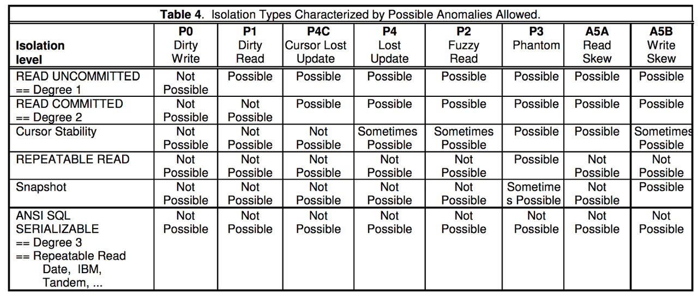
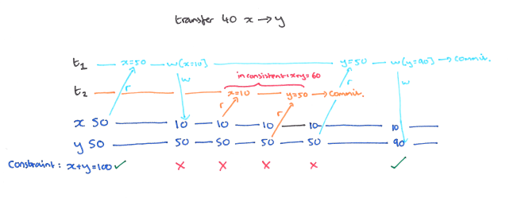
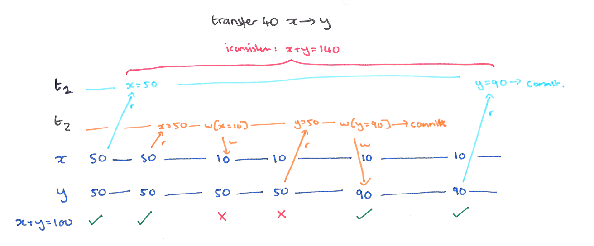
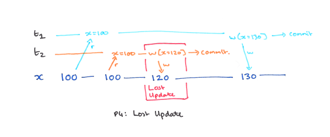
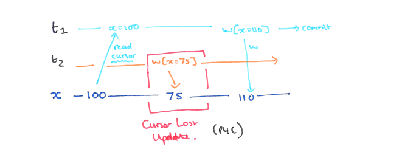
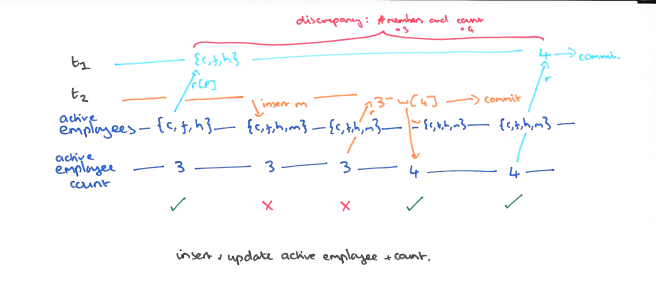
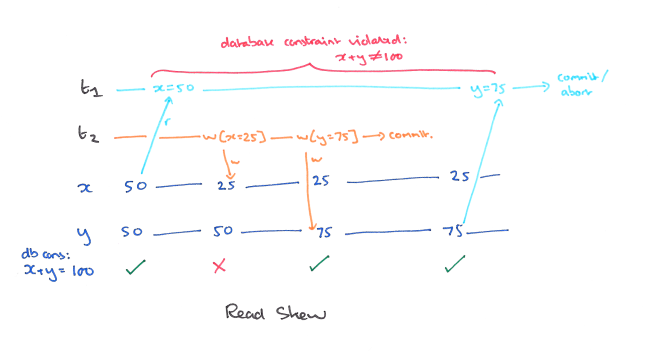
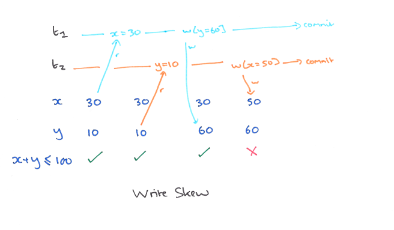

# 事务隔离标准分析

## **1 概述与背景**

本文主要在 Hal Berenson、Phil Bernstein、Jim Gray、Jim Melton、Elizabeth O'Neil、Patrick O'Neil 合著的论文 Critique of ANSI SQL Isolation Levels 基础上，分析关系数据库的事务隔离级别标准和不同隔离级别情况下的行为。

第 2 节主要讨论基于异象（phenomena）的隔离级别定义，第 3 节讨论基于悲观锁实现的事务隔离级别，第 4 节讨论基于多版本技术的快照隔离，最后总结并排序本文讨论到的各个隔离级别。

ACID 是关系数据库的一组重要特性，其中 Isolation（隔离性）描述了数据库允许多个并发事务同时对其数据进行读写和修改的能力。隔离性可以防止多个事务并发时由于交错执行而导致数据的不一致。

在最极端的情况下，数据库完全串行化执行每一个事务，所有事务之间遵守全序关系，此时不存在并发事务间的隔离问题。但是在实际工程实践中，出于性能和吞吐量考虑，数据库通常允许多个事务并发执行，并通过隔离级别约束并发执行可能造成的不一致。

ANSI SQL-92 标准用 P1/P2/P3 三种异象定义了 Read Uncommitted、Read Committed、Repeatable Read、Serializable 四个隔离级别。但是论文指出，ANSI 对这些异象的自然语言描述偏窄，不能完整刻画真实系统中的并发异常。因此本文只简要提及 ANSI 标准，后续分析主要采用论文中更有解释力的广义异象定义。

## **2 基于异象的隔离级别**

基于异象的定义方式不直接描述数据库应该如何加锁或如何维护多版本，而是描述在某个隔离级别下哪些并发历史不应该出现。

先定义本文使用的记号：

* `w1[x]` 表示事务 1 写入记录 `x`
* `r1[x]` 表示事务 1 读取记录 `x`
* `c1` 表示事务 1 提交
* `a1` 表示事务 1 回滚
* `r1[P]` 表示事务 1 按照谓词 `P` 读取一组记录
* `w1[y in P]` 表示事务 1 写入记录 `y`，且 `y` 满足谓词 `P`

本文采用广义版本的 P0/P1/P2/P3。广义版本不要求事务最终一定提交或回滚，也不要求事务必须重复读取同一条记录；它只保留事务之间关键读写操作的时序关系。因此，它比 ANSI 文本中的狭义自然语言定义覆盖更多真实异常。

* **P0 Dirty Write（脏写）**：`w1[x] ... w2[x] ... ((c1 or a1) and (c2 or a2) in any order)`
	* 一个事务覆盖了另一个未结束事务已经写入的数据。脏写会破坏恢复语义，也会让事务回滚变得不可靠，因此实际系统通常都会禁止。
* **P1 Dirty Read（脏读）**：`w1[x] ... r2[x] ... ((c1 or a1) and (c2 or a2) in any order)`
	* 一个事务读取到了另一个未结束事务写入的数据。即使写入事务最后提交，这种读取也可能看到事务中间状态，而不是一个完整的一致状态。
* **P2 Fuzzy Read / Non-repeatable Read（模糊读 / 不可重复读）**：`r1[x] ... w2[x] ... ((c1 or a1) and (c2 or a2) in any order)`
	* 一个事务已经读取过的数据项，被另一个并发事务写入。广义 P2 不要求事务 1 一定再次读取 `x`；只要事务 1 的后续逻辑可能依赖旧值，就可能出现不一致。
* **P3 Phantom（幻读）**：`r1[P] ... w2[y in P] ... ((c1 or a1) and (c2 or a2) in any order)`
	* 一个事务读取过谓词 `P` 对应的数据集合，另一个并发事务写入了满足 `P` 的数据。广义 P3 关注谓词范围被并发写入，而不局限于事务 1 是否用同一谓词重复查询。

ANSI SQL-92 大体上通过禁止 P1/P2/P3 来划分四个隔离级别：

| 级别 | P1（脏读） | P2（模糊读） | P3（幻读） |
| --- | --- | --- | --- |
| Read Uncommitted | 允许 | 允许 | 允许 |
| Read Committed | 禁止 | 允许 | 允许 |
| Repeatable Read | 禁止 | 禁止 | 允许 |
| Serializable | 禁止 | 禁止 | 禁止 |

这张表容易造成一个误解：只要禁止 P1/P2/P3，就等价于严格可串行化。实际上，真正的 Serializable 要求并发执行结果等价于某个串行执行结果；单纯排除 P1/P2/P3 并不足以覆盖所有不可串行化历史。后文讨论的 Write Skew 就是典型例子。

因此，本文后续使用 “基于异象的 Serializable” 指代“禁止 P1/P2/P3”的隔离级别，用严格意义上的 “Serializable” 指代“等价于某个串行执行”的隔离级别。

## **3 基于锁的事务隔离**

第 2 节只描述了隔离级别要禁止哪些异象，但没有说明数据库如何做到这一点。基于锁的隔离模型可以把 P0/P1/P2/P3 与具体实现机制关联起来。

先定义几种读写和锁操作：

* **Predicate lock 谓词锁：Locks on all data items satisfying the search condition**
	* 谓词锁是逻辑谓词范围上的锁；在某些实现中可由范围锁、gap lock 或 next-key lock 近似实现，但不应直接等同。
* **Well-formed Writes 合法 write：Requests a Write(Exclusive) lock on each data item or predicate before writing**
* **Well-formed Reads 合法 read：Requests a Read(share) lock on each data item or predicate before reading**
* **Long duration locks 长周期锁：Locks are held until after the transaction commits or aborts**
* **Short duration locks 短周期锁：Locks are released immediately after the action completes**

通过组合上述锁规则，可以构建不同级别的锁式隔离。由于 “No Well-formed Writes” 或 “Short duration write locks” 可能允许 P0 Dirty Write，约束过弱，实际系统通常不会采用。所以下面默认所有写入操作都使用 “Well-formed Writes, Long duration Write locks”。

在这个前提下，通过调整读取操作的锁规则，可以得到四种锁式隔离级别：

| 隔离级别 | Read Lock | Write Lock |
| --- | --- | --- |
| Locking Read Uncommitted | none required | Well-formed Writes, Long duration Write locks |
| Locking Read Committed | Well-formed Reads, Short duration read lock | Well-formed Writes, Long duration Write locks |
| Locking Repeatable Read | Well-formed Reads, Long duration data-item Read locks, Short duration Read Predicate locks | Well-formed Writes, Long duration Write locks |
| Locking Serializable | Well-formed Reads, Long duration Read locks | Well-formed Writes, Long duration Write locks |

这些锁规则与 P1/P2/P3 的关系如下：

* **短周期读锁禁止 P1**：如果读操作必须先获取读锁，而写锁持有到事务结束，那么 `w1[x] ... r2[x]` 中的 `r2[x]` 会被事务 1 的写锁阻塞，直到事务 1 提交或回滚。因此事务 2 不能读到事务 1 未结束时写入的版本。
* **长周期数据项读锁禁止 P2**：如果事务 1 读取 `x` 后把 `x` 的读锁持有到事务结束，那么 `r1[x] ... w2[x]` 中的 `w2[x]` 会被阻塞，直到事务 1 结束。因此事务 1 已经读过的数据项不会在事务结束前被其他事务改写。
* **长周期谓词读锁禁止 P3**：如果事务 1 按谓词 `P` 读取数据后把谓词锁持有到事务结束，那么 `r1[P] ... w2[y in P]` 中的 `w2[y in P]` 会被阻塞。因此事务 1 读过的谓词范围不会在事务结束前被其他事务插入、删除或更新出新的匹配结果。

因此，锁式隔离可以被理解为广义 P1/P2/P3 的一种实现方式：读锁越长、覆盖范围越大，能禁止的异象越多，但并发度也越低。论文中也因此认为，基于异象的隔离级别在很大程度上是锁式隔离级别的另一种表达。

## **4 基于快照的事务隔离**

对于基于锁实现事务隔离的数据库，读写、写写事务之间也可能因为锁冲突而被阻塞，数据库的整体吞吐能力受到比较大的限制，特别是在目前多核 CPU 条件下，难以充分发挥计算能力。

因此现代关系型数据库和 NewSQL，比如 MySQL、Oracle、PostgreSQL、OceanBase、TiDB 等，都使用多版本并发控制（MVCC）技术来实现事务隔离。它的核心设计思想是，为数据的每次修改保存一个用时间戳标记的版本，数据读取不需要阻塞写入，而是通过一致性快照读取某个历史版本。

### **4.1 什么是快照隔离**

Snapshot Isolation（SI，快照隔离）是一种基于 MVCC 的事务隔离模型。它的基本语义可以概括为两点：

* **一致性读**：事务开始时获得一个逻辑时间点上的快照，事务内的普通读取都从这个快照中取数。因此，一个事务多次读取同一条记录、同一个谓词范围，或者多条存在业务约束的数据时，看到的是同一个历史状态，而不是多个提交时刻拼接出来的结果。
* **写冲突检测**：事务提交时，数据库会检查它写入的数据项是否与其他并发事务发生写写冲突。经典 SI 通常采用 First-committer-wins 或等价策略：如果两个并发事务修改同一条记录，先提交者成功，后提交者需要回滚或重试。

由此可以看出，快照隔离和基于锁的隔离模型关注点不同。基于锁的隔离通过读锁、写锁、谓词锁来阻塞冲突操作；快照隔离则让读操作读取历史版本，避免读写互相阻塞，再通过提交阶段的写冲突检测处理一部分写写冲突。

不过，工程实现中的“快照读”并不总是等同于严格的 Snapshot Isolation。不同数据库在快照粒度、当前读、锁定读、谓词冲突检测、写冲突检测上存在差异。因此下面讨论的是论文意义上的经典 SI，而不是某个具体数据库产品中名为 Repeatable Read 或 Serializable 的实现。

### **4.2 快照隔离与 P1/P2/P3**

先从 P1/P2/P3 来看，快照隔离的读一致性非常强，但它和基于锁的隔离不是同一种实现语义：

* **禁止 P1 脏读**：P1 描述的是 `w1[x] ... r2[x] ...`，即事务 2 读取到事务 1 尚未提交的写入。在 SI 下，事务 2 只会读取自己快照中已经提交的历史版本，因此实际读取更接近 `r2[last committed version of x]`。
* **避免 P2 对读者可见**：如果事务 1 已经读取 `x`，事务 2 随后写入 `x` 的新版本，那么事务 1 后续普通读取仍然返回自己快照中的旧版本，不会在同一个事务内看到 `x` 被改写后的结果。
* **避免 P3 对读者可见**：如果事务 1 已经按谓词 `P` 读取数据，事务 2 随后写入满足 `P` 的新版本，那么事务 1 后续普通谓词查询仍然基于原快照，不会看到事务 2 新提交的匹配结果。

这里需要注意一个细节：从广义读写依赖的角度看，SI 并不会阻止 `r1[x] ... w2[x]` 或 `r1[P] ... w2[y in P]` 这样的并发关系出现；它只是通过多版本机制让事务 1 继续读取旧快照。因此，SI 在读取体验上避免了不可重复读和幻读，但这些读写依赖仍可能参与形成不可串行化历史。后文的 Write Skew 正是这个问题的典型表现。

### **4.3 Read Skew：快照隔离强于 Read Committed 的原因**

快照隔离不仅禁止脏读，也能避免 Read Committed 下常见的 A5A Read Skew：

* **A5A Read Skew**：`r1[x]...w2[x]...w2[y]...c2...r1[y]...(c1 or a1)`

Read Skew 的问题不在于单条记录被重复读取后发生变化，而在于事务 1 读取到的 `x` 和 `y` 来自两个不同的提交时刻。比如 `x + y = 100` 是业务约束，事务 1 先读到旧版本 `x = 50`，事务 2 随后提交 `x = 25, y = 75`，事务 1 再读到新版本 `y = 75`，于是事务 1 看到 `x + y = 125`。这个结果并不是数据库真实存在过的状态，而是两个时间点拼接出来的状态。

在 Read Committed 下，每条语句通常只要求读取语句开始前已经提交的数据，因此同一个事务中的不同语句可能读取不同快照，Read Skew 可以发生。在 SI 下，事务 1 的 `r1[x]` 和 `r1[y]` 来自同一个事务级快照，因此不会看到这种跨时间点拼接结果。

从这个角度看，快照隔离高于 Read Committed：它不仅禁止 P1，而且能为事务内多次普通读取提供一致视图。

### **4.4 Write Skew：快照隔离仍然不是 Serializable**

快照隔离的问题在于，它主要检测写写冲突，而经典 SI 不会自动检测“读集合与其他事务写集合之间的谓词依赖”。因此，当两个事务读取相同约束下的不同数据，并写入彼此不冲突的数据项时，仍然可能发生 A5B Write Skew：

* **A5B Write Skew**：`r1[x]...r2[y]...w1[y]...w2[x]...(c1 and c2 occur)`
	* **扩展的 Write Skew**：`r1[P]...r2[P]...w1[x]...w2[y]...(c1 and c2 occur)`

例如约束是 `x + y <= 100`，初始值为 `x = 30, y = 10`。事务 1 读取 `x = 30` 后认为可以写入 `y = 60`；事务 2 读取 `y = 10` 后认为可以写入 `x = 50`。两个事务分别基于自己的快照判断约束成立，且写入的是不同记录，所以没有直接写写冲突；但二者都提交后，最终状态变成 `x + y = 110`，违反了约束。

这说明快照隔离不是严格意义上的 Serializable。真正的 Serializable 要求并发执行结果等价于某个串行执行结果，而上述 Write Skew 找不到合法的串行顺序：如果 T1 先执行，T2 应该能看到 T1 写入后的 `y = 60`；如果 T2 先执行，T1 应该能看到 T2 写入后的 `x = 50`。SI 允许二者都基于旧快照完成判断并提交，因此产生了不可串行化结果。

### **4.5 快照隔离与锁式 Repeatable Read 的关系**

快照隔离和第 3 节中的 Locking Repeatable Read 不能简单排序。

一方面，SI 使用事务级一致性快照，可以避免 P1/P2/P3 和 A5A Read Skew；而 Locking Repeatable Read 只对数据项读锁持有到事务结束，谓词读锁仍可能是短周期，因此它不一定禁止 P3。

另一方面，Locking Repeatable Read 的长周期数据项读锁可能阻止某些 A5B Write Skew。例如 `r1[x]...r2[y]...w1[y]...w2[x]` 中，事务 1 对 `x` 持有长周期读锁，事务 2 对 `y` 持有长周期读锁，后续 `w2[x]` 和 `w1[y]` 会被对方读锁阻塞，最终只能死锁回滚或串行化执行。而经典 SI 因为两个事务写入不同记录，提交阶段检测不到直接写写冲突，所以可能允许二者同时提交。

因此，快照隔离与 Locking Repeatable Read 双方都能禁止一些对方可能允许的异象，二者不是简单的大于或小于关系。更准确的排序是：

`Read Committed < (Locking Repeatable Read >< Snapshot Isolation) < Serializable`

## **5 总结**

从前面几个小节的隔离性分析来看，我们可以得到如下几种隔离级别的关系：

`Read Uncommitted < Read Committed < (Repeatable Read >< Snapshot) < Serializable`

本文首先介绍了基于广义异象的隔离级别定义，并简要说明 ANSI 标准与严格 Serializable 之间的差异；然后介绍了基于锁的隔离级别标准；最后分析快照隔离级别，并通过 Read Skew 和 Write Skew 说明快照隔离在几种隔离级别中的位置。

## **6 附录**

### **P1: Dirty Read**

* 当一个事务 T1 能读取到另一个未提交事务 T2 写入的值时，就称为脏读。这里不论 T2 最终状态是被提交还是被回滚，只要在 T2 未结束的时候 T1 就读到了 T2 写的值，就是脏读。
* 如下图，x 和 y 最开始值都为 50，并具有完整性约束，即 x + y = 100。现在需要从 x 转移 40 到 y，事务 T2 从 x 读取值为 50，扣除 40 后将 x = 10 写入数据库，但尚未把 y 更新为 90。这时事务 T1 读取 x = 10 和 y = 50，在事务 T1 看来，x + y = 60，其和不为 100，读取到了 T2 的中间状态。
* 

### **P2: Fuzzy Read**

* 当进行中的事务 T1 读取到的值被另一个事务 T2 写的新值覆盖，并且新值在 T1 可见时，我们称发生了 Fuzzy Read（模糊读）或者 Non-Repeatable Read（不可重复读）。即使 T1 没有真正读取 T2 写入的新值，仍然可能导致违反数据库一致性约束。
* 如下图，x 和 y 最开始值都为 50，并具有完整性约束，即 x + y = 100，现在仍需要从 x 转移 40 到 y。
* 事务 T1 开始读取 x = 50，同时并发执行了事务 T2。事务 T2 先后读取了 x 和 y 值，并将 x = 10，y = 90 写回了数据库。然后事务 T1 继续执行，读取了 y = 90，这时在事务 T1 看来，x + y = 140，同样违背了一致性约束。
* 

### **P4: Lost Update**

* 当事务 T1 读取一个数据项然后 T2 更新该数据项，然后 T1（基于 T2 更新前的读取值）更新该数据项并提交时，就会发生丢失更新异常。
* 如下图，事务 T1 和事务 T2 都读取了 x = 100，事务 T2 将 x = 120 写回数据库。然后事务 T1 又基于旧值将 x = 130 写回数据库，在事务 T2 看来，自己的更新 x = 120 丢失了。
* 

### **P4C: Cursor Lost Update**

* Cursor Lost Update 是 Lost Update 的一种变种，只是这里的 read 是由游标读取的。

### **P3: Phantom**

* 当事务 T1 执行了基于谓词的读取（例如 SELECT…WHERE P），另外一个并发执行事务 T2 写入（删除、更新）与该谓词相匹配的数据项并在 T1 可见，我们称这种情况为幻读。
* 如下图，事务 T1 最开始读取了三个值分别为 {c，f，h}，同时 T2 又插入了 m，这时数据库中的值为 {c，f，h，m}。然后事务 T1 再次读取了数据的 count 为 4，这时发生了异常。
* 

### **A5A: Read Skew**

* 读者看到不一致视图
* 当两个或多个数据项之间存在完整性约束时，可能会发生 Read Skew（读偏斜）。
* 如下图，有一致性约束 x + y = 100。事务 T1 首先读取 x = 50，同时事务 T2 写入了 x = 25 和 y = 75。然后事务 T1 继续读取了 y = 75。这时在事务 T1 看到的视图中，x + y = 125，违背了一致性约束；但数据库的最终状态本身仍然可能是满足约束的。
* 

### **A5B: Write Skew**

* 写者共同破坏约束
* 写偏斜和读偏斜非常相似，只是数据库中的值违背了一致性约束。假设我们的约束是 x + y≤100。
* 如下图，事务 T1 读取了 x = 30，并将 y = 60 写入了数据库，事务 T2 读取了 y = 10，并将 x = 50 写回了数据库。此时数据库中 x + y = 110，违背了一致性约束。
* 
