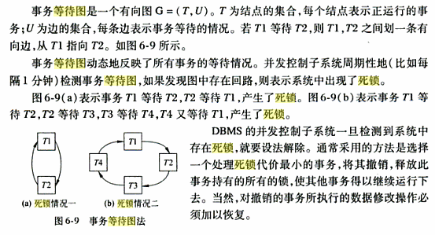

# 事务与并发控制

## 1. 事务

事务是一系列数据库操作组成的一个完整逻辑过程。

### ACID 特性

- **原子性**：事务要么全部成功，要么全部失败；中间状态不能在数据库上持久化，依赖故障恢复保证。
- **一致性**：事务执行前后，数据库都应满足完整性约束。典型例子是转账。
- **隔离性**：并发执行的事务之间应相互隔离，避免互相破坏一致性。
- **持久性**：一旦事务提交，对数据库的修改必须持久化。

## 2. 隔离性与一致性

即使每个事务本身能保证一致性和原子性，多个事务**并发**执行也可能导致不一致状态。若事务串行执行，问题会简单很多。

### 调度与可串行化

- **串行调度**：事务一个一个执行。
- 如果调度 `S` 可以通过一系列**非冲突指令**交换变成 `S'`，则称它们是冲突等价的。
- 如果一个调度 `S` 与某个串行调度冲突等价，则称 `S` 是冲突可串行化的。

保证可串行化的协议可能只允许很小的并发度。某些场景下，可以采用**较弱**的一致性级别。

### 一致性级别

从强到弱：

1. 可串行化
2. 可重复读
3. 已提交读
4. 未提交读

使用较弱一致性级别时，程序员需要额外保证数据库的正确性。

隔离性级别可以通过多种并发机制保证：

- 锁
- 时间戳
- 多版本
- 快照隔离

## 3. 隔离性与原子性

在允许并发的系统中，如果 `Ti` 失败，原子性要求 `Ti` 及依赖于 `Ti` 的任何事务 `Tj` 也回滚。

### 可恢复调度

对于每对事务 `Ti`、`Tj`，如果 `Tj` 读取了 `Ti` 所写的数据项，则 `Ti` 必须先于 `Tj` 提交。

### 无级联调度

对于每对事务 `Ti`、`Tj`，如果 `Tj` 读取了 `Ti` 所写的数据项，则 `Ti` 必须在这一读取操作前提交。

## 4. 优先图

优先图用于判断调度是否冲突可串行化。

设 `S` 是一个调度，由 `S` 构造一个有向图，称为优先图。该图为：

```text
G = (V, E)
```

- `V`：顶点集，由所有参与调度的事务组成。
- `E`：边集，由满足下列条件之一的边 `Ti -> Tj` 组成。

边 `Ti -> Tj` 的构造条件：

1. `Ti` 的 `write(Q)` 在 `Tj` 的 `read(Q)` 之前执行。
2. `Ti` 的 `read(Q)` 在 `Tj` 的 `write(Q)` 之前执行。
3. `Ti` 的 `write(Q)` 在 `Tj` 的 `write(Q)` 之前执行。

满足上述条件的 `Ti -> Tj` 是一对冲突指令。如果有向图中存在边 `Ti -> Tj`，则在任何与 `S` 冲突等价的调度 `S'` 中，`Ti` 都必须出现在 `Tj` 之前。

**结论**：如果优先图无环，则调度 `S` 是冲突可串行化的。

## 5. 锁

### 锁类型

- **共享锁（S）**
- **排他锁（X）**

### 锁相容性矩阵

| 已持有 \ 请求 | S | X |
| --- | --- | --- |
| S | Y | N |
| X | N | N |

### 简单封锁协议

事务 `Ti` 要访问数据项 `Q` 前，必须先给 `Q` 加锁。

如果 `Q` 上已经被其他事务加了不相容类型的锁，`Ti` 进入等待，直到所有不相容类型的锁释放。

### 防止饿死

典型问题：一系列共享锁请求不断被授权，导致排他锁请求长期阻塞。

改进协议：当事务 `Ti` 请求对数据项 `Q` 加 `M` 型锁时，并发控制器授权加锁的条件是：

1. 数据项 `Q` 上不存在与 `M` 型锁冲突的锁。
2. 不存在等待对数据项 `Q` 加锁且先于 `Ti` 申请的事务。

## 6. 两阶段封锁协议

两阶段封锁协议用于保证可串行性。

### 基本两阶段封锁协议

事务分为两个阶段：

1. **增长阶段**：事务可以获得锁，但不能释放锁。
2. **缩减阶段**：事务可以释放锁，但不能获得新锁。

最后加锁的位置称为事务的**封锁点**。多个事务可以根据封锁点排序，这个顺序就是事务的一个可串行化顺序。

### 严格两阶段封锁协议

用于防止级联回滚。

- 事务持有的**所有排他锁**只能在事务提交后释放。

### 强两阶段封锁协议

- 事务持有的**所有锁**只能在事务提交后释放。
- 事务按提交顺序串行化。

### 锁转换

锁转换用于提高并发度：

- **升级**：只能在增长阶段进行。
- **降级**：只能在缩减阶段进行。

## 7. 死锁

### 死锁预防

常见方法：

1. 事务开始时一次性全部封锁，或者全部不封锁。
2. 给数据项强加一个顺序，事务只能按规定顺序封锁数据，例如树形协议。
3. 抢占与事务回滚。给事务自身加次序，通过时间戳决定事务等待还是回滚。
4. 锁超时。

并发控制仍使用封锁协议。系统给每个事务赋予唯一时间戳，通过时间戳决定事务等待还是回滚。回滚后重启仍使用原来的时间戳。

#### wait-die

`Ti` 请求的数据项被 `Tj` 持有时：

- `Ti` 更老：`Ti` 等待。
- `Ti` 更年轻：`Ti` 回滚。

也就是：**老事务可以等年轻事务；年轻事务遇到老事务就回滚**。

等待方向只会从老到年轻：

```text
T1 -> T2 -> T3 -> ...
```

箭头表示“左边事务等待右边事务”。因为等待方向单调，所以不会形成环。

#### would-wait

`Ti` 请求的数据项被 `Tj` 持有时：

- `Ti` 更老：让 `Tj` 回滚，`Ti` 抢占锁。
- `Ti` 更年轻：`Ti` 等待。

也就是：**老事务会抢占年轻事务；年轻事务遇到老事务就等待**。

等待方向只会从年轻到老：

```text
T1 <- T2 <- T3 <- ...
```

### 死锁检测与恢复

- 通过**等待图**检测死锁。



- 通过超时处理死锁。
- 选择牺牲者并回滚。

## 8. 多粒度锁

多粒度锁允许各种大小的数据项集合，并定义数据粒度的层次结构。其中小粒度数据项嵌套在大粒度数据项中。

多粒度封锁协议允许多粒树中的每个结点被独立加锁。**对一个结点加锁意味着这个结点的所有后裔结点也被加以同样类型的锁**。

- 加锁顺序：自上向下。
- 释放顺序：自底向上。

如果给某个节点加锁时还要遍历它的所有子节点，否则可能错误授予锁。这与多粒度锁的初衷相背。一种初级解决方案是在路径上都加锁，但代价太高。

因此引入意向锁。

### 意向锁

- **IS（共享意向锁）**：将在较低节点加共享锁。
- **IX（排他意向锁）**：将在较低节点加锁，可以加共享锁或排他锁。
- **SIX（共享排他型意向锁）**：对当前节点加共享锁，并将在较低节点加排他锁。

| 已持有 \ 请求 | IS | IX | S | SIX | X |
| --- | --- | --- | --- | --- | --- |
| IS | true | true | true | true | false |
| IX | true | true | false | false | false |
| S | true | false | true | false | false |
| SIX | true | false | false | false | false |
| X | false | false | false | false | false |

### 多粒度封锁协议

1. 事务 `Ti` 必须遵从锁相容性矩阵。
2. 事务 `Ti` 必须首先封锁树的根节点，并且可以加任意类型的锁。
3. 仅当 `Ti` 当前对 `Q` 的父节点具有 `IX` 或 `IS` 锁时，`Ti` 才可对节点 `Q` 加 `S` 或 `IS` 锁。
4. 仅当 `Ti` 当前对 `Q` 的父节点具有 `IX` 或 `SIX` 锁时，`Ti` 才可对节点 `Q` 加 `X`、`SIX` 或 `IX` 锁。
5. 仅当 `Ti` 未曾对任何节点解锁时，`Ti` 才可对节点加锁。
6. 仅当 `Ti` 当前不持有 `Q` 的子节点的锁时，`Ti` 才可以对节点 `Q` 解锁。

## 9. 时间戳

### 基本概念

对于系统中的每个事务 `T`，DBMS 的并发控制管理器在事务开始执行前赋予一个唯一固定的时间戳，记为 `TS(T)`。

时间戳有大小，也表示先后顺序：

```text
若事务 Ti 先于事务 Tj 进入系统，则 TS(Ti) < TS(Tj)
```

### 实现方式

- **系统时钟值**：事务进入系统时的时钟值就是该事务的时间戳。
- **逻辑计数器**：事务进入系统时的计数器值。每赋予一个时间戳，计数器自动增加一次。

### 数据项上的两个时间戳

每个数据项 `Q` 需要关联两个重要时间戳：

- `W-TS(Q)`：当前已成功执行 `write(Q)` 的所有事务的最大时间戳。
- `R-TS(Q)`：当前已成功执行 `read(Q)` 的所有事务的最大时间戳。

每当有新的 `read(Q)` 或 `write(Q)` 指令成功执行，这两个时间戳就会被更新。

事务的时间戳决定调度中事务的串行化顺序。若：

```text
TS(Ti) < TS(Tj)
```

则 DBMS 必须保证所产生的调度等价于 `Ti` 出现在 `Tj` 之前的某个串行调度。

### 时间戳排序协议

时间戳排序协议保证任何有冲突的 `read` 和 `write` 操作都按时间戳顺序执行。

假设事务 `Ti` 发出 `read(Q)` 操作：

- 若 `TS(Ti) < W-TS(Q)`，则 `Ti` 需要读入的 `Q` 值已被覆盖，`read` 操作被拒绝，`Ti` 回滚。
- 若 `TS(Ti) >= W-TS(Q)`，则执行 `read` 操作，并将 `R-TS(Q)` 设为 `R-TS(Q)` 与 `TS(Ti)` 中的较大者。

假设事务 `Ti` 发出 `write(Q)` 操作：

- 若 `TS(Ti) < R-TS(Q)`，则 `Ti` 产生的 `Q` 值是先前所需要的值，但系统已假定该值不会被产生。因此，`write` 操作被拒绝，`Ti` 回滚。
- 若 `TS(Ti) < W-TS(Q)`，则 `Ti` 试图写入的值已经过时。基本时间戳排序协议会拒绝该 `write` 操作并回滚 `Ti`；Thomas 写规则可以选择忽略该过时写入。
- 其他情况下执行 `write` 操作，并将 `W-TS(Q)` 设为 `TS(Ti)`。

事务 `Ti` 被并发控制机制回滚之后，会被赋予新的时间戳并重新启动。

### Thomas 写规则

Thomas 写规则通过删除事务发出的过时 `write` 操作来利用视图可串行化。

## 10. 基于有效性检查的协议

### 问题背景

数据库系统中的大部分事务都是只读事务。在这种情况下，事务发生冲突的频率较低。因此，即使没有并发控制机制的监控，也不一定会破坏数据库的一致性。

并发控制机制会带来代码执行开销及可能的事务延迟。因此，可以采用开销较小的协议。

### 事务生命周期

根据事务所要执行的操作，事务生命周期可分为三个阶段。对于只读事务，则只有两个阶段。

1. **读阶段**：各数据项的值被读入并保存在事务的局部变量中。所有写操作都是对局部临时变量进行的，并不真正更新数据库。
2. **有效性检查阶段**：判断是否可以将写操作所更新的临时变量值拷入数据库，同时不违反可串行性。
3. **写阶段**：若事务通过有效性检查，则实际更新写入数据库；否则事务回滚。

### 时间戳

有效性检查协议也利用时间戳排序技术来保证调度的可串行性：

- `Start(Ti)`：事务 `Ti` 开始执行的时刻。
- `Validation(Ti)`：事务 `Ti` 完成读阶段并开始有效性检查阶段的时刻。
- `Finish(Ti)`：事务 `Ti` 完成写阶段的时刻。

### 有效性测试

和时间戳排序协议不同，有效性检查协议令：

```text
TS(Ti) = Validation(Ti)
```

若 `TS(Tj) < TS(Tk)`，则该协议产生的任何调度必定等价于 `<Tj, Tk>`。

事务 `Ti` 通过有效性检查的条件之一是，对任意满足 `TS(Tk) < TS(Ti)` 的事务 `Tk`，满足以下条件之一：

1. `Finish(Tk) < Start(Ti)`。
2. `Start(Ti) < Finish(Tk) < Validation(Ti)`，且 `Tk` 所写数据集与 `Ti` 所读数据集不相交。

第二种情况的含义：

- `Tk` 的写不影响 `Ti` 的读。
- `Ti` 的写又不可能影响 `Tk` 的读。

如果不满足有效性测试，`Ti` 就需要回滚。

该协议的基本前提是大多数事务不会与其他事务发生冲突，因此尽可能允许事务先执行，再在提交前检查。

## 11. 多版本

### 多版本时间戳排序

对于每个数据项 `Q`，有一个版本序列与之关联：

```text
<Q1, Q2, ..., Qm>
```

每个版本 `Qk` 包含三个数据字段：

- `Content`：`Qk` 版本的值。
- `W-timestamp`：创建 `Qk` 版本的时间戳。
- `R-timestamp`：所有成功读取 `Qk` 版本的事务的最大时间戳。

假设事务 `Ti` 发出 `read(Q)` 或 `write(Q)` 操作，系统选择一个版本 `Qk`：

```text
Qk 是 W-timestamp 小于或等于 TS(Ti) 的版本中 W-timestamp 最大的版本
```

规则：

- 如果 `Ti` 发出 `read(Q)`，则返回 `Qk` 的内容。
- 如果 `Ti` 发出 `write(Q)`：
  - 若 `TS(Ti) < R-timestamp(Qk)`，则 `Ti` 回滚。
  - 若 `TS(Ti) = W-timestamp(Qk)`，则覆盖 `Qk` 的内容。
  - 若 `TS(Ti) > R-timestamp(Qk)`，则创建 `Q` 的一个新版本。

多版本时间戳排序中，读请求从不失败。这个优点对实践至关重要。

缺点：

- 读取时需要更新 `R-timestamp`，可能导致两次磁盘访问。
- 写冲突会回滚，而不是等待。

### 多版本两阶段封锁

多版本两阶段封锁结合了**多版本**与**两阶段封锁**。

核心规则：

- 区分只读事务和更新事务。
- 时间戳使用计数器，称为 `ts-counter`。该计数器在更新提交时增加。
- 只读事务开始时，读取数据库当前的 `ts-counter` 作为 `TS`。
- 只读事务处理遵从多版本时间戳排序协议。
- 更新事务使用两阶段封锁：
  - 读取数据项时请求共享锁。
  - 写数据项时请求排他锁，然后为数据项创建一个新版本，时间戳暂设为无穷大。
- 更新事务提交时，先为它创建的每个版本设置 `timestamp = ts-counter + 1`，然后将 `ts-counter++`。
- 同一时间只能有一个更新事务提交。

效果：

- `ts-counter` 增加之前启动的只读事务看到旧值。
- `ts-counter` 增加之后启动的只读事务看到新值。

### 版本删除规则

如果某个数据项有两个版本 `Qk`、`Qj`，并且这两个版本的 `W-timestamp` 都小于系统中最老事务的时间戳，那么较旧的版本不再会被用到，可以删除。

## 12. 快照隔离

事务开始时获得一份数据库快照，后续操作都在这个快照上执行，直到提交时更新数据库。

更新数据库必须是原子的，以保证其他快照要么包含事务 `T` 的全部改动，要么全部不包含。

待补充：

- 更新冲突处理
