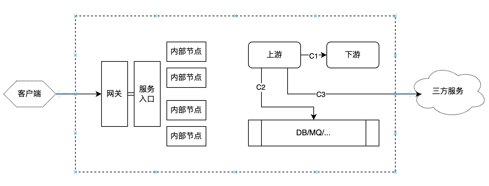

# 微服务系统

微服务架构把系统复杂性从单体内部转移到了服务之间：调用链变长、故障传播路径变多、数据一致性变弱、发布和治理面变宽。可运行、可演进的微服务系统，需要同时具备资源供给、基础组件、发布部署、监控观测、服务治理、容量保障、身份权限和数据一致性等能力。

微服务系统的建设重点是能否建立一套支撑服务自治和整体稳定的基础设施。

## 1. 目标

微服务系统的核心目标包括：

1. 支持业务按领域拆分，让服务可以独立开发、测试、发布和扩展。
2. 降低单个服务的复杂度，使团队可以围绕服务边界自治。
3. 通过标准化基础设施降低服务接入成本。
4. 在服务数量增加后，仍然保持系统可观测、可治理、可恢复。
5. 在局部故障、容量波动和外部依赖异常时，控制影响范围。

微服务系统不是天然高可用。相反，如果缺少治理和观测，微服务会比单体更容易出现复杂故障。它需要以平台化能力作为底座。

## 2. 底座与先决条件

一个完整的微服务系统至少需要以下底座能力：

- 资源管理：底层虚拟机、物理机、容器、网络和存储资源的申请、调度与隔离。
- 基础组件：数据库、缓存、消息队列、对象存储、搜索引擎等通用依赖。
- 发布系统：支持服务部署、升级、回滚和版本管理。
- 监控系统：覆盖日志、指标、追踪、审计和告警。
- 服务治理：覆盖服务发现、配置管理、流量治理和故障隔离。

这些能力构成微服务系统的最小可运行集合。没有资源快速分配，服务无法弹性扩展；没有基本监控，系统无法判断是否健康；没有快速部署和回滚，服务自治会变成发布风险；没有标准化 RPC 和服务发现，服务之间的调用关系会迅速失控。

微服务化之前，应先确认以下条件是否具备：

- 计算资源可以快速分配。
- 存储资源容易申请和访问。
- 基础组件具备稳定接入方式。
- 监控体系已经覆盖基础设施和服务状态。
- 发布系统可以支持快速部署和回滚。
- 服务之间有标准化通信方式。
- 认证、授权和访问控制有统一方案。
- 外围系统和第三方依赖有清晰接入边界。

如果这些条件不具备，过早拆分服务通常会带来更多运维和协作成本。微服务拆分应该跟平台能力同步推进，而不是只做代码层面的拆分。

## 3. 配置中心

配置中心是微服务系统中的关键基础组件。服务数量增加后，配置不再适合分散在各个实例或机器上管理，否则很难统一变更、审计和回滚。

配置中心至少需要支持：

- 多环境配置：区分开发、测试、预发、生产等环境。
- 多集群配置：支持不同机房、地域、集群的差异化配置。
- 订阅与发布：配置变更后可以通知客户端，或由客户端通过版本、MD5 等方式拉取差异。
- 权限控制：限制谁可以修改哪些配置。
- 操作审计：记录配置变更人、变更时间、变更内容和发布范围。
- 版本管理：每次发布形成版本，支持回滚。
- 灰度发布：先让部分实例生效，观察稳定后再全量发布。
- 本地缓存：配置中心异常时，客户端仍能使用已有配置运行。
- 降级开关：在异常时快速关闭非核心功能。

配置分发一般有两类模式：

- 推模式：实时性好，但客户端和配置中心之间需要保持连接，系统复杂度较高。
- 拉模式：实现简单，但实时性较弱；如果没有增量机制，可能增加配置中心压力。

实际系统通常会结合两者：服务端负责变更通知，客户端负责拉取配置内容，并保留本地缓存和兜底配置。

## 4. 发布与变更

微服务系统中，发布系统不只是把服务部署到机器上。它还承担风险控制职责。

基本发布能力包括：

- 构建和打包标准化。
- 多语言服务接入规范。
- 部署、升级、回滚流程。
- 实例版本可见。
- 发布过程可观测。
- 支持灰度发布和蓝绿部署。
- 支持失败自动停止或人工确认。

灰度发布和蓝绿部署不一定属于微服务最小集，但当服务数量、业务复杂度和变更频率上升后，它们会成为稳定性建设的必要能力。

发布系统应和监控、配置中心、服务发现联动。发布后，系统需要能看到新旧版本比例、错误率、延迟、流量分布和实例健康状态；一旦异常，可以快速停止发布、回滚配置或摘除实例。

## 5. 服务治理

服务治理解决的是服务数量增加后的调用关系管理问题。核心能力包括服务发现、负载均衡、请求重试、熔断、限流和降级。

### 服务发现

服务发现用于解决“调用方如何找到服务实例”的问题。服务实例启动后注册自身地址、版本、健康状态等信息；调用方或代理层根据注册信息选择可用实例。

服务发现不只是地址簿，还应该参与健康治理：

- 异常实例可以被主动摘除。
- 实例版本和权重可以被识别。
- 机房、集群、可用区等拓扑信息可以影响路由。
- 发布和扩容后的实例可以逐步接入流量。

### 负载均衡

负载均衡的目标是均衡流量、改善请求完成效率、提高系统吞吐。

常见策略包括：

- 静态权重：按固定权重分配流量。
- 动态权重：根据历史耗时、在途请求数、错误率或实例负载调整权重。

微服务内部的负载均衡不应只看实例数量。慢实例比故障实例更隐蔽，如果负载均衡仍持续把请求打到慢实例，可能拖慢上游并放大故障。

### 请求重试

请求重试的目标是尽可能完成请求，但重试也可能放大流量并加剧过载。因此重试必须有边界。

基本策略包括：

- 限制重试次数。
- 使用退避算法，避免立即集中重试。
- 设置全局重试预算，控制系统整体额外流量。
- 区分可重试与不可重试错误。
- 对进程负载、节点负载导致的临时限流可以谨慎重试；对明确业务拒绝、权限失败、参数错误等不应重试。

重试应该和超时、截止时间、幂等性配套设计。没有截止时间的重试会浪费资源，没有幂等保障的重试可能造成重复写入。

### 熔断

熔断的目标是隔离异常，避免调用方持续请求已经异常的下游。广义上算负载均衡的一部分，也会带来一定限流效果。

常见触发方式包括：

- 静态规则：失败次数达到阈值后摘除或短路。
- 动态规则：根据失败率、延迟或负载情况进行概率摘除。

熔断不是为了隐藏错误，而是为了阻止错误扩散。熔断后需要有探测恢复机制，避免下游恢复后长期无法接入流量。

### 限流

限流的目标是在极限负载时拒绝部分请求，以保持系统稳定吞吐。

限流维度包括：

- 并发限制。
- QPS 或 TPS 限制。
- 带宽限制。
- 多租户限制。
- 接口级限制。
- 进程、节点、链路或系统级负载限制。

限流规则需要考虑请求优先级。例如前台请求和后台任务、核心链路和非核心链路、普通租户和重点租户，应该有不同保护策略。

限流还需要关注截止时间。已经超过业务可接受时限的请求，即使继续处理成功，也可能对用户没有价值，反而浪费系统资源。

### 降级

降级的目标是在极限负载或依赖异常时关闭部分功能，以保护核心链路。

降级可以是自动触发，也可以是人工触发。设计上应尽量分级：

- 优先关闭低价值、低频、非核心功能。
- 优先采用温和降级，例如减少推荐数量、降低刷新频率、延迟异步任务。
- 必要时采用有损降级，例如关闭某些展示模块、暂停非关键写入。

降级开关应和配置中心联动，并经过演练。没有演练过的降级方案，在真实故障中很可能不可用。

### 分层流量治理

流量治理不应只放在某一个位置。客户端、网关、服务入口、上游、下游和基础组件看到的风险不同，能做出的决策也不同。合理的做法是分层治理：能前置拒绝的请求尽量前置拒绝，必须依赖真实负载判断的请求则靠近瓶颈位置决策。

分层治理可以按调用链位置拆开看：

- 客户端
	- 不做可靠性假设。
- 网关
	- 限流，识别异常流量等（比如DDOS）
- 服务入口
	- 限流，系统负载
- 内部节点
	- 协助评估负载指标
	- 服务发现里主动摘除
- 上游
	- 负载均衡、重试、熔断
	- C1，内部服务之间
	- C2，到数据库等基础组件，可能要特殊的限流策略（连接池）
	- C3，到三方服务，可能要流量整形
- 下游
	- 限流，进程负载、节点负载、链路负载
	- 请求实际处理前决策，避免浪费

分层治理的关键不是把所有位置都加上规则，而是明确每一层负责什么。网关更适合挡住明显不该进入系统的流量；服务入口更适合结合业务优先级和截止时间做取舍；上游更适合控制调用行为；下游更适合基于真实负载保护自己；基础组件和第三方依赖则需要独立隔离。规则如果层层重复、口径不一致，反而会增加排障难度。

## 6. 容量保障

容量保障的目标是让系统知道自己能承受多少流量、瓶颈在哪里、增长后如何治理，以及极端情况下如何保护核心服务。

容量保障包括三个层面：

- 容量规划：估算业务增长、峰值流量、资源需求和扩容节奏。
- 容量测试：通过压测验证系统实际承载能力。
- 容量治理：通过扩容、限流、降级和优化持续保持容量水位健康。

容量目标需要量化。常见目标包括：

- SLA 和 SLO。
- QPS / TPS。
- 响应时间。
- 错误率。
- 用户体验指标。
- 资源水位。

容量测试应目标先行。压测不是为了“打满机器”，而是为了验证系统是否满足业务目标，以及在逼近瓶颈时是否能稳定退化。

全链路压测需要关注：

- 压测流量是否完整且可识别。
- 压测数据是否和真实数据隔离。
- 中间件和应用服务是否支持压测标识透传。
- 压测模型是否接近真实场景。
- 是否能制造足够规模的流量。
- 是否形成常态化执行机制。

容量治理不能只靠扩容。快速扩容适合作为应急手段，但如果把扩容当成唯一治理方式，容易掩盖架构瓶颈并推高成本。限流和降级同样是容量治理的一部分。

## 7. 监控与观测

监控是微服务系统的基础能力。没有监控，服务拆分越细，系统越难理解。

监控对象可以分为四层：

1. 基础设施：机器、机房、交换机、网络等。
2. 通用组件：数据库、缓存、消息队列等。
3. 服务状态：实例状态、全局统计、调用统计、业务指标。
4. 用户体验：业务实际感知到的可用率、流畅度、首开时间等。

### 日志、指标与追踪

日志、指标和追踪关注点不同：

- 日志记录应用或系统事件，适合排查、取证和还原现场。
- 指标聚合关键事件和状态，适合告警、趋势分析和自适应控制。
- 追踪关注请求路径和调用质量，适合分析跨服务调用链和定位复杂延迟。

一般来说，微服务系统应先具备基础日志和指标，再逐步建设追踪系统。追踪很有价值，但如果缺少稳定指标和日志，追踪很难单独支撑运维。

### 指标模型

应用监控可以参考四个黄金指标：

- 延迟。
- 流量。
- 错误。
- 饱和度。

主机和资源监控可以参考 USE：

- 使用率。
- 饱和度。
- 错误数。

微服务接口监控可以参考 RED：

- Rate：每秒请求数。
- Errors：每秒失败请求数。
- Duration：请求耗时。

这些模型不是互斥的。基础设施更适合 USE，服务接口更适合 RED，整体应用可用性可以用黄金指标组织。

### 监控分层

基础设施监控包括：

- CPU 使用率、运行队列、硬件错误。
- 内存使用率、换页、分配失败、OOM。
- 磁盘容量、I/O 使用率、I/O 等待、读写错误。
- 文件系统容量、文件读写错误。
- 网络带宽、重传、丢包、网卡错误。
- 文件描述符、连接数、TIME_WAIT 等系统资源。

服务状态监控包括：

- 实例版本。
- 启停状态。
- 句柄和连接使用情况。
- 请求量。
- 响应时间。
- 错误分布。
- 饱和情况。

全局统计用于观察一个服务整体状态，例如实例数、版本分布、请求量、响应时间和错误分布。调用统计用于观察服务之间的依赖质量。业务指标用于从对外服务视角判断系统是否正常。

### 监控数据组织

监控数据需要统一标识。一个数据点最好能体现：

- 子系统。
- 服务。
- 实例。
- 指标类型。
- 所属关键路径。
- 是否关联容量信息。

监控展示不能只按机器堆图表。更有效的方式是按视角组织：

- 全局视角：展示系统整体服务质量和第三方黑盒测量结果。
- 子系统视角：展示子系统入请求、出请求、数据层请求和实例状态。
- 关键路径视角：展示一条核心业务路径上每个节点的请求质量。

系统化、多视角的监控可以降低人员心智负担，让排障从“找图表”转变为“沿业务路径定位问题”。

## 8. 认证与授权

微服务系统中的认证与授权可以分为外部访问控制和内部服务鉴权。

外部访问通常经过 API 网关进入系统，应执行严格认证。Web、APP、桌面客户端、第三方应用等都属于外部调用方。

内部服务通常位于内网环境，但这并不意味着永远可以互信。安全要求较高的系统中，内部服务之间也需要身份认证和权限控制。

统一身份体系通常包括：

- 账户管理。
- 身份认证。
- 用户授权。
- 角色与权限管理。
- 单点登录。
- 第三方授权登录。
- 账户登出和销毁。
- 付费或商业授权。

技术方案上，常见选择包括 Cookie + Session、OAuth2、JWT 和 CAS。微服务系统更倾向于无状态 API 模式。

OAuth2 更适合完整的统一认证和授权体系。它可以覆盖授权码模式、密码模式、客户端模式等不同场景：

- 授权码模式适合统一登录和第三方登录。
- 密码模式适合一方客户端登录后访问受控接口。
- 客户端模式适合服务自身鉴权和开放平台应用接入。

JWT 简洁轻量，适合短期授权和无状态校验，但令牌一旦签发，天然存在撤销困难的问题。若采用 JWT，通常需要 API 网关配合黑名单、令牌状态查询或短有效期机制，才能支持登出、封禁和账户销毁等需求。

认证授权能力不应散落在各个业务服务里。更合理的方式是由统一身份服务、鉴权服务和 API 网关共同承担，业务服务只消费标准化身份和权限上下文。

## 9. 数据一致性

微服务拆分后，数据通常归属各自服务，其他服务只能通过 API 访问。这使得传统单库事务不再适用。不同服务还可能使用不同类型数据库，进一步削弱分布式事务的通用性。

在微服务架构中，通常不应把传统二阶段提交作为默认选择。更常见的原则是接受最终一致性，并把最终一致性的时间窗口控制在业务可接受范围内。

常见模式包括：

### 可靠事件

服务完成本地业务操作后发布事件，其他服务订阅事件并完成后续动作。

关键要求包括：

- 本地业务操作和事件发布要具备可靠性。
- 消息至少投递一次。
- 消费方必须幂等，避免重复消费造成重复扣款、重复发货等问题。

可靠事件适合业务流程天然可以异步推进的场景。

### 业务补偿

协调服务按顺序调用多个服务。如果后续步骤失败，则调用前面已成功步骤的取消或反向操作。

补偿适合无法完全避免业务异常的场景，但应谨慎使用。补偿操作本身也可能失败，因此补偿过程也需要最终一致性保障，并要求补偿接口幂等。

如果可以通过业务设计避免补偿，例如预冻结库存、预冻结余额、先校验再提交，通常应优先优化业务流程。

### TCC

TCC 将业务操作拆成 Try、Confirm、Cancel 三个阶段：

- Try：完成业务检查，并预留必要资源。
- Confirm：在 Try 成功后真正执行业务，只使用已预留资源。
- Cancel：释放 Try 阶段预留的资源。

Confirm 和 Cancel 都必须幂等，并且需要活动管理器支持失败重试。

TCC 适合对一致性要求较高、业务资源可以预留的场景，但它会增加接口设计和业务实现复杂度。

### 对账

对账是最终防线。对于支付、结算、库存、账务等重要业务，即使已经采用可靠事件、补偿或 TCC，也仍然需要周期性对账来发现和修复异常状态。

微服务数据一致性的重点不是追求所有流程强一致，而是根据业务风险选择合适的一致性策略，并把异常修复机制设计进去。

## 10. 小结

微服务系统是一套工程体系，而不是单一架构风格。服务拆分只解决局部复杂度问题，真正决定系统质量的是拆分之后是否还能治理整体复杂度。

一个成熟的微服务系统至少要回答这些问题：

- 服务如何找到彼此？
- 配置如何统一变更和回滚？
- 服务如何发布、灰度和回滚？
- 故障如何被发现、定位和止血？
- 流量过载时如何拒绝、隔离和降级？
- 容量瓶颈如何被发现和治理？
- 用户和服务身份如何统一认证授权？
- 跨服务数据如何达到业务可接受的一致性？

只有这些问题都有明确机制，微服务才从“多个服务”变成“可持续运行的系统”。
