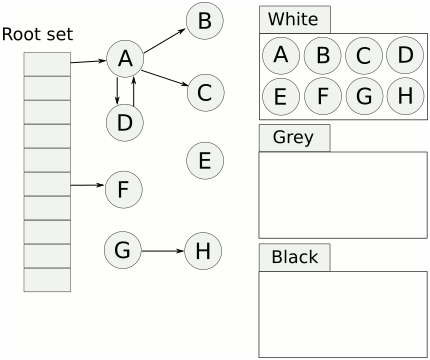

# Go GC 三色标记与混合写屏障

Go 官方运行时当前使用的是并发、非移动、标记-清扫式 GC。它的核心目标不是完全消除停顿，而是避免停顿时间随堆大小线性增长：大部分标记和清扫工作与用户程序并发执行，但阶段切换、root 扫描等位置仍会产生短暂停顿。

核心问题是：并发标记时，用户程序仍在修改指针，GC 如何避免把仍然可达的对象误判为垃圾。

## GC 周期

Go GC 可以粗略理解为几个阶段：

1. `sweep termination`：清扫终止阶段。这个阶段会 STW，确保上一轮 GC 还没有清扫完成的 span 被清扫完，为进入新一轮标记做准备。
2. `mark setup`：标记准备阶段。这个阶段仍在 STW 中完成，把 `gcphase` 从 `_GCoff` 切到 `_GCmark`，开启写屏障和 mutator assists，并加入 root mark jobs。只有所有 P 都启用写屏障后，才会开始扫描对象。
3. `mark`：并发标记阶段。大部分标记工作与用户程序并发执行，写屏障处于开启状态。GC 会扫描 goroutine 栈、全局变量和 runtime off-heap 结构中的堆指针，并持续扫描灰色对象；这个阶段中新分配的对象会直接标黑。
4. `mark termination`：标记终止阶段。这个阶段会 STW，把 `gcphase` 设为 `_GCmarktermination`，停止 mark workers 和 assists，并做 flushing mcache 等收尾工作。注意，runtime 状态上 `_GCmarktermination` 仍然是写屏障开启状态，只是此时 world stopped，用户代码不在并发修改对象图。
5. `sweep setup / sweep`：清扫准备与清扫阶段。runtime 把 `gcphase` 切回 `_GCoff`，设置 sweep 状态并关闭写屏障，然后恢复用户程序执行。之后清扫主要与用户程序并发发生，也会在分配路径上按需清扫 span。
6. `scavenging`：内存归还阶段。heap scavenger 会把 free/unused heap pages 背后的物理内存归还给操作系统，以降低 RSS；它不是一个独立的 `gcphase`，可能后台异步发生，也可能在分配路径或内存限制压力下同步发生。

## 三色标记

三色标记把对象分为三类：

- 白色：尚未发现。标记结束后仍为白色的对象会被回收。
- 灰色：已经发现，但它引用的对象还没有扫描完成。
- 黑色：已经发现，且它引用的对象也已经处理过。

标记从 root set 开始。roots 包括 goroutine 栈、全局变量等确定可达的入口。GC 先把 roots 能直接到达的对象标灰，再反复取出灰色对象扫描，把它引用的白色对象标灰，自己变黑。直到没有灰色对象为止，剩余白色对象就是不可达对象。



## 并发标记的风险

如果标记器和用户程序并发运行，用户程序可能在 GC 扫描过程中修改对象图。错误回收通常需要两个条件同时成立：

1. 某个黑色对象新增了对白色对象的引用。
2. 从灰色对象到该白色对象的原有可达路径被破坏。

第一个条件让 GC 不会再从黑色对象继续扫描到这个白色对象；第二个条件又切断了 GC 之后从灰色对象发现它的机会。两者同时发生时，一个实际仍可达的对象可能在标记结束时仍保持白色，从而被错误回收。

## 三色不变式

为了避免上述风险，GC 通常维护某种三色不变式。

强三色不变式：黑色对象永远不能指向白色对象。

弱三色不变式：如果黑色对象指向白色对象，那么这个白色对象必须仍然能从某个灰色对象经由一条白色路径到达。

Go 混合写屏障可以理解为维护了弱三色不变式的一个变形：在堆对象图中，被黑色对象指向的白色对象，需要受到某个灰色对象的保护。直观地说，黑到白的边可以暂时存在，但不能让这个白对象从 GC 视野里完全消失；如果一次指针写入可能造成这种隐藏，写屏障会先把相关对象 `shade`，让它进入 GC 的待处理集合。

## Dijkstra 插入屏障

Dijkstra 插入屏障关注“新写入的指针”：

```text
writePointer(slot, ptr):
    shade(ptr)
    *slot = ptr
```

当对象 A 新增对对象 B 的引用时，先把 B 标灰。这样可以避免黑色对象直接指向白色对象，满足强三色不变式。

它的优点是单调：对象只会从白到灰、从灰到黑，工作量有明确上界，也不需要读屏障配合。

它的问题在栈上。Go 不希望给当前栈帧上的每次指针写入都加写屏障，因为栈操作非常频繁，成本过高。如果栈写入没有屏障，那么已经扫描过的栈之后仍可能产生对白色对象的引用。早期 Go 因此需要在标记结束时 STW 重新扫描栈。

## Yuasa 删除屏障

Yuasa 删除屏障通常和 `snapshot-at-the-beginning` 思路一起理解：GC 在标记开始时先建立一个逻辑快照，目标是保证“快照开始那一刻可达的对象”最终都会被标记。之后用户程序可以继续修改对象图，但只要每次删除或覆盖旧引用时先保护旧指针，GC 就不会因为路径被改掉而漏掉快照里的对象。

粗略步骤是：

1. GC 开始时，短暂停下用户线程，记录当时的 roots 作为快照入口，例如线程栈、寄存器、全局变量和 runtime 维护的根集合。
2. 从这些入口出发标记当时可达的对象。这个标记过程可以并发推进，不要求立刻扫描完整个对象图。
3. 并发标记期间，任何指针槽位被覆盖前，都先把旧指针指向的对象 `shade`。

```text
writePointer(slot, ptr):
    shade(*slot)
    *slot = ptr
```

这样做保护的是“旧对象图”。如果某个对象在 GC 开始时还能从 roots 到达，即使用户程序后来把通往它的引用链逐段覆盖掉，删除屏障也会在覆盖前把旧引用指向的对象标灰，让标记器仍有机会沿着快照里的路径继续追下去。

在 C 或类似的传统线程模型里，这个开始快照通常是可行的：线程数量相对有限，线程栈是固定的系统栈，GC 可以在短暂停顿中枚举线程、保存寄存器上下文并扫描或记录栈根。完成这个开始快照后，就可以依靠删除屏障保护快照中的对象图。

它的优点是可以避免标记结束时重新扫描栈：只要栈已经被纳入开始快照，之后从堆字段删除到栈上的唯一引用时，旧堆引用会先被 `shade`，对象不会因为只剩在已扫描栈上而被漏掉。缺点是更保守：GC 开始时可达、后来已经无用的对象，也可能因为删除屏障被保留下来到下一轮 GC，回收精度较低。

在 Go 里直接实现完整 Yuasa 思路更困难。Go 的 root 不只是少量系统线程栈，还包括大量 goroutine 栈；goroutine 数量可以很大，栈还会动态增长和收缩。

## Go 的混合写屏障

Go 当前 runtime 注释中描述的屏障伪代码如下：

```text
writePointer(slot, ptr):
    shade(*slot)
    if current stack is grey:
        shade(ptr)
    *slot = ptr
```

其中：

- `slot` 是写入目标位置，非栈才会使用屏障。
- `ptr` 是准备写入的新指针。
- `shade(x)` 表示如果 `x` 指向白色对象，就把该对象标记并加入待扫描队列。

这段逻辑结合了删除屏障和插入屏障：

1. `shade(*slot)`：保护即将被覆盖的旧指针。这里“移动”的是指针，不是对象本身。
2. `shade(ptr)`：当当前 goroutine 的栈仍是灰色时，保护即将写入的新指针。
3. 栈扫描完成后，`shade(ptr)` 不再必要。因为栈刚扫黑时只会指向已经标记过的对象；之后 `shade(*slot)` 又能防止新的唯一引用从堆对象图转存到栈上并被隐藏。

`shade(*slot)` 的典型场景是：某个白色对象的唯一引用原本在堆对象字段里，用户程序先把这个引用读到已扫描过的栈上，然后覆盖堆字段。

```text
// 当前栈和堆对象 A 都已经扫描完成，B 仍是白色
stack root -> A
A.child   -> B

// 用户程序执行
tmp = A.child
A.child = nil
```

如果没有 `shade(*slot)`，写 `A.child = nil` 时，`B` 的引用会从堆对象图里消失，只剩在已扫描过的栈变量 `tmp` 里。GC 通常不会再扫描这个栈，因此可能漏标 `B`。删除屏障会在覆盖 `A.child` 前先 `shade(A.child)`，让 `B` 先被发现。

`shade(ptr)` 的典型场景是：当前 goroutine 的栈还没扫描，栈上保存着某个白色对象的唯一引用；用户程序把这个引用写入一个已经扫描完成的堆对象字段，然后又删除栈上的引用。

```text
// 当前栈还没扫描，堆对象 A 已经扫描完成，B 仍是白色
stack tmp -> B
A.child   -> nil

// 用户程序执行
A.child = tmp
tmp = nil
```

如果没有灰色栈期间的 `shade(ptr)`，`B` 会被写进已经扫描完成的 `A.child`，但 `A` 不会再被 GC 扫描；随后 `tmp = nil` 又让未扫描栈上也不再有 `B`。标记结束时，`B` 可能仍是白色。插入屏障会在写入 `A.child` 前先 `shade(tmp)`，让 `B` 先被发现。

注意，“新增引用对象会被标灰”不是无条件规则。按当前 Go runtime 的解释，插入屏障部分只在当前 goroutine 栈仍为灰色时是必要的。

## Goroutine 的栈扫描

GC 需要扫描 goroutine 栈，把栈作为 root 来发现堆对象：

1. 暂停目标 goroutine，扫描它栈上的指针槽位。
2. 把这些指针可达的堆对象标记或加入扫描队列。
3. 扫描完成后，该 goroutine 的栈可视为黑色。

“栈可视为黑色”的意思不是栈本身参与堆对象的三色状态，而是这个 goroutine 的栈已经作为 root 扫描过：扫描完成那一刻，栈上指针能到达的堆对象都已经被 GC 发现，因此这段栈不会藏着一个 GC 完全不知道的白色堆对象。

扫描完成后用户程序还会继续运行，栈和堆之间的引用关系仍可能变化。混合写屏障会确保已经扫描过的栈不必再回到“需要重扫”的状态：

- 如果程序把某个对象的唯一引用从堆字段转存到已扫描栈上，覆盖堆字段时的 `shade(*slot)` 会先保护旧引用。
- 如果当前 goroutine 的栈还没扫描，写入堆字段时的 `shade(ptr)` 会保护从灰色栈写入堆对象的新引用。

Go 提案里还讨论过更细粒度的低停顿栈扫描思路：扫描栈时只短暂停下 goroutine 的活动栈帧，然后在返回到下一帧的位置放置阻塞式 stack barrier，让 goroutine 先恢复运行；扫描器继续向外层栈帧推进，必要时再阻塞返回到未扫描帧的 goroutine。这个设计依赖一个重要观察：在部分扫描的栈里，未扫描帧可以近似看作堆的一部分；只要跨帧指针写入仍受写屏障保护，活动帧就不会把未扫描帧里的白色对象悄悄搬走。

## 跨栈引用漏标？

一个常见疑问是：如果栈 1 已扫黑，栈 2 还没扫黑，栈 1 突然引用了栈 2 上的某个对象，会不会因为没有栈写屏障而漏标？

这个问题的关键是“栈 1 怎么拿到栈 2 手里的指针”。指针不会凭空从一个 goroutine 的栈跳到另一个 goroutine 的栈。不同 goroutine 不能直接读写对方的栈帧，中间必须至少有一个非栈的中转点。

先看最小模型：

```go
var shared *T

func g2(x *T) {
    shared = x // 从 goroutine 2 发布到非栈位置
}

func g1() {
    y := shared // goroutine 1 再读到自己的栈上
    _ = y
}
```

这里真正需要屏障的是第一步：

```text
// goroutine 2 执行
shared = x
```

这次写入的目标 `slot` 是非栈位置，不是当前栈上的局部变量，所以会触发屏障。进入混合写屏障后，会执行插入屏障部分：

```text
writePointer(&shared, x):
    shade(shared)
    if current stack is grey:
        shade(x)
    shared = x
```

也就是说，如果 `x` 原本只被未扫描的栈 2 持有，那么它在发布到非栈中转点之前就会被 `shade`。之后 goroutine 1 执行：

```text
// goroutine 1 执行
y = shared
```

这是把指针读到当前栈上的局部变量，一般不会触发屏障。但这一步已经不是危险点：对象在前面的“发布到中转点”时已经被保护了。

## 版本演进

Go GC 的演进可以这样记：

- Go 1.3 以前：以更粗粒度的 STW 标记清扫为主，停顿明显。
- Go 1.5：引入并发三色标记，堆写屏障开启；但栈不加写屏障，标记结束前需要 STW 重新扫描栈。
- Go 1.8：引入混合写屏障，结合删除屏障和插入屏障，消除了标记结束时为了栈进行长时间重扫的需要。
- Go 1.18：`GOGC` 的目标计算纳入 GC roots，包括 goroutine 栈和全局变量中的指针，而不只是 live heap。
- Go 1.19：引入 `GOMEMLIMIT` / `debug.SetMemoryLimit`，GC 调优从单纯的 CPU/内存比例控制，扩展到运行时内存上限控制。

## 参考

- [A Guide to the Go Garbage Collector](https://go.dev/doc/gc-guide)
- [Go runtime: mbarrier.go](https://go.dev/src/runtime/mbarrier.go)
- [Proposal: Eliminate STW stack re-scanning](https://github.com/golang/proposal/blob/master/design/17503-eliminate-rescan.md)
