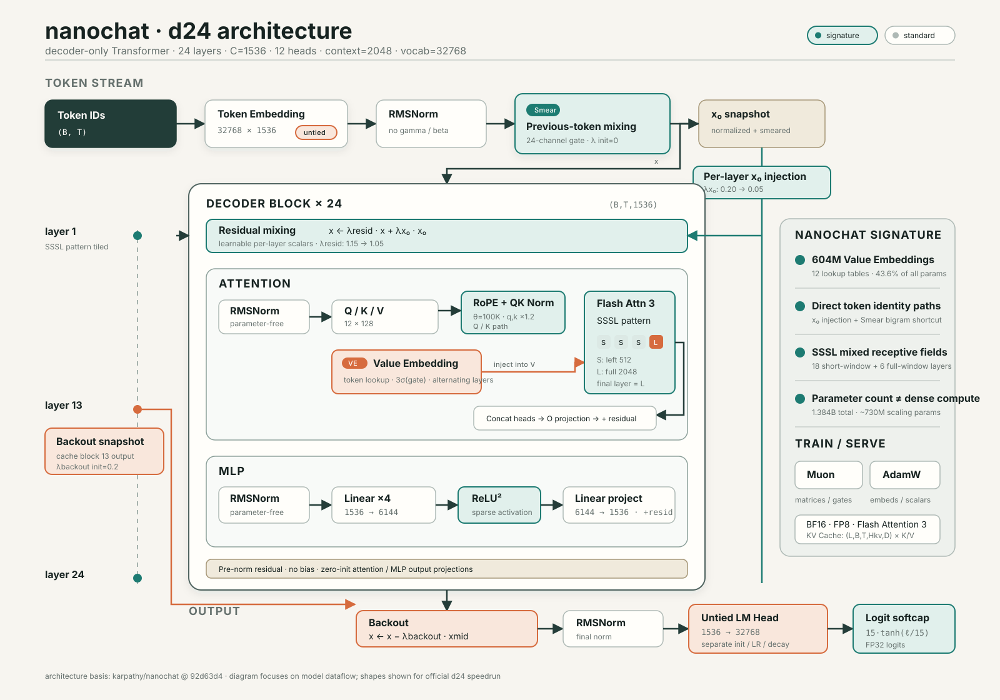

# nanochat 模型结构与特性研究笔记

> 研究对象：[karpathy/nanochat](https://github.com/karpathy/nanochat)  
> 源码基准：[`92d63d4`](https://github.com/karpathy/nanochat/tree/92d63d4e8bb4df75c3b71618f31ddde2378b2bcd)，2026-07-03  
> 整理日期：2026-07-24

## 1. 结论先行

nanochat 不是简单缩小 GPT-2，而是一套面向“低成本、单机多卡、快速实验”的 decoder-only Transformer。

它保留了熟悉的 GPT 主干：

```text
Token Embedding
    ↓
N × Decoder Transformer Block
    ↓
LM Head
    ↓
Next-token Prediction
```

但在主干周围加入了较多实验性设计：

- RoPE 和 QK Norm；
- 无可学习参数的 RMSNorm；
- $\operatorname{ReLU}^2$ MLP；
- 交替使用的超大 Value Embedding；
- `SSSL` 滑动窗口注意力；
- 每层 residual scalars 和初始 embedding 回注；
- Smear 前一 token embedding 混合；
- Backout 中层特征扣除；
- untied embedding/unembedding；
- logit softcap；
- Muon + AdamW 分组优化；
- BF16、FP8 和 Flash Attention 3 集成。

理解 nanochat 时，最重要的不是记住“它有 1.38B 参数”，而是区分：

1. 总参数量；
2. 参与 token-stream 矩阵乘法的参数量；
3. Value Embedding 这类参数量很大、矩阵乘法 FLOPs 很低的查表参数。

以官方 d24 为例，总参数约 1.384B，其中约 604M 来自 Value Embedding，占总参数的 43.6%。因此，它不能直接按普通 dense 1.38B Transformer 来估算训练计算量。



---

## 2. 项目定位

nanochat 试图用一个尽量小、可读、可修改的代码库覆盖完整 LLM 生命周期：

```text
原始文本
  ↓
BPE Tokenizer
  ↓
Base Pretraining
  ↓
Supervised Fine-Tuning
  ↓
Evaluation / KV Cache Inference / CLI / Web UI
```

对应的关键代码：

| 阶段 | 主要文件 |
|---|---|
| Tokenizer | [`scripts/tok_train.py`](https://github.com/karpathy/nanochat/blob/92d63d4e8bb4df75c3b71618f31ddde2378b2bcd/scripts/tok_train.py) |
| 模型定义 | [`nanochat/gpt.py`](https://github.com/karpathy/nanochat/blob/92d63d4e8bb4df75c3b71618f31ddde2378b2bcd/nanochat/gpt.py) |
| 预训练 | [`scripts/base_train.py`](https://github.com/karpathy/nanochat/blob/92d63d4e8bb4df75c3b71618f31ddde2378b2bcd/scripts/base_train.py) |
| SFT | [`scripts/chat_sft.py`](https://github.com/karpathy/nanochat/blob/92d63d4e8bb4df75c3b71618f31ddde2378b2bcd/scripts/chat_sft.py) |
| 推理引擎 | [`nanochat/engine.py`](https://github.com/karpathy/nanochat/blob/92d63d4e8bb4df75c3b71618f31ddde2378b2bcd/nanochat/engine.py) |
| 官方完整流程 | [`runs/speedrun.sh`](https://github.com/karpathy/nanochat/blob/92d63d4e8bb4df75c3b71618f31ddde2378b2bcd/runs/speedrun.sh) |
| CPU/MPS 示例 | [`runs/runcpu.sh`](https://github.com/karpathy/nanochat/blob/92d63d4e8bb4df75c3b71618f31ddde2378b2bcd/runs/runcpu.sh) |

nanochat 的重点不是提供高度通用、配置繁多的训练框架，而是提供一套可以完整阅读和修改的实验基线。

---

## 3. 模型规模如何由 depth 决定

nanochat 把 `--depth` 作为主要规模旋钮。

设：

- $L$：Transformer 层数，即 depth；
- $C$：residual stream / model dimension；
- $D$：attention head dimension；
- $H$：query head 数；
- $H_{\mathrm{kv}}$：KV head 数；
- $T$：最大序列长度；
- $V$：词表大小。

当前 `base_train.py` 的默认关系为：

$$
\begin{aligned}
L &= \mathrm{depth}, \\
C_{\mathrm{base}} &= 64L, \\
C &= 128\left\lceil \frac{C_{\mathrm{base}}}{128} \right\rceil, \\
D &= 128, \\
H &= \frac{C}{D}, \\
H_{\mathrm{kv}} &= H, \\
T &= 2048, \\
V &= 32768, \\
C_{\mathrm{FFN}} &= 4C.
\end{aligned}
$$

源码位置：

- [`GPTConfig`](https://github.com/karpathy/nanochat/blob/92d63d4e8bb4df75c3b71618f31ddde2378b2bcd/nanochat/gpt.py#L28-L39)
- [`build_model_meta`](https://github.com/karpathy/nanochat/blob/92d63d4e8bb4df75c3b71618f31ddde2378b2bcd/scripts/base_train.py#L129-L145)

### 3.1 GQA 支持与实际配置的区别

`GPTConfig` 和 attention 实现支持：

$$
H_{\mathrm{kv}} \le H,
\qquad
H \bmod H_{\mathrm{kv}} = 0.
$$

因此模型代码支持 GQA。

但当前 `base_train.py` 明确设置：

```python
n_head=num_heads,
n_kv_head=num_heads,
```

也就是：

$$
H_{\mathrm{kv}} = H.
$$

所以官方 d24 speedrun 实际使用普通 Multi-Head Attention，而不是 GQA。不能因为代码注释写着 “GQA support” 就认为官方模型已经启用了 GQA。

### 3.2 模型族

在默认 `aspect_ratio=64`、`head_dim=128`、`V=32768` 下：

| depth | width C | heads H | VE 层数 | 总参数量 |
|---:|---:|---:|---:|---:|
| 4 | 256 | 2 | 2 | 36.7M |
| 6 | 384 | 3 | 3 | 73.5M |
| 10 | 640 | 5 | 5 | 196.0M |
| 12 | 768 | 6 | 6 | 286.3M |
| 16 | 1024 | 8 | 8 | 536.9M |
| 20 | 1280 | 10 | 10 | 896.5M |
| 24 | 1536 | 12 | 12 | 1.384B |
| 26 | 1664 | 13 | 13 | 1.682B |
| 32 | 2048 | 16 | 16 | 2.819B |

由于 Value Embedding 数量也随 depth 增长，总参数量并不只是普通 Transformer 的约 $12LC^2$。

---

## 4. 官方 d24 的精确形状

当前 [`speedrun.sh`](https://github.com/karpathy/nanochat/blob/92d63d4e8bb4df75c3b71618f31ddde2378b2bcd/runs/speedrun.sh#L68-L72) 使用：

$$
\begin{aligned}
L &= 24, &
C &= 1536, \\
H &= 12, &
H_{\mathrm{kv}} &= 12, \\
D &= 128, &
C_{\mathrm{FFN}} &= 6144, \\
T &= 2048, &
V &= 32768.
\end{aligned}
$$

### 4.1 前向传播形状

输入：

$$
\operatorname{shape}(\mathrm{idx})=(B,T).
$$

Token Embedding：

$$
\begin{aligned}
\operatorname{shape}(W_{\mathrm{te}}) &= (V,C), \\
\operatorname{shape}(x) &= (B,T,C).
\end{aligned}
$$

d24 中：

$$
\begin{aligned}
\operatorname{shape}(W_{\mathrm{te}}) &= (32768,1536), \\
\operatorname{shape}(x) &= (B,T,1536).
\end{aligned}
$$

每层 Attention：

$$
\begin{aligned}
\operatorname{shape}(Q) &= (B,T,H,D), \\
\operatorname{shape}(K) &= (B,T,H_{\mathrm{kv}},D), \\
\operatorname{shape}(V) &= (B,T,H_{\mathrm{kv}},D), \\
\operatorname{shape}(Y_{\mathrm{attn}}) &= (B,T,H,D), \\
\operatorname{shape}(Y_{\mathrm{concat}}) &= (B,T,C), \\
\operatorname{shape}(Y_{\mathrm{proj}}) &= (B,T,C).
\end{aligned}
$$

d24 中：

$$
\begin{aligned}
\operatorname{shape}(Q,K,V) &= (B,T,12,128), \\
\operatorname{shape}(Y_{\mathrm{attn}}) &= (B,T,12,128), \\
\operatorname{shape}(Y_{\mathrm{concat}}) &= (B,T,1536).
\end{aligned}
$$

每层 MLP：

$$
(B,T,C)
\;\longrightarrow\;
(B,T,4C)
\;\longrightarrow\;
(B,T,C).
$$

d24 中：

$$
(B,T,1536)
\;\longrightarrow\;
(B,T,6144)
\;\longrightarrow\;
(B,T,1536).
$$

输出：

$$
\begin{aligned}
\operatorname{shape}(W_{\mathrm{LM}}) &= (V,C), \\
\operatorname{shape}(\mathrm{logits}) &= (B,T,V).
\end{aligned}
$$

d24 中：

$$
\begin{aligned}
\operatorname{shape}(W_{\mathrm{LM}}) &= (32768,1536), \\
\operatorname{shape}(\mathrm{logits}) &= (B,T,32768).
\end{aligned}
$$

Flash Attention 不显式保存完整的 attention score matrix，但概念形状仍可以理解成：

$$
(B,H,T_{\mathrm{query}},T_{\mathrm{key}}).
$$

短窗口层只计算其中的局部带状区域。

---

## 5. Transformer Block

每一层可以概括为：

$$
\begin{aligned}
x &\leftarrow \lambda_{\mathrm{resid}}^{(i)}x
   + \lambda_{x_0}^{(i)}x_0, \\
x &\leftarrow x
   + \operatorname{Attention}\!\left(\operatorname{RMSNorm}(x)\right), \\
x &\leftarrow x
   + \operatorname{MLP}\!\left(\operatorname{RMSNorm}(x)\right).
\end{aligned}
$$

其中：

- $x_0$ 是初始的 normalized token embedding，包含可能的 Smear 修改；
- $\lambda_{\mathrm{resid}}^{(i)}$ 是当前 residual stream 的缩放；
- $\lambda_{x_0}^{(i)}$ 控制初始 embedding 的重新注入；
- Attention 和 MLP 都采用 pre-norm residual；
- 输入输出形状始终保持 $(B,T,C)$。

源码见 [`Block.forward`](https://github.com/karpathy/nanochat/blob/92d63d4e8bb4df75c3b71618f31ddde2378b2bcd/nanochat/gpt.py#L134-L138) 和 [`GPT.forward`](https://github.com/karpathy/nanochat/blob/92d63d4e8bb4df75c3b71618f31ddde2378b2bcd/nanochat/gpt.py#L460-L527)。

### 5.1 Attention 参数形状

一般形式：

$$
\begin{aligned}
\operatorname{shape}(W_Q) &= (HD,C), \\
\operatorname{shape}(W_K) &= (H_{\mathrm{kv}}D,C), \\
\operatorname{shape}(W_V) &= (H_{\mathrm{kv}}D,C), \\
\operatorname{shape}(W_O) &= (C,C).
\end{aligned}
$$

d24 当前使用 $H_{\mathrm{kv}}=H$，因此：

$$
\operatorname{shape}(W_Q,W_K,W_V,W_O)=(1536,1536).
$$

如果实验性地减少 $H_{\mathrm{kv}}$，则 K/V projection 和 KV Cache 会同时缩小。

### 5.2 MLP

nanochat 不使用 GELU、SwiGLU，而使用：

$$
C \;\longrightarrow\; 4C \;\longrightarrow\; C.
$$

激活函数：

$$
\operatorname{ReLU}^2(x)
=
\left(\max(0,x)\right)^2.
$$

对应源码：

```python
x = self.c_fc(x)
x = F.relu(x).square()
x = self.c_proj(x)
```

它比带门控的 SwiGLU 更简单，且中间激活具有稀疏性。

---

## 6. 模型特性详解

### 6.1 RoPE

nanochat 不使用 learned positional embedding，而是对 Q/K 应用 RoPE。

当前源码使用：

$$
\theta_{\mathrm{base}}=100000.
$$

并预计算：

$$
T_{\mathrm{RoPE\ cache}}=10T.
$$

cos/sin cache 形状：

$$
\operatorname{shape}(\cos,\sin)
=
\left(1,10T,1,\frac{D}{2}\right).
$$

d24 中：

$$
\operatorname{shape}(\cos,\sin)=(1,20480,1,64).
$$

需要注意：

- 10 倍 RoPE cache 只是避免频繁扩容；
- 它不代表模型在 20K 上下文训练过；
- 默认训练长度和可靠上下文仍是 2048。

2026 年 1 月的历史说明写的是 base `10,000`，已经不是当前实现。

### 6.2 无参数 RMSNorm

归一化直接调用：

```python
F.rms_norm(x, (x.size(-1),))
```

没有 learnable gamma 或 beta。

它被用于：

1. token embedding 后；
2. 每层 attention 前；
3. 每层 MLP 前；
4. lm_head 前。

这减少了一点参数，更重要的是把尺度控制交给 residual scalars、QK Norm 和初始化。

### 6.3 QK Norm 与 attention sharpening

RoPE 后：

$$
\begin{aligned}
q &\leftarrow \operatorname{RMSNorm}(q), &
k &\leftarrow \operatorname{RMSNorm}(k), \\
q &\leftarrow 1.2q, &
k &\leftarrow 1.2k.
\end{aligned}
$$

因此点积整体约放大：

$$
1.2^2=1.44.
$$

QK Norm 先约束 Q/K 尺度，后续常数缩放再使 attention 更尖锐。

### 6.4 SSSL 滑动窗口注意力

默认 pattern：

```text
S S S L | S S S L | ...
```

当前源码：

$$
\begin{aligned}
W_L &= T, \\
W_S &= 128\left\lceil\frac{T/4}{128}\right\rceil.
\end{aligned}
$$

当 $T=2048$：

$$
W_L=2048,
\qquad
W_S=512.
$$

d24 恰好由六组 `SSSL` 构成：

```text
18 个 left window 为 512 的短窗口层
 6 个 2048-token 全窗口层
```

这里的 `512` 是 `window_size` 的 left 参数，表示最多回看 512 个历史
token；计入当前位置后，稳定阶段最多有 513 个 key 参与注意力。

最后一层无条件设为全窗口。

#### 文档漂移

这里有三种互相冲突的描述：

- 旧讨论文章写短窗口为 1024；
- `base_train.py` 的 CLI help 仍写 “half context”；
- 当前 `gpt.py` 实际实现为 quarter context，即 512。

实验时应以 `_compute_window_sizes()` 为准。

### 6.5 Value Embedding

普通 Transformer 的 V 来自：

$$
v=W_Vx.
$$

nanochat 在交替层中加入由 token ID 直接查表得到的 Value Embedding：

$$
\begin{aligned}
e_V^{(i)} &= \operatorname{ValueEmbedding}_i(\mathrm{token\_ids}), \\
g &= 3\sigma\!\left(W_{\mathrm{gate}}x_{[...,\, :12]}\right), \\
v &\leftarrow v + g\odot e_V^{(i)}.
\end{aligned}
$$

一般形状：

$$
\begin{aligned}
\operatorname{shape}(E_V^{(i)}) &= (V,H_{\mathrm{kv}}D), \\
\operatorname{shape}(e_V^{(i)}) &= (B,T,H_{\mathrm{kv}}D), \\
\operatorname{shape}(\operatorname{reshape}(e_V^{(i)}))
  &= (B,T,H_{\mathrm{kv}},D), \\
\operatorname{shape}(g) &= (B,T,H_{\mathrm{kv}},1).
\end{aligned}
$$

d24 中，$H_{\mathrm{kv}}D=C=1536$，每张表为：

$$
\operatorname{shape}(E_V^{(i)})=(32768,1536).
$$

共有 12 张独立表：

```text
单张 VE 参数             50,331,648
12 张 VE 参数            603,979,776
```

其特点是：

- 提供非常大的 token-specific 容量；
- 主要操作是 embedding lookup，而不是大型矩阵乘法；
- 会显著增加权重、优化器状态和显存读取；
- 总参数量巨大，但 matmul FLOPs 增量很低。

这是 nanochat 与普通 GPT 参数结构差异最大的部分。

### 6.6 Untied Embedding / Unembedding

输入 token embedding 和输出 lm_head 不共享权重：

$$
\operatorname{shape}(W_{\mathrm{te}})
=
\operatorname{shape}(W_{\mathrm{LM}})
=
(V,C),
\qquad
W_{\mathrm{te}}\ne W_{\mathrm{LM}}.
$$

二者使用不同的：

- 初始化尺度；
- 学习率；
- weight decay；
- optimizer parameter group。

它增加 $VC$ 个参数，但让输入表示和输出分类器可以独立学习。

### 6.7 Per-layer Residual Scalars

每层 block 前：

$$
x
\leftarrow
\lambda_{\mathrm{resid}}^{(i)}x
+
\lambda_{x_0}^{(i)}x_0.
$$

当前初始化：

$$
\begin{aligned}
\lambda_{\mathrm{resid}}^{(i)}
&=1.15-0.10\frac{i}{L-1}, \\
\lambda_{x_0}^{(i)}
&=0.20-0.15\frac{i}{L-1},
\qquad i=0,\ldots,L-1.
\end{aligned}
$$

旧资料中的 $\lambda_{\mathrm{resid}}=1.0$、$\lambda_{x_0}=0.1$ 已经不是当前配置。

$x_0$ 回注可以理解为：深层网络在加工语义信息的同时，持续获得原始 token 身份的直接通路。

### 6.8 Smear

embedding 归一化后，当前位置可以混入前一个 token 的 embedding：

$$
x_t
\leftarrow
x_t
+
\lambda_{\mathrm{smear}}
\sigma\!\left(g(x_{t,:24})\right)
\odot x_{t-1}.
$$

特点：

- gate 只读取当前 embedding 的前 24 个通道；
- $\lambda_{\mathrm{smear}}$ 初始化为 0，因此初始等同于未启用；
- 训练时用序列 slice 读取前一位置；
- KV Cache 推理时单独保存前一个 normalized embedding。

它可以看成一条廉价的、输入依赖的 bigram shortcut。

### 6.9 Backout

模型保存零基索引为 $\lfloor L/2\rfloor$ 的 block 输出：

$$
x_{\mathrm{mid}}
=
\operatorname{BlockOutput}_{\left\lfloor L/2\right\rfloor}.
$$

因此 d24 保存的是索引 12、即第 13 个 block 的输出。

最后在 final norm 前执行：

$$
x
\leftarrow
x-\lambda_{\mathrm{backout}}x_{\mathrm{mid}}.
$$

其中：

$$
\lambda_{\mathrm{backout}}^{\mathrm{init}}=0.2.
$$

其意图是从最终表示中扣除一部分较低层特征。

历史复盘曾把 backout 列为“没有明显提升”的实验，当前源码又重新包含它。这说明 nanochat 的 `master` 是活跃实验基线，而不是稳定冻结的架构规范。

### 6.10 Logit Softcap

lm_head 输出转为 FP32 后：

$$
\widetilde{\ell}
=
15\tanh\!\left(\frac{\ell}{15}\right).
$$

将 logits 平滑限制在：

$$
\widetilde{\ell}\in[-15,15].
$$

这可以抑制极端 logits，并减少数值不稳定和过度自信。

### 6.11 无 Bias

Attention、MLP、lm_head 和小 gate 的 Linear 层都不使用 bias。

这让模型定义和参数分组更简单，也减少少量非矩阵参数。

---

## 7. 初始化策略

当前初始化：

| 参数 | 初始化 |
|---|---|
| token embedding | Normal，`std=0.8` |
| lm_head | Normal，`std=0.001` |
| Q/K/V | Uniform，等效 $\operatorname{std}=1/\sqrt{C}$ |
| attention output projection | 全零 |
| MLP expansion | Uniform，额外乘 `0.4` |
| MLP output projection | 全零 |
| Value Embedding | Uniform，等效 $\operatorname{std}=1/\sqrt{C}$ |
| VE gate | 较小的正 Uniform |
| smear lambda | 0 |
| backout lambda | 0.2 |

attention 和 MLP 的 output projection 初始为零，因此 block 一开始不会向 residual stream 注入较大的随机输出。

结合 residual scalars 和 `x0` 回注，模型初始更接近可控的 residual 路径，而不是每层都进行强随机变换。

---

## 8. d24 参数构成

按照当前源码、$V=32768$ 重新核算：

| 参数组 | 参数量 | 占比 |
|---|---:|---:|
| Token Embedding | 50,331,648 | 3.6% |
| Value Embeddings | 603,979,776 | 43.6% |
| LM Head | 50,331,648 | 3.6% |
| Transformer Matrices + VE Gates | 679,478,976 | 49.1% |
| Residual/Smear/Backout 小参数 | 74 | 约 0% |
| 总计 | 1,384,122,122 | 100% |

### 8.1 近似参数公式

当 $H_{\mathrm{kv}}=H$、词表无需 padding 时：

$$
\begin{aligned}
N_{\mathrm{VE}} &= \left\lceil\frac{L}{2}\right\rceil, \\
N_{\mathrm{embed}} &= VC, \\
N_{\mathrm{value\ embed}} &= N_{\mathrm{VE}}VC, \\
N_{\mathrm{LM\ head}} &= VC, \\
N_{\mathrm{transformer}} &\approx 12LC^2.
\end{aligned}
$$

其中每层：

$$
\begin{aligned}
N_{\mathrm{attn/layer}}
&=
\underbrace{C^2+C^2+C^2+C^2}_{Q,K,V,O}
=4C^2, \\
N_{\mathrm{MLP/layer}}
&=
\underbrace{C(4C)}_{C\to4C}
+
\underbrace{(4C)C}_{4C\to C}
=8C^2, \\
N_{\mathrm{block}}
&=4C^2+8C^2=12C^2.
\end{aligned}
$$

所以总参数近似为：

$$
N_{\mathrm{total}}
\approx
\left(N_{\mathrm{VE}}+2\right)VC+12LC^2.
$$

### 8.2 总参数与 scaling parameters

nanochat 的 scaling-law 逻辑没有使用全部参数，而使用：

$$
N_{\mathrm{scaling}}
=
N_{\mathrm{transformer}}
+
N_{\mathrm{LM\ head}}.
$$

d24 大约为：

$$
679.48\ \mathrm{M}
+
50.33\ \mathrm{M}
=
729.81\ \mathrm{M}.
$$

Value Embedding 是大规模查表参数，对模型容量、内存和参数更新有影响，但不产生与 dense Linear 同量级的矩阵乘法 FLOPs。

因此，比较模型时至少要同时报告：

```text
总参数量
matmul/scaling 参数量
训练 token 数
训练 FLOPs
显存占用
```

---

## 9. KV Cache

nanochat KV Cache 的形状是：

$$
\operatorname{shape}(\mathrm{KV\ Cache})
=(L,B,T,H_{\mathrm{kv}},D).
$$

K 和 V 各一份。

单个请求、单个 token 的 KV Cache 字节数：

$$
\operatorname{KVBytesPerToken}
=
2LH_{\mathrm{kv}}D\,b,
$$

其中 $b$ 是每个 KV 元素的字节数，系数 2 分别对应 K 和 V。

d24、BF16：

$$
\begin{aligned}
\operatorname{KVBytesPerToken}
&=2\times24\times12\times128\times2 \\
&=147456\ \mathrm{bytes/token} \\
&=144\ \mathrm{KiB/token}.
\end{aligned}
$$

当 cache 容量上限为 2048 个位置时，单个序列的理论分配量：

$$
144\ \mathrm{KiB/token}\times2048\ \mathrm{tokens}
=288\ \mathrm{MiB}.
$$

当前 cache 按请求的容量上限预分配：prefill cache 使用 prompt 长度；decode
cache 在指定 `max_tokens` 时使用 `prompt 长度 + max_tokens`，否则使用模型的
`sequence_len`。滑动窗口可以减少 attention 读取的 KV 数量，但不会缩小已经
预分配的各层 K/V cache。

如果真正启用 GQA，例如 $H_{\mathrm{kv}}=3$：

$$
\frac{\operatorname{KVCache}_{\mathrm{GQA}}}
     {\operatorname{KVCache}_{\mathrm{MHA}}}
=
\frac{H_{\mathrm{kv}}}{H}
=
\frac{3}{12}
=
\frac14.
$$

这也是 nanochat 已支持但官方训练配置尚未使用的一条直接实验路径。

---

## 10. 精度与执行

nanochat 不依赖全局 `torch.amp.autocast`，而是通过自定义 Linear 显式控制精度。

### 10.1 默认精度

大致规则：

| 硬件 | 默认 compute dtype |
|---|---|
| A100/H100 等 SM80+ CUDA | BF16 |
| 较旧 CUDA GPU | FP32 |
| CPU/MPS | FP32 |

可以通过 `NANOCHAT_DTYPE` 覆盖。

### 10.2 权重与激活

- Linear master weights 保持 FP32，forward 时转成 input dtype；
- token embedding 和 Value Embedding 通常直接存成 BF16；
- logits、softcap 和 loss 在 FP32 中计算；
- FP16 训练使用 GradScaler；
- speedrun 可以把符合条件的 Linear 转成 FP8 训练；
- FP8 评测期间临时切回普通 Linear/BF16。

### 10.3 Flash Attention

优先使用 Flash Attention 3：

$$
(B,T,H,D).
$$

这是 FA3 原生布局，不需要先转成 $(B,H,T,D)$。

无法使用 FA3 时回退到 PyTorch SDPA，但当前 SDPA fallback 对滑动窗口支持有限，`SSSL` 配置的性能可能很差。

---

## 11. 优化器与 scaling 策略

### 11.1 参数分组

模型使用组合优化器：

```text
Muon
  - Q/K/V/O matrices
  - MLP matrices
  - VE gate matrices

AdamW
  - token embedding
  - Value Embeddings
  - lm_head
  - residual scalars
  - x0 scalars
  - smear/backout 参数
```

不同参数组使用不同学习率、betas 和 weight decay。

### 11.2 单一 depth 旋钮隐藏了什么

`depth` 不只影响层数，还间接决定：

- model width；
- head 数；
- 参数量；
- 估算训练 FLOPs；
- scaling parameters；
- 训练 token horizon；
- optimal batch size；
- learning-rate correction；
- weight-decay scaling；
- 优化步数。

这种设计非常适合生成一系列有统一假设的 miniseries 模型，但不一定适合任意架构之间的公平比较。

尤其要注意，代码对 Muon 的部分 scaling 规则是从 AdamW 理论类推而来，源码注释也明确承认这是经验假设。

---

## 12. Base Model、SFT 与工具调用

nanochat 的 Base Model 和 Chat Model 使用同一套 GPT 网络结构。

SFT 不会换模型，只会：

- 载入 base checkpoint；
- 加入对话格式数据；
- 训练 special-token 协议；
- 混合 SmolTalk、MMLU、GSM8K；
- 教模型使用 calculator / Python expression 工具格式。

推理引擎识别：

```text
<|python_start|>
<|python_end|>
<|output_start|>
<|output_end|>
<|assistant_end|>
```

模型输出工具表达式后，Engine 执行受限计算，再把结果 token 强制注入上下文。这里的“工具调用能力”来自：

```text
模型生成协议 + 外部状态机执行
```

而不是模型结构中存在特殊 tool head。

---

## 13. 当前源码与历史资料的差异

nanochat 更新频繁，应使用：

```text
当前 commit 源码
  > 当前 README / scripts
  > maintainer discussion
  > 社区教程
```

截至 `92d63d4`，主要差异包括：

| 项目 | 旧资料 | 当前源码 |
|---|---|---|
| RoPE base | 10,000 | 100,000 |
| S 短窗口 | 1024 / half context | 512 / quarter context |
| VE gate 输入通道 | 32 | 12 |
| VE gate 范围 | $2\sigma(\cdot)$ | $3\sigma(\cdot)$ |
| residual lambda 初值 | $1.0$ | $1.15\to1.05$ |
| x0 lambda 初值 | $0.1$ | $0.20\to0.05$ |
| Smear | 历史文章认为收益有限 | 当前源码存在 |
| Backout | 历史文章认为没有提升 | 当前源码存在 |

2026 年 1 月的架构说明还存在一个内部矛盾：

- 参数表列出约 604M Value Embedding；
- 正文却称 Value Embedding 约 150M。

前者与参数形状和当前代码一致，后者不应继续引用。

---

## 14. 如何评价这套架构

### 14.1 优点

- 模型代码短，能够完整读懂；
- 训练、SFT、评测和推理链路完整；
- 小模型实验成本相对可控；
- 许多近期训练技巧都能在一个代码库里观察；
- shape 和参数分组相对显式；
- depth miniseries 适合做跨规模趋势观察。

### 14.2 局限

- `master` 是活跃实验基线，结构会快速变化；
- Value Embedding 让总参数量的可比性变差；
- 官方模型未实际启用 GQA，KV Cache 仍然较大；
- 默认上下文只有 2048；
- 很多超参数来自 d12/d20/d24 的经验迁移；
- 小模型上有效的改动不一定能迁移到大模型；
- 单一 depth 旋钮隐藏了大量作者假设；
- 对特定硬件，尤其 H100 + FA3，优化倾向明显。

它更适合回答：

> 如何在一个可读的端到端系统中快速试验小型语言模型？

而不是直接回答：

> 当前通用大模型的标准生产架构应该是什么？

---

## 15. 推荐的学习顺序

### 第一阶段：只看 shape

按以下顺序读 `nanochat/gpt.py`：

1. `GPTConfig`
2. `CausalSelfAttention`
3. `MLP`
4. `Block`
5. `GPT.__init__`
6. `GPT.forward`

目标是能手工写出：

$$
\begin{aligned}
(B,T)
&\longrightarrow(B,T,C) \\
&\longrightarrow Q/K/V \\
&\longrightarrow \operatorname{Attention} \\
&\longrightarrow(B,T,C) \\
&\longrightarrow \operatorname{MLP} \\
&\longrightarrow(B,T,C) \\
&\longrightarrow(B,T,V).
\end{aligned}
$$

### 第二阶段：核对参数量

分别计算：

1. 一层 attention 参数；
2. 一层 MLP 参数；
3. wte 和 lm_head；
4. 一张 Value Embedding；
5. 全模型 Value Embedding；
6. 总参数和 scaling parameters。

### 第三阶段：理解训练系统

阅读 `base_train.py`：

- depth 如何映射到 width；
- token horizon 如何确定；
- batch size 如何确定；
- Muon/AdamW 如何分组；
- BF16/FP8 如何切换；
- validation BPB 如何计算。

### 第四阶段：做 d6 或 d12 消融

优先实验：

1. `window_pattern=L` 与 `SSSL`；
2. 关闭 Value Embedding；
3. 共享多层 Value Embedding；
4. $H_{\mathrm{kv}}<H$ 启用 GQA；
5. 关闭 Smear；
6. 关闭 Backout；
7. 固定 residual scalars；
8. $\operatorname{ReLU}^2$ 与 SwiGLU；
9. tied 与 untied lm_head；
10. 参数量匹配与 FLOPs 匹配两种比较。

### 第五阶段：验证跨规模迁移

不要只在 d4/d6 上得出架构结论。至少比较：

```text
d6  → 快速功能验证
d12 → 主要实验尺度
d20 → 检查规模迁移
d24 → 官方 speedrun 尺度
```

对每个实验同时报告：

```text
validation BPB
CORE / ChatCORE
训练 token 数
训练 FLOPs
tokens/s
MFU
峰值显存
总参数
scaling/matmul 参数
```

---

## 16. 建议优先做的三个实验

### 实验一：Value Embedding 消融

比较：

```text
A. 原始交替 VE
B. 无 VE
C. 所有 VE 层共享一张表
D. VE 低秩化
```

观察：

- 总参数；
- embedding optimizer state；
- 训练显存；
- tokens/s；
- validation BPB；
- CORE；
- checkpoint 大小。

这是 nanochat 中结构影响最大的变量。

### 实验二：真正启用 GQA

d12 可尝试：

$$
H=6,
\qquad
H_{\mathrm{kv}}\in\{6,3,2,1\}.
$$

比较：

- prefill latency；
- decode latency；
- KV Cache；
- validation BPB；
- generation quality。

当前模型已经具备必要接口，但需要修改 `build_model_meta` 才能从训练脚本设置。

### 实验三：SSSL 的真实收益

比较：

```text
L
SL
SSL
SSSL
```

同时记录：

- 实际 per-layer window sizes；
- FA3 与 SDPA fallback；
- 训练吞吐；
- 长距离依赖任务；
- CORE；
- validation BPB。

必须区分“架构本身有效”和“只有 FA3 kernel 下性能有效”。

---

## 17. 资料清单

### 一手源码

- [nanochat README](https://github.com/karpathy/nanochat)
- [GPT model](https://github.com/karpathy/nanochat/blob/92d63d4e8bb4df75c3b71618f31ddde2378b2bcd/nanochat/gpt.py)
- [Base training](https://github.com/karpathy/nanochat/blob/92d63d4e8bb4df75c3b71618f31ddde2378b2bcd/scripts/base_train.py)
- [Optimizer](https://github.com/karpathy/nanochat/blob/92d63d4e8bb4df75c3b71618f31ddde2378b2bcd/nanochat/optim.py)
- [Inference engine](https://github.com/karpathy/nanochat/blob/92d63d4e8bb4df75c3b71618f31ddde2378b2bcd/nanochat/engine.py)
- [Tokenizer training](https://github.com/karpathy/nanochat/blob/92d63d4e8bb4df75c3b71618f31ddde2378b2bcd/scripts/tok_train.py)
- [SFT](https://github.com/karpathy/nanochat/blob/92d63d4e8bb4df75c3b71618f31ddde2378b2bcd/scripts/chat_sft.py)
- [Official speedrun](https://github.com/karpathy/nanochat/blob/92d63d4e8bb4df75c3b71618f31ddde2378b2bcd/runs/speedrun.sh)
- [CPU/MPS example](https://github.com/karpathy/nanochat/blob/92d63d4e8bb4df75c3b71618f31ddde2378b2bcd/runs/runcpu.sh)

### 作者说明

- [Beating GPT-2 for <<$100: the nanochat journey](https://github.com/karpathy/nanochat/discussions/481)
- [nanochat miniseries v1](https://github.com/karpathy/nanochat/discussions/420)
- [Introducing nanochat](https://github.com/karpathy/nanochat/discussions/1)

历史说明适合理解设计动机，但具体结构、数值和参数量应回到对应 commit 的源码核对。
