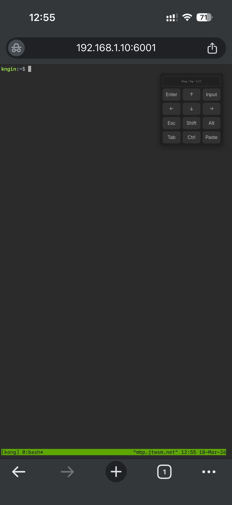
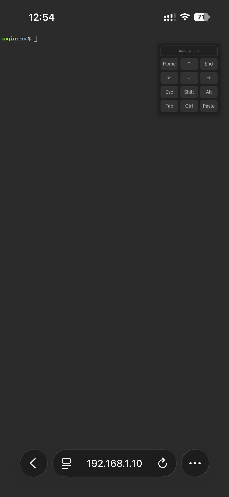
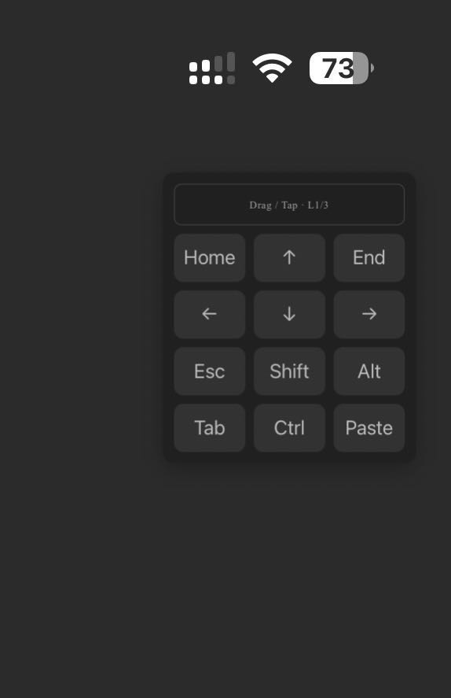
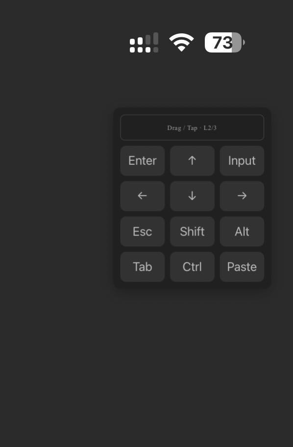

# Mobile Optimized TTYD Guide

This page explains how to use the mobile keyboard features in Mobile Optimized TTYD.

Commit list: <https://github.com/someonegg/ttyd/commits/1.7.7-mobile/>

## What This Solves

Using terminal sessions on phones is usually painful when you need keys like `Esc`, arrows, `Ctrl`, and fast selection.

Mobile Optimized TTYD adds a touch-first keyboard panel and gesture-based selection so common terminal actions are practical on iOS and Android browsers.

## Quick Start

Minimal setup:

```bash
ttyd -t enableMobileKeyboard=true bash
```

Use the prebuilt mobile-optimized `index.html` with official `ttyd`:

- Download:
  <https://github.com/someonegg/ttyd/blob/1.7.7-mobile/html/dist/inline.html>
- Save it as local `./index.html`, then start:

```bash
ttyd \
  --index "./index.html" \
  --client-option "focusOnMouseDown=cursor" \
  --client-option "forceSelection=true" \
  --client-option "enableMobileKeyboard=true" \
  bash
```

Notes:

- `focusOnMouseDown` and `forceSelection` are `mobile-optimized-xtermjs` options.
- See: <https://someonegg.github.io/docs/view.html?file=mobile-optimized-xtermjs-guide.md>

## How To Use The Panel

### 1) Show and Drag

- On touch devices, the virtual panel appears automatically when mobile keyboard is enabled.
- Drag the header bar to move the panel to a comfortable thumb position.

### 2) Switch Dynamic Pages

- Tap the header bar to cycle dynamic key pages.
- The top area is `2 x 3` keys per page (6 keys total).
- A practical split is: navigation page, input helper page, tmux page.

### 3) Modifiers and Combos

Fixed keys include `Esc`, `Tab`, `Shift`, `Alt`, `Ctrl`, and `Copy/Paste`.

- `Shift` / `Alt` / `Ctrl` are toggle modifiers.
- Active modifiers stay highlighted until toggled off.
- This makes combos like `Ctrl+C` and `Ctrl+D` easy on mobile.

### 4) Hold Repeat

- Hold a repeatable key to send repeated input.
- Timing options:
  - `mobileKeyboardHoldDelayMs`
  - `mobileKeyboardHoldIntervalMs`
  - `mobileKeyboardHoldWheelIntervalMs`

## Touch Selection Gestures

- Double tap: select current word.
- Triple tap: select current line.
- `Shift + triple tap`: select visible lines in viewport.
- `Alt + triple tap`: select all text in terminal buffer.

## Layout Examples

Example dynamic layouts:

```bash
-t 'mobileKeyboardLayouts=[["home","up","end","left","down","right"],["enter","up","batch_input","left","down","right"],["enter","up","space","tmux_next_window","down","tmux_list_windows"]]'
```

Example custom tmux keys:

```bash
-t 'mobileKeyboardCustomKeys=[{"id":"tmux_copy_mode","label":"C-b [","combo":["Ctrl+b","["]},{"id":"tmux_next_window","label":"C-b n","combo":["Ctrl+b","n"]},{"id":"tmux_list_windows","label":"C-b w","combo":["Ctrl+b","w"]}]'
```

## Mobile Tuning Tips

- Place the panel before heavy interaction.
- Keep page 1 for navigation and page 3 for tmux workflow.
- If accidental repeats happen, increase `mobileKeyboardHoldDelayMs` to `320-360`.
- If repeat feels slow, decrease `mobileKeyboardHoldIntervalMs` to `80-100`.

## Screenshots

### Group A (1-2)

<div style="display:grid;grid-template-columns:repeat(auto-fit,minmax(220px,1fr));gap:12px;">
  
  
</div>

### Group B (3-5)

<div style="display:grid;grid-template-columns:repeat(auto-fit,minmax(220px,1fr));gap:12px;">
  
  
  
</div>
